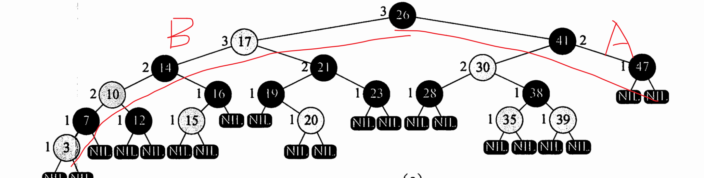
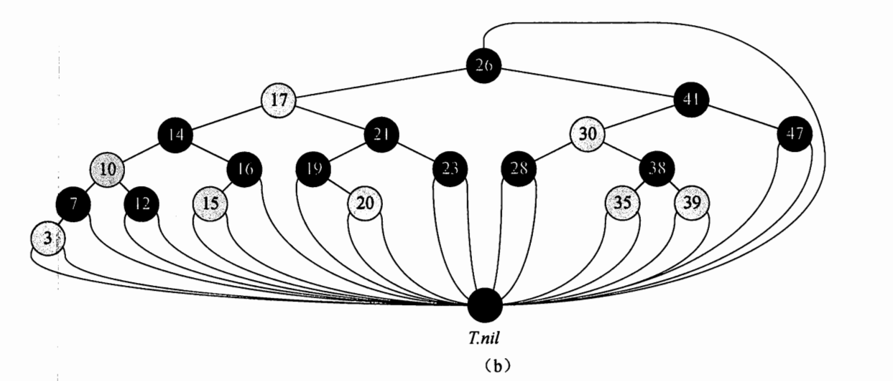
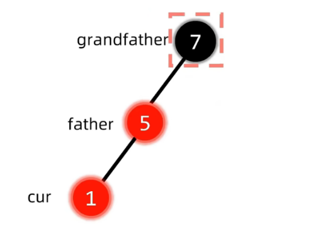
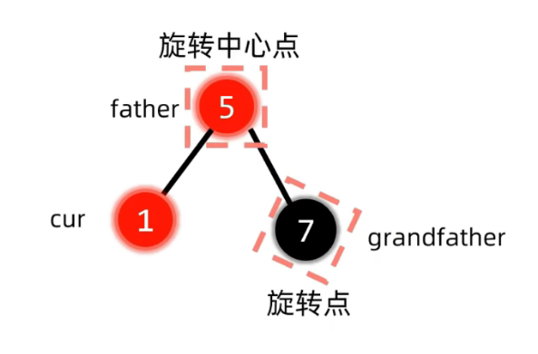

# 红黑树

二叉搜索树的一种

节点的一个存储位用来表示节点是Red Or Black

可以保证最深的节点不会深过最浅的节点的两倍

## 性质

1.  每个节点不是红就是黑
2.  根节点是黑色的
3.  每个节点Nil是黑色的
4.  如果节点是红色的, 两个子节点都是黑色的
5.  对每个节点, 从根节点到所有后代叶子节点的简单路径上, 均包含相同数目的黑色节点

```cpp
template<class T>
bool RedBlackTree<T>::isRedBlackTree(BinaryTreeNode<T> *root) {
    if (root == nullptr) {
        return true;
    }
    // 根节点一定是黑色的
    if (RedBlackTreeNode<T>::isRed(root)) {
        return false;
    }
    Stack<BinaryTreeNode<T> *> trace;
    // 栈用于迭代遍历树
    Stack<BinaryTreeNode<T> *> nodeStack;
    Stack<int> blackHeight;
    trace.push(root);
    blackHeight.push(0);

    while (!nodeStack.empty()) {
        BinaryTreeNode<T> *node = nodeStack.pop();
        int currentBlackHeight = blackHeight.pop();
        BinaryTreeNode<T> *left = node->getLeft();
        BinaryTreeNode<T> *right = node->getRight();
        // 检查当前节点是否违反红黑树性质
        if (RedBlackTreeNode<T>::isRed(node)) {
            if (left) {
                if (RedBlackTreeNode<T>::isRed(left)) {
                    return false;
                }
            }
            if (right) {
                if (RedBlackTreeNode<T>::isRed(right)) {
                    return false;
                }
            }
            return false; // 如果当前节点和其子节点均为红色，则违反性质
        } else {
            // 更新当前节点的黑高度
            currentBlackHeight++;
        }
        if (right) {
            nodeStack.push(right);
            blackHeight.push(currentBlackHeight);
        }
        // 将左右子节点入栈，并记录黑高度
        if (left) {
            nodeStack.push(left);
            blackHeight.push(currentBlackHeight);
        }

        // 检查从根节点到叶子节点的黑高度是否相同
        if (left == nullptr && right == nullptr) {
            int firstBlackHeight = blackHeight.top();
            if (currentBlackHeight != firstBlackHeight) {
                return false; // 如果当前路径的黑高度与第一个叶子节点的黑高度不同，则违反性质
            }
        }
    }
    return true;
}
```

### 引理

最深的节点不会深过最浅的节点的两倍

由"对每个节点, 从根节点到所有后代叶子节点的简单路径上, 均包含相同数目的黑色节点"

可得



AVL树对平衡的限制更加严格, 因此, 红黑树的查询略逊于AVL树, AVL为了达到严格的平衡, 插入和删除更加复杂


## 哨兵Nil



所有叶子节点都指向哨兵, 根节点的父节点为哨兵节点(什么好处?)

## 插入

插入一个节点, 首先默认其为红色(什么好处?由性质5, 插入红色节点可能是不需要做任何调整的, 但插入黑色节点就一定要调整了)

插入之后, 调整节点颜色, 并且通过旋转使其符合红黑树的性质

当红色节点插入后, 确定红黑性质能不能被保证, 然后根据不同情况调整

如果插入节点的父亲是黑色节点, 不需要改变, 否则: 

-   插入根节点, 直接转化为黑色节点

-   插入节点X和父节点P都是红色的, 违反性质4

    -   A的叔节点是黑色的

        1.  以爷爷节点作为旋转点旋转

            LR,LL,RL,RR...

            

            

        2.  变色

            对旋转点和旋转中心点红变黑黑变红

            在LR型中, 旋转点和旋转中心点指第二步的右旋中的旋转点和旋转中心点
        
        3.  将指针指向节点, 继续判定

    -   A的叔节点是红色的
    
        1.  将爷, 父, 叔变色(红变黑, 黑变红)
        2.  将指针指向爷爷节点, 继续判定

```cpp
template<class T>
void RedBlackTree<T>::insertNode(Stack<BinaryTreeNode<T> *> &trace) {
    // 将节点调整为红黑树的节点
    BinaryTreeNode<T> *newNode = trace.pop();
    if (newNode == nullptr) {
        return;
    }
    trace.push(new RedBlackTreeNode<T>(newNode));
    delete newNode;
    // 增加
    this->BinarySearchTree<T>::insertNode(trace);
    // 调整
    while (!rbInsertAdjust(trace));
}
```

```cpp
template<class T>
bool RedBlackTree<T>::rbInsertAdjust(Stack<BinaryTreeNode<T> *> &trace) {
    BinaryTreeNode<T> *node = trace.pop();

    if (trace.empty()) {
        // 根节点, 直接为黑
        RedBlackTreeNode<T>::cast(node)->setColor(tree::BLACK);
        return true;
    }
    BinaryTreeNode<T> *nodeParent = trace.pop();
    if (RedBlackTreeNode<T>::isBlack(nodeParent)) {
        // 已经正常
        return true;
    }
    if (trace.empty()) {
        throw IllegalStatementException();
    }
    BinaryTreeNode<T> *nodeGrandParent = trace.pop();
    bool isLeft = this->BinaryTree<T>::isLeftChild(nodeParent, nodeGrandParent);
    BinaryTreeNode<T> *nodeUncle = isLeft ? nodeGrandParent->getRight() : nodeGrandParent->getLeft();
    if (RedBlackTreeNode<T>::isRed(nodeUncle)) {
        RedBlackTreeNode<T>::painting(nodeParent); // 变色
        RedBlackTreeNode<T>::painting(nodeUncle);
        RedBlackTreeNode<T>::painting(nodeGrandParent);
        trace.push(nodeGrandParent);
        return false;
    }
    RedBlackTreeNode<T>::painting(nodeParent);
    RedBlackTreeNode<T>::painting(nodeGrandParent);
    this->BinaryBalanceSearchTree<T>::rotateAdjust(nodeGrandParent, trace.empty() ? nullptr : trace.top());
    return true;
}
```

## 删除

先按照二叉搜索树的方式删除

然后是各种判断如何删除

```cpp
BinaryTreeNode<T> *removedNode = trace.pop();
bool leftChild = trace.empty() ? true : BinaryTree<T>::isLeftChild(removedNode, trace.top());

trace.push(removedNode);
tree::RedBlackTreeNodeColor color = RedBlackTreeNode<T>::getColor(removedNode);
BinaryTreeNode<T> *left = removedNode->getLeft();
BinaryTreeNode<T> *right = removedNode->getRight();
int removeType = -1;
if (left == nullptr && right == nullptr) {
    removeType = 0;
} else if (left || right) {
    removeType = 1;
}
```
判断之后执行删除

```cpp
if (this->BinarySearchTree<T>::removeNode0(trace)) {
    return true;
}
```
删除之后

-   被删除的是没有子节点的节点
    -   是红节点, 无需调整, 直接删除
    -   是黑节点, 另论
-   被删除的是有一个子节点的节点, 在删除后被子节点覆盖
    -   该被删除的节点一定是黑色的, 该用于覆盖的子节点一定是红色的(排除法)
    -   将覆盖的节点着色成黑色

```cpp
switch (removeType) {
    case 0:
        if (color == tree::RedBlackTreeNodeColor::BLACK) {
            fixBlackNoneChildNodeRemove(trace, leftChild);
        }
        // 红节点不需要调整
        break;
    case 1: {
        BinaryTreeNode<T> *replaceNode = this->root;
        if (!trace.empty()) {
            replaceNode = leftChild ? trace.top()->getLeft() : trace.top()->getRight();
        }
        if (RedBlackTreeNode<T>::isBlack(replaceNode)) {
            throw IllegalStatementException();
        }
        RedBlackTreeNode<T>::painting(replaceNode);
        break;
    }
    default:
        throw IllegalStatementException();
}
return false;
```


### 无子节点的黑色节点的删除

### 黑色的兄弟节点

#### 兄弟没有红孩子

父亲是红节点, 红节点变黑, 结束调整

父亲是根节点, 根节点变黑, 结束调整

父亲是黑色节点, 将黑色节点作为新一次无子节点的黑色节点删除后的调整的起点, 进入循环


#### 兄弟有红孩子

1.  着色
2.  旋转

-   LL

    ```
    		Parent
        	/  	\
    	sidling	RemovedNode
    	/	\
    Red1	Red2
    ```

    ```
    		Parent
        	/  	\
    	sidling	RemovedNode
    	/
    Red1
    ```

    1.  着色
        -   Red1着sidling色
        -   sidling着Parent色
        -   Parent着黑色
    2.  旋转, 以Parent为中心, 右旋

-   RR

    ```
    		Parent
        	/  	\
    RemovedNode	sidling	
                /	\
            Red1	Red2
    ```

    ```
    		Parent
        	/  	\
    RemovedNode	sidling	
                	\
            		Red2
    ```

    1.  着色
        -   Red2着sidling色
        -   sidling着Parent色
        -   Parent着黑色
    2.  旋转, 以Parent为中心, 左旋

-   LR

    ```
    		Parent
        	/  	\
    	sidling	RemovedNode
    		\
    		Red2
    ```

    1.  着色
        -   Red2着Parent色
        -   Parent着黑色
    2.  旋转, 以Parent为中心, sidling左旋, Parent右旋

-   RL

    ```
    		Parent
        	/  	\
    RemovedNode	sidling	
               	/
            Red1
    ```

    1.  着色
        -   Red1着Parent色
        -   Parent着黑色
    2.  旋转, 以Parent为中心, sidling右旋, Parent左旋

结束调整

### 红色的兄弟节点

Parent和兄弟变色

朝被删除节点旋转

旋转后的局势是, 原来的父亲成了兄弟的孩子

将旋转后的父亲作为新一次无子节点的黑色节点删除后的调整的起点, 进入循环

### 代码清单

```cpp
template<class T>
void RedBlackTree<T>::fixBlackNoneChildNodeRemove(Stack<BinaryTreeNode<T> *> trace, bool leftChild) {
    if (trace.empty()) {
        return;
    }
    BinaryTreeNode<T> *nodeParent = trace.pop();
    BinaryTreeNode<T> *sibling = leftChild ? nodeParent->getRight() : nodeParent->getLeft();
    if (RedBlackTreeNode<T>::isBlack(sibling)) {
        // 兄弟是黑色
        if (sibling == nullptr) {
            // RedBlackTreeNode<T>::painting(nodeParent, tree::RedBlackTreeNodeColor::BLACK);
            return;
        }
        BinaryTreeNode<T> *leftNephew = sibling->getLeft();
        BinaryTreeNode<T> *rightNephew = sibling->getRight();
        if (RedBlackTreeNode<T>::isBlack(leftNephew) && RedBlackTreeNode<T>::isBlack(rightNephew)) {
            // 两个节点都是黑色节点
            // 兄弟变红
            RedBlackTreeNode<T>::painting(sibling, tree::RedBlackTreeNodeColor::RED);
            if (trace.empty() || RedBlackTreeNode<T>::isRed(nodeParent)) {
                // 根变黑              红色父亲变黑
                RedBlackTreeNode<T>::painting(nodeParent, tree::RedBlackTreeNodeColor::BLACK);
                return;
            }
            // 待改循环
            fixBlackNoneChildNodeRemove(trace, trace.top()->getLeft() == nodeParent); // 小型的判断左孩子
        } else {
            paintingAndRotate(leftChild, sibling, nodeParent);
        }
    } else {
        // 兄弟是红色,
        // 父兄变色
        RedBlackTreeNode<T>::painting(nodeParent);
        RedBlackTreeNode<T>::painting(sibling);
        // 朝被删除节点旋转
        BinaryTreeNode<T> *nodeGrandParent = trace.empty() ? nullptr : trace.top();
        if (leftChild) {
            this->BinaryBalanceSearchTree<T>::leftRotate(nodeParent, nodeGrandParent);
        } else {
            this->BinaryBalanceSearchTree<T>::rightRotate(nodeParent, nodeGrandParent);
        }
        trace.push(sibling);
        trace.push(nodeParent);
        fixBlackNoneChildNodeRemove(trace, leftChild);
    }
}
```


```cpp
template<class T>
void RedBlackTree<T>::paintingAndRotate(
        const bool removedNodeIsLeftChild, BinaryTreeNode<T> *sibling, BinaryTreeNode<T> *nodeParent,
        BinaryTreeNode<T> *nodeGrandParent) {
    BinaryTreeNode<T> *leftNephew = sibling->getLeft();
    BinaryTreeNode<T> *rightNephew = sibling->getRight();
    if (removedNodeIsLeftChild) {
        if (RedBlackTreeNode<T>::isRed(rightNephew)) { //RR
            RedBlackTreeNode<T>::painting(rightNephew, RedBlackTreeNode<T>::getColor(sibling));
            RedBlackTreeNode<T>::painting(sibling, RedBlackTreeNode<T>::getColor(nodeParent));
        } else if (RedBlackTreeNode<T>::isRed(leftNephew)) { // RL
            RedBlackTreeNode<T>::painting(leftNephew, RedBlackTreeNode<T>::getColor(nodeParent));
             this->BinaryBalanceSearchTree<T>::rightRotate(sibling, nodeParent);
        } else {
            // 全是null, 应该是全部都是黑色子节点的情况
            throw IllegalStatementException();
        }
        this->BinaryBalanceSearchTree<T>::leftRotate(nodeParent, nodeGrandParent);
    } else {
        if (RedBlackTreeNode<T>::isRed(leftNephew)) { // LL
            RedBlackTreeNode<T>::painting(leftNephew, RedBlackTreeNode<T>::getColor(sibling));
            RedBlackTreeNode<T>::painting(sibling, RedBlackTreeNode<T>::getColor(nodeParent));
        } else if (RedBlackTreeNode<T>::isRed(rightNephew)) { // LR
            RedBlackTreeNode<T>::painting(rightNephew, RedBlackTreeNode<T>::getColor(nodeParent));
             this->BinaryBalanceSearchTree<T>::leftRotate(sibling, nodeParent);
        } else {
            throw IllegalStatementException();
        }
         this->BinaryBalanceSearchTree<T>::rightRotate(nodeParent, nodeGrandParent);
    }
    RedBlackTreeNode<T>::painting(nodeParent, tree::RedBlackTreeNodeColor::BLACK);
}
```

## 树高

红黑树仅凭借增删实现对一个树高字段的维护?Who To?