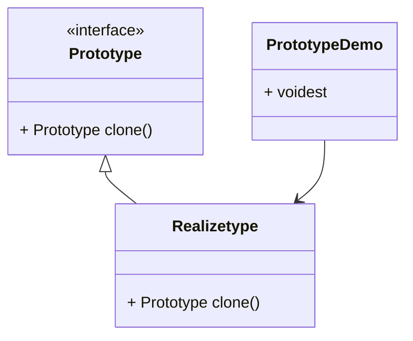

# 原型模式

>Prototype

用一个已经创建的实例作为原型, 通过复刻该原型对象来创建一个和原型对象相同的新对象

## 适用场景

-   对象的创建冗余而复杂
-   对性能和安全性的要求较高

## 结构

-   抽象原型类
    -   规定具体原型类必须实现的`clone`方法
-   具体原型类
    -   实现抽象原型类的`clone`方法, 是可被复制的对象



## 实现

浅克隆和深克隆

java Object类中使用`clone`实现浅克隆, 不会使用构造器来创建对象

JDK提供了`Clonable`来作为抽象原型

Serializable+ObjectStream使用的是深克隆

### 具体原型类

```java
public class RealizeType implements Cloneable {

    private List<String> valueList;

    public RealizeType(String... value) {
        valueList = new ArrayList<>();
        valueList.addAll(Arrays.asList(value));
    }


    @Override
    public RealizeType clone() throws CloneNotSupportedException {
        // RealizeType clone = (RealizeType) super.clone();// 还不如用new出来的, 真没用
        RealizeType clone = new RealizeType();
        clone.valueList = new ArrayList<>();
        clone.valueList.addAll(valueList);
        return clone;
    }

    public void show() {
        valueList.forEach(System.out::println);
    }

    public List<String> get() {
        return valueList;
    }

}
```

### 使用类

```java
public class PrototypeDemo {
    public static boolean demo() throws CloneNotSupportedException {
        RealizeType realizeType = new RealizeType("AAA", "CCC", "cc", "A");
        RealizeType clone = realizeType.clone();
        clone.show();
        realizeType.show();
        return clone.get() == realizeType.get(); // false
    }
}
```


### 使用序列化拷贝

缺点是效率低, 优点是**完全**的深拷贝

```java
public static <T> T clone(T src) {
    if (src == null) {
        return null;
    }
    byte[] cache;
    try (ByteArrayOutputStream baos = new ByteArrayOutputStream();
         ObjectOutputStream oos = new ObjectOutputStream(baos)
    ) {
        oos.writeObject(src);
        cache = baos.toByteArray(); // 序列化后的字节数组数据
    } catch (IOException e) {
        throw new RuntimeException(e);
    }
    T clone;
    try (ByteArrayInputStream bais = new ByteArrayInputStream(cache);
         ObjectInputStream ois = new ObjectInputStream(bais)
    ) {
        clone = (T) ois.readObject();
    } catch (IOException | ClassNotFoundException e) {
        throw new RuntimeException(e);
    }
    return clone;
}
```

```java
public static boolean serialize() {
    RealizeType realizeType = new RealizeType("AAA", "CCC", "cc", "A");
    RealizeType clone = SerializeCloneUtil.clone(realizeType);
    clone.show();
    realizeType.show();
    return clone.get().get(0) == realizeType.get().get(0); // false
}
```

不能反复利用字符串常量池就挺悲伤的
