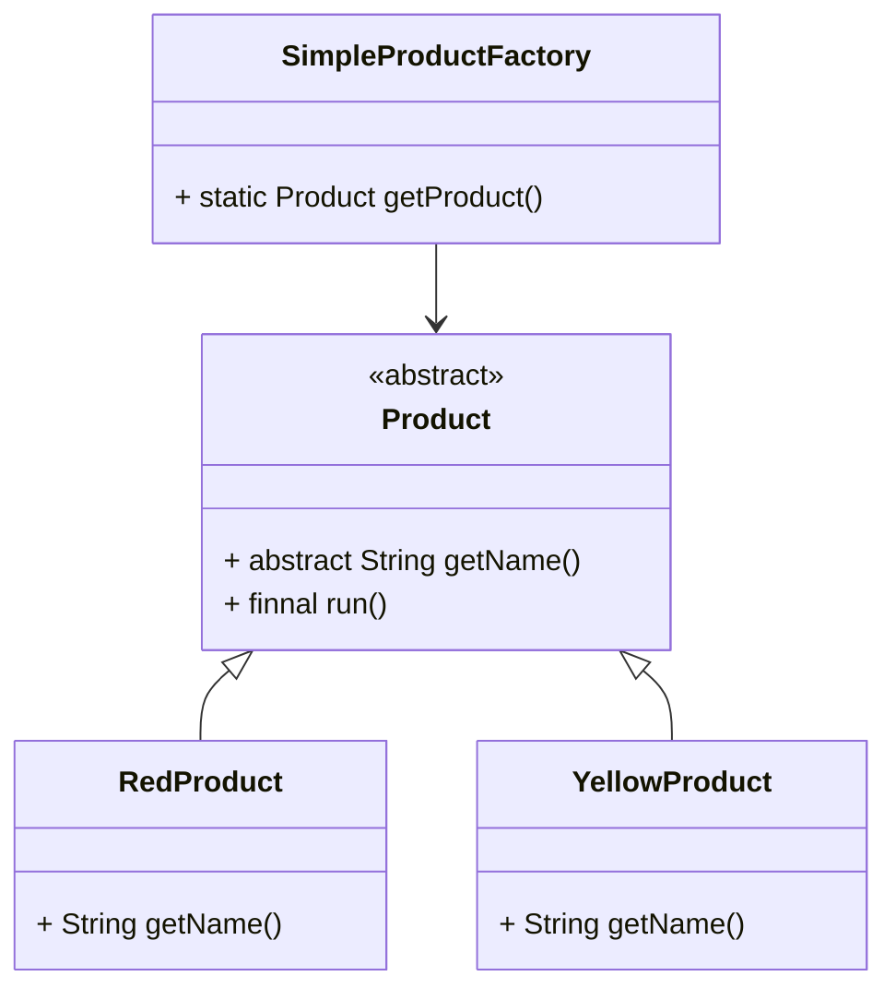
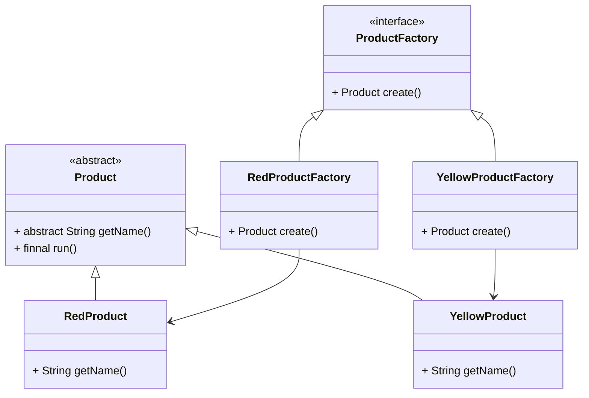

# 工厂方法

解耦

当对象的创建很繁琐, 不让代码的使用者创建对象, 将创建的过程封装

代码的使用者只需要知道具体工厂的名称, 就可以得到所要的产品, 无需知道产品的创建过程


## 虚假的工厂

简单工厂/静态工厂

不是设计模式

### 结构

-   抽象商品(工厂创建的类)
-   具体商品
-   具体工厂




### 缺陷

都没有符合原则开闭原则, 每次有新的具体商品时, 都需要在工厂里进行代码的更改

### 创建流程

#### 抽象商品

```java
public abstract class Product {
    public abstract String getName();
    public final void run(){
        System.out.println(getName() + " 在运行抽象父类对象任务");
    }
}
```

#### 具体商品

```java
public class RedProduct extends Product {
    @Override
    public String getName() {
        return "RedProduct";
    }
}
```

```java
public class YellowProduct extends Product {
    @Override
    public String getName() {
        return "YellowProduct";
    }
}
```

#### 具体工厂

```java
public class ProductSimpleFactory {
    public static Product getProduct(Class<? extends Product> type) {
        Product result = null;
        if (RedProduct.class == type) {
            result = new RedProduct();
        } else if (YellowProduct.class == type) {
            result = new YellowProduct();
        }
        return result;
    }
}
```

#### 使用

```java
public static String simple(Class<? extends Product> type) {
    Product product = ItemSimpleFactory.getProduct(type);
    product.run();
    return product.getName();
}
```


### 简单工厂+配置文件

解除耦合

非常没用, 因为工厂模式本身就是因为要构造一个对象太复杂要封装而诞生的, 用配置文件如果能成功构建对象, 那就说明这个构建对象还不够复杂

你凭什么确认所有的构造器都是无参的?

```java
public class PropertyFactory {

    private static final Map<String, Product> MAP = new HashMap<>();

    static {
        Properties p = new Properties();
        try (InputStream is = PropertyFactory.class.getClassLoader().getResourceAsStream("bean.properties")) {
            p.load(is);
        } catch (IOException e) {
            throw new RuntimeException(e);
        }
        //遍历Properties集合对象
        p.keySet().forEach(key -> {
            String className = p.getProperty((String) key);
            //获取字节码对象
            Constructor<?> constructor;
            Product product;
            try {
                constructor = Class.forName(className).getDeclaredConstructor();
                constructor.setAccessible(true); // 取消访问检查
                product = (Product) constructor.newInstance();
            } catch (ReflectiveOperationException e) {
                throw new RuntimeException(e);
            }
            MAP.put((String) key, product);
        });
    }

    public static Product create(String name) {
        return MAP.get(name);
    }

}
```


## 工厂方法的概念

定义一个用于创建对象的接口, **让子对象决定实例化哪个产品类对象**

工厂方法使一个产品类的实例化延迟到其工厂的子类

## 结构

-   抽象工厂
    -   Abstruct Factory
    -   提供创建产品的接口
    -   调用者通过它访问具体工厂的工厂方法来创建产品
-   具体工厂
    -   Concrete Factory
    -   实现抽象工厂中的抽象方法,  完成具体产品的创建
-   抽象产品
    -   Product
    -   定义产品规范, 描述产品主要特征和功能
-   具体产品
    -   Concrete Product
    -   实现了抽象产品类角色所定义的接口, 由具体工厂类来创建
    -   同具体工厂类一一对应



## 创建流程

### 抽象产品

不变

### 抽象工厂

```java
public interface ProductFactory {
    Product create();
}
```

### 具体产品和工厂

```java
public class YellowProductFactory implements ProductFactory {
    @Override
    public Product create() {
        return new YellowProduct();
    }
}

class YellowProduct extends Product {
    @Override
    public String getName() {
        return "YellowProduct";
    }
}
```

```java
public class RedProductFactory implements ProductFactory {
    @Override
    public Product create() {
        return new RedProduct();
    }
}

class RedProduct extends Product {

    @Override
    public String getName() {
        return "RedProduct";
    }
}
```

### 使用

```java
public static boolean factoryMethod() {
    Product product1 = new RedProductFactory().create();
    Product product2 = new YellowProductFactory().create();
    product1.run();
    product2.run();
    return !Objects.equals(product1.getName(), product2.getName());
}
```

## 缺陷

每增加一个产品就要增加一个具体的产品类和一个对应的具体工厂类, 增加了系统的复杂度

## JDK中的工厂

>   Collection的Iterater
>
>   DateFormat 的 getInstance
>
>   Calendar 的 getInstance


```java
public class ArrayList<E> extends AbstractList<E>
        implements List<E>, RandomAccess, Cloneable, java.io.Serializable
{
	// ...
    public Iterator<E> iterator() {
        return new Itr();
    }

    /**
     * An optimized version of AbstractList.Itr
     */
    private class Itr implements Iterator<E> {
        // ... 
    }
    // ...
}
```


