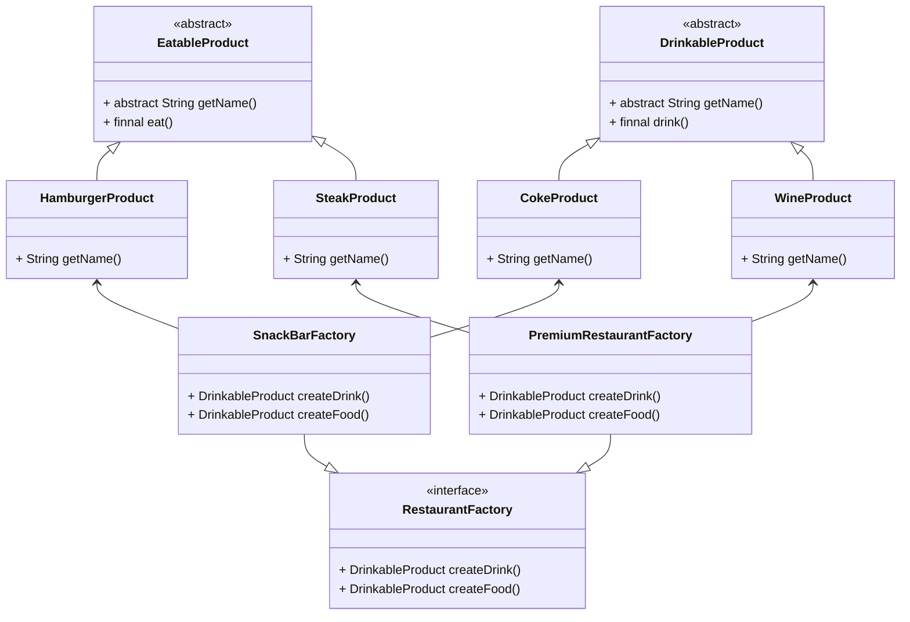

# 抽象工厂


##产品族

工厂方法只考虑生产一类产品的生产, 例如畜牧场只生产动物, 电视机产只生产电视机

同种类的产品称为**同等级产品**

但有时候, 往往一个工厂会生产**多等级的产品**

例如Apple公司会生产iPhone, 会生产iPad, 生产Mac

电器厂会生产电视机, 会生产洗衣机, 会生产空调


## 概念

为访问类提供一个创建**一组相关或相互依赖对象的接口**

访问类无须指定所要产生的具体类就能得到**同族的不同等级的产品**的模式结构

抽象工厂模式是工厂方法模式的升级

抽象工厂模式课生产多个等级的产品

~~Map能生产Entry, 也能生产keySet, 也能生产valueSet~~

## 使用场景

如果要增加一个新的产品族的话, 只需要增加一个产品类即可

当一个产品族的多个对象被设计成一起工作时, 它能保证客户端始终只使用同一个产品族中的对象

适用于以下场景

-   需要创建的对象是一系列相互关联或相互依赖的的产品组时
-   系统中有多个产品组, 但每次只使用其中某一族产品
-   系统中提供了产品的类库, 且所有产品的接口相同, 客户端依然不依赖产品实例的创建细节和内部结构

##结构

-   抽象工厂
    -   Abstruct Factory
    -   提供创建产品的接口
    -   包含多个创建产品的方法吗可以创建多个不同等级的产品
-   具体工厂
    -   Concrete Factory
    -   实现抽象工厂中的多个抽象方法, 完成具体产品的创建
-   抽象产品
    -   Product
    -   定义产品规范, 描述产品主要特征和功能
    -   抽象工厂模式有多个抽象产品
-   具体产品
    -   Concrete Product
    -   实现了抽象产品类角色所定义的接口, 由具体工厂类来创建
    -   同具体工厂类多对一的关系



##创建流程

### 抽象商品

```java
public abstract class EatableProduct {
    public abstract String getName();

    public final void eat() {
        System.out.println(getName() + " was been eaten");
    }
}
```

```java
public abstract class DrinkableProduct {
    public abstract String getName();

    public final void drink() {
        System.out.println(getName() + " was been drunk");
    }
}
```

### 抽象工厂

```java
public interface RestaurantFactory {
    DrinkableProduct createDrink();
    EatableProduct createFood();
}
```

### 具体商品+具体工厂

```java
public class SnackBarFactoryFactory implements RestaurantFactory {
    
    public SnackBarFactoryFactory() {
        System.out.println("Here is Snack Bar");
    }
    
    @Override
    public DrinkableProduct createDrink(){
        return new CokeProduct();
    }
    @Override
    public EatableProduct createFood(){
        return new HamburgerProduct();
    }
}
class HamburgerProduct extends EatableProduct{

    @Override
    public String getName() {
        return "Hamburger";
    }
}

class CokeProduct extends DrinkableProduct{

    @Override
    public String getName() {
        return "Coke";
    }
}
```

```java
public class PremiumRestaurantFactory implements RestaurantFactory {
    
    public PremiumRestaurantFactory() {
        System.out.println("Here is Premium Restaurant");
    }
    
    @Override
    public DrinkableProduct createDrink(){
        return new WineProduct();
    }
    @Override
    public EatableProduct createFood(){
        return new SteakProduct();
    }
}
class SteakProduct extends EatableProduct{

    @Override
    public String getName() {
        return "Steak";
    }
}

class WineProduct extends DrinkableProduct{

    @Override
    public String getName() {
        return "Wine";
    }
}
```

### 使用

```java
public static void abstractFactory() {
    RestaurantFactory snackBar = new SnackBarFactoryFactory();
    DrinkableProduct snackBarDrink = snackBar.createDrink();
    EatableProduct snackBarFood = snackBar.createFood();
    snackBarDrink.drink();
    snackBarFood.eat();
	System.out.println("--------------------");
    RestaurantFactory premiumRestaurant = new PremiumRestaurantFactory();
    DrinkableProduct premiumRestaurantDrink = premiumRestaurant.createDrink();
    EatableProduct premiumRestaurantFood = premiumRestaurant.createFood();
    premiumRestaurantDrink.drink();
    premiumRestaurantFood.eat();
}
```


## 缺点

当产品族中需要增加一个新产品时, 所有的工厂类都需要进行修改

