# UML

>   Unified Modeling Language UML

统一建模语言

设计软件的可视化建模语言

特点是简单, 统一, 图形化,能表达软件设计中的动态和静态信息

UML从目标系统出发, 定义了例图, 类图, 对象图, 状态图, 活动图, 时序图, 协作图, 构件图, 部署图

## 类图

>   Class Diagram

类图显示了模型的静态结构, 不显示暂时性信息

-   模型中存在的类
-   类内部结构
-   类与其他类的关系

### 作用

描述了系统的类集合, 类的属性和类之间的关系, 可以简化人们对系统的理解

类图是系统分析和设计阶段的重要产物, 是系统编码和测试的重要模型

## 类图表示方式

>   Mermaid 辅助

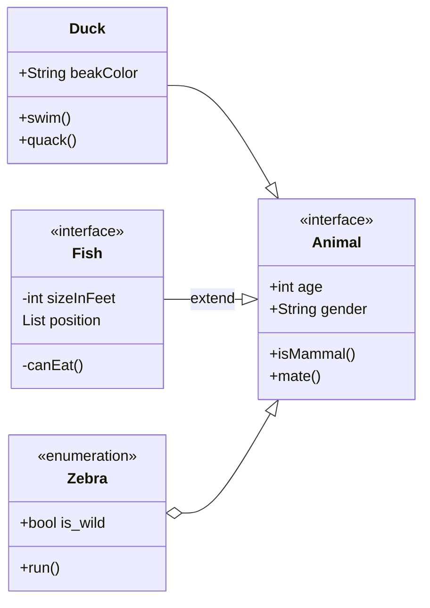

### 类的表示方式

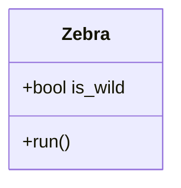

#### 访问权限

-   `+`  public
-   `- `private
-   `#` protected
-   `~`缺省或default

#### 字段和方法的表示

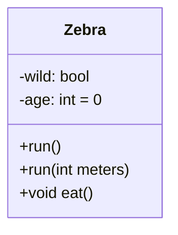

### 关联关系

对象之间的引用关系, 用于表示一类对象与另一类对象之间的联系

-   一般性关系
-   聚合关系
-   组合关系

#### 关联符号

单向

| 类型   | 描述               |
| :----- | :----------------- |
| `<|--` | 继承               |
| `*--`  | 作品               |
| `o--`  | 聚合               |
| `-->`  | 关联               |
| `--`   | 链接（实心）       |
| `..>`  | 依赖 不可用        |
| `..|>` | 实现 不可用        |
| `..`   | 链接（虚线）不可用 |

双向

| 类型 | 描述 |
| :--- | :--- |
| `<|` | 继承 |
| `\*` | 作品 |
| `o`  | 聚合 |
| `>`  | 关联 |
| `<`  | 关联 |
| `|>` | 实现 |

#### 单项关联

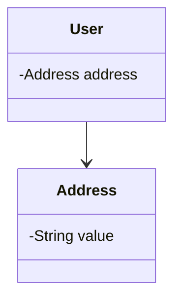

#### 双向关联

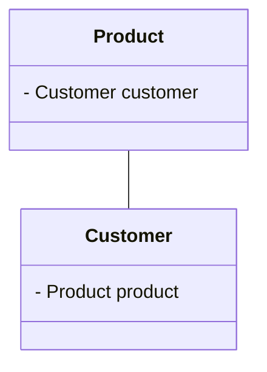

#### 自关联

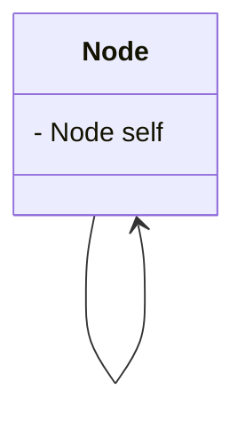

#### 聚合关系

强关联关系, 整体和部分之间的关系, 部分可脱离整体存在

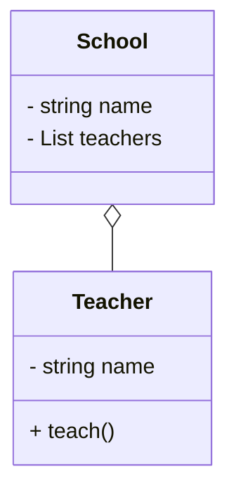

空心菱形指向整体

#### 组合关系

更强烈的聚合关系

整体对象可以控制部分对象的生命周期

整体对象不存在, 部分对象也将不存在, 部分对象不能脱离整体对象而存在

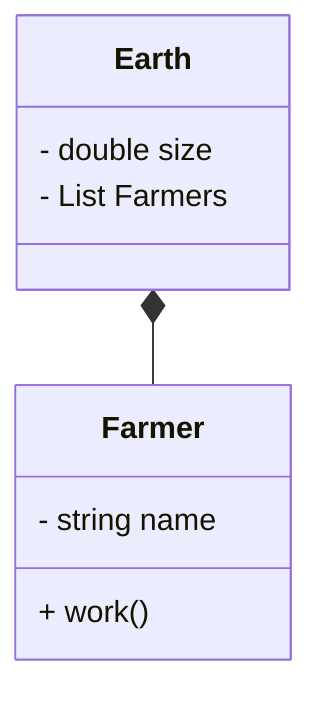

实心菱形指向整体

#### 依赖关系

是一种使用关系, 是对象之间耦合度最低的一种关系

是临时性的关联, 在代码中, 某个类的方法通过**局部变量**, **方法的参数**或者对**静态方法的调用**来访问一个类

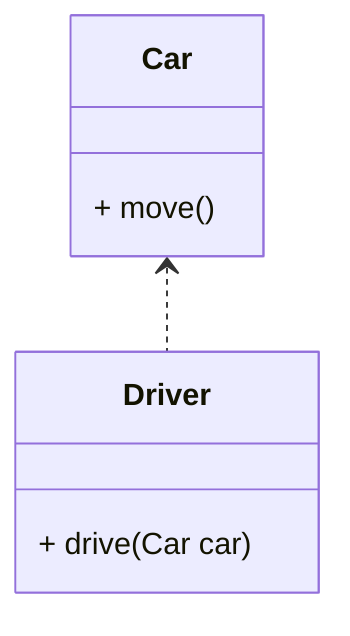

用带箭头的虚线, 使用类指向被依赖的类

#### 继承关系

耦合度最大的关系

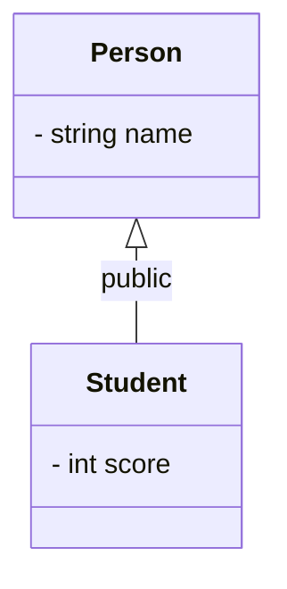

实现实心大箭头表示, 子类指向父类,没有代箭头的虚线

#### 实现关系

接口与实现类之间的关系, 耦合性仅次于继承

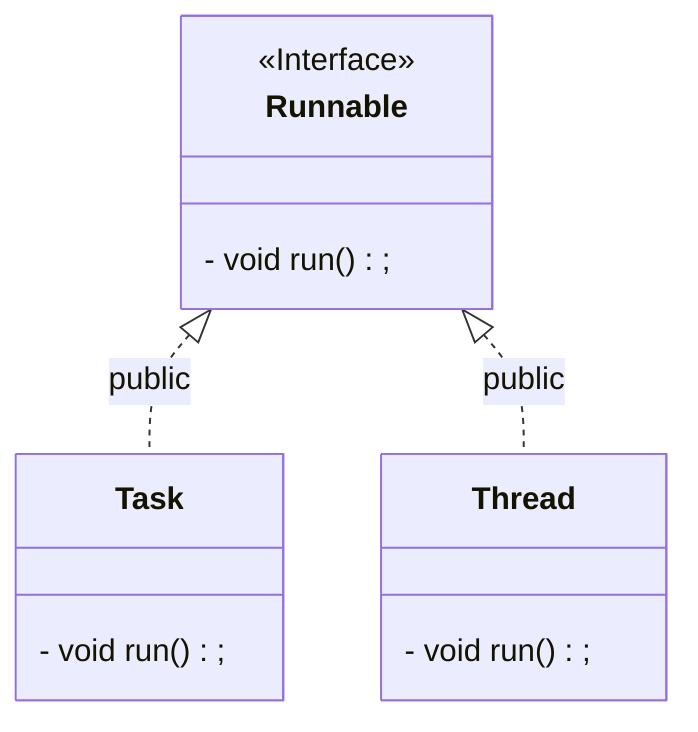

虚线空心小箭头表示, mermaid没有

### 类注释

-   `<<Interface>>` 表示一个接口类
-   `<<Abstract>>` 表示一个抽象类
-   `<<Service>>` 代表一个服务类
-   `<<Enumeration>>` 表示一个枚举

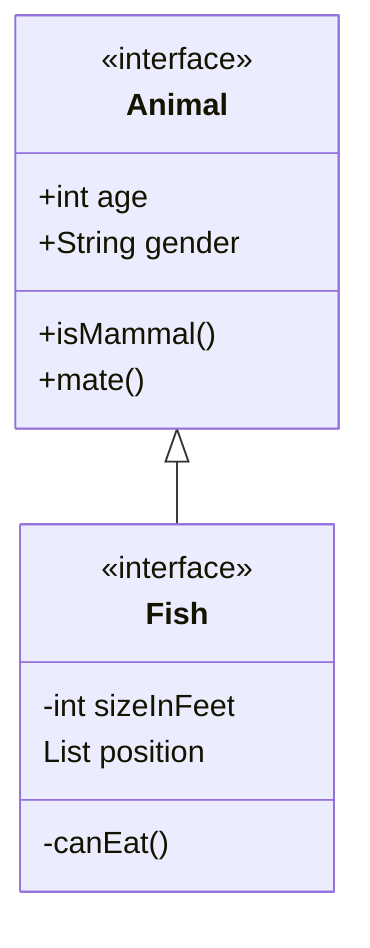

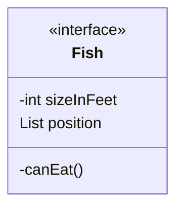
