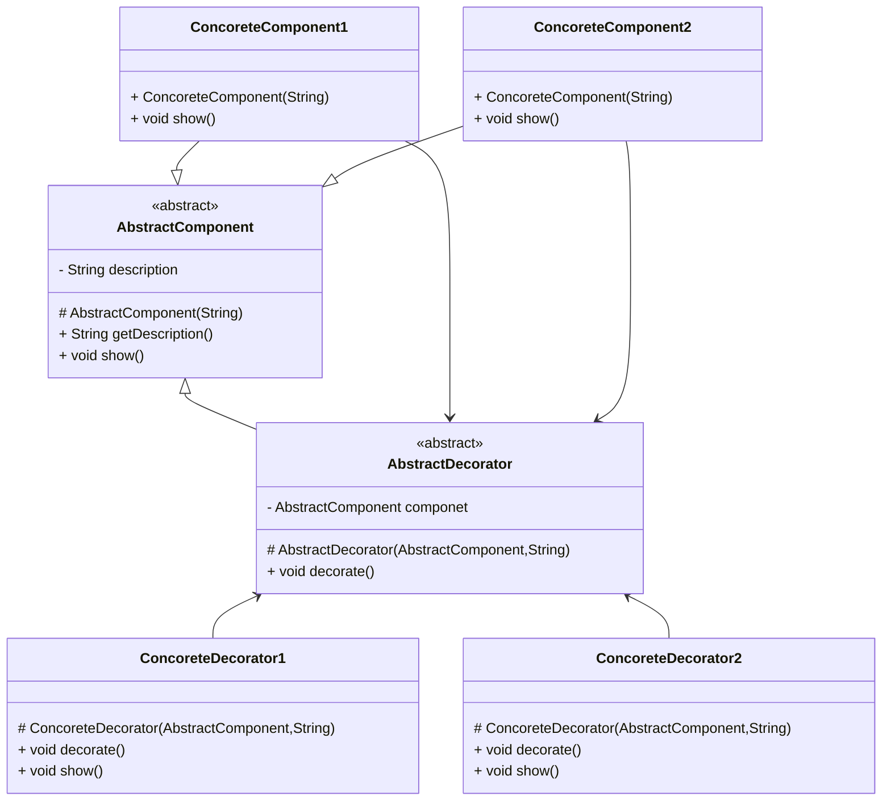
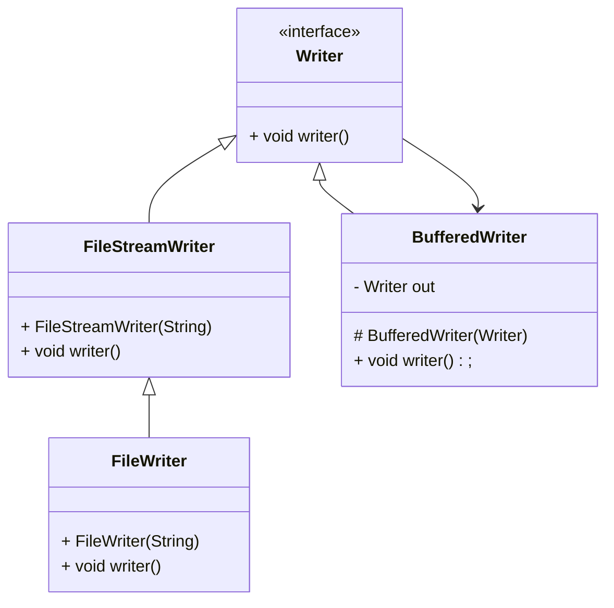

# 装饰者

>   Decorator

要求对类的新增不同的增强要以较弱耦合的依赖或聚合的形式进行, 而不是继承或实现的高耦合的形式

重在动态的(针对继承的静态)

即合成复用原则

比继承有更好的灵活性, 使用方便,可以通过组合不同的装饰着对象来获取具有不同行为的多样化结果

比继承具有更好的拓展性, 遵循开闭原则

装饰类和倍装饰类可以独立发展, 不会相互耦合

**装饰者模式是继承的一个替代方案**, 装饰类的一个装饰可以替代一个实现类的功能拓展

## 适用场景

-   不能采用继承的方式对系统进行扩充
    -   类定义finnal不能被继承时
-   采用继承不利于系统扩展和维护
    -   系统中存在独立的拓展, 多种拓展+多个构件--排列组合-> 更多子列
-   在不影响其他对象的情况下, 以动态透明的方式给对象添加责任
-   当对象功能**要求可以动态添加, 也可以动态撤销时**


## 结构

特征抽象装饰继承抽象构件同时含有具体构件实例成员

难点在于多态和多次对父类成员和构件成员同一API不同逻辑的调用

-   抽象构件
    -   Component
    -   定义抽象类接口以规范准备接收附加责任对象
-   具体构件
    -   Concrete Component
    -   实现抽象构件通过装饰角色为其增加职责
-   抽象装饰
    -   Decorator
    -   **继承或实现抽象构件**
    -   **包含具体构件实例**
    -   可以通过子类扩展具体构建的功能
-   具体装饰
    -   Concrete Decorator
    -   实现抽象装饰的相关方法, 并给具体构建对象添加附加的责任





## 实现流程

### 抽象构件

```java
public abstract class AbstractComponent {
    private final String description;

    protected AbstractComponent(String initDescription) {
        this.description = initDescription;
    }

    public String getDescription() {
        return description;
    }


    public abstract void show();


}
```

### 具体构件

```java
public class ConcreteComponent extends AbstractComponent {

    public ConcreteComponent(String initDescription) {
        super(initDescription);
    }

    @Override
    public void show() {
        System.out.println(super.getDescription());
    }
}
```

### 抽象装饰器

```java
public abstract class AbstractDecorator extends AbstractComponent {
    private final AbstractComponent component;

    protected AbstractDecorator(AbstractComponent component, String decorate) {
        super(decorate);
        this.component = component;
    }

    protected final AbstractComponent getComponent() {
        return component;
    }

    @Override
    public final String getDescription() {
        return decorate();
    }

    protected abstract String decorate();

    protected final String getDecorate() {
        return super.getDescription();
    }
}
```

### 具体装饰器

```java
public class ConcreteDecorator extends AbstractDecorator {
    public ConcreteDecorator(AbstractComponent component, String decorate) {
        super(component, decorate);
    }

    @Override
    protected String decorate() {
        return super.getComponent().getDescription() + " " + super.getDecorate();
    }

    @Override
    public void show() {
        // 联系本装饰和构件共同组合出新的show实现方案
        System.out.println(super.getDescription());
    }
}
```

### Demo

```java
AbstractComponent component = new ConcreteComponent("Component");
component.show(); // Component
System.out.println(component.getDescription()); // Component

component = new ConcreteDecorator(component, "Red");
component.show(); // Component Red
System.out.println(component.getDescription()); // Component Red

component = new ConcreteDecorator(component, "Yellow");
component.show(); // Component Red Yellow
System.out.println(component.getDescription()); // Component Red Yellow

component = new ConcreteDecorator(component, "Blue");
component.show(); // Component Red Yellow Blue
System.out.println(component.getDescription()); // Component Red Yellow Blue
```

## 静态代理和装饰器

代理不需要知道真实主题的方法逻辑, 根本目的是保护和隐藏目标对象

装饰器需要知道构件的原理, 且要保证装饰之后的逻辑和装饰之前的逻辑的差别仅在"装饰"

装饰器可以通过构造器**传递**, 不断被装饰

### JDK中装饰者的使用

包装类使用了装饰者

BufferedInputStream

BufferedOutputStream

BufferedReader

BufferedWriter

```java
Writer writer = new FileWriter("/usr/local/file.txt");
writer = new BufferedWriter(writer);
writer.write("");
// 打开的流是FileWriter的字符流, 执行通过的是BufferedWriter的逻辑
writer.close()
```



