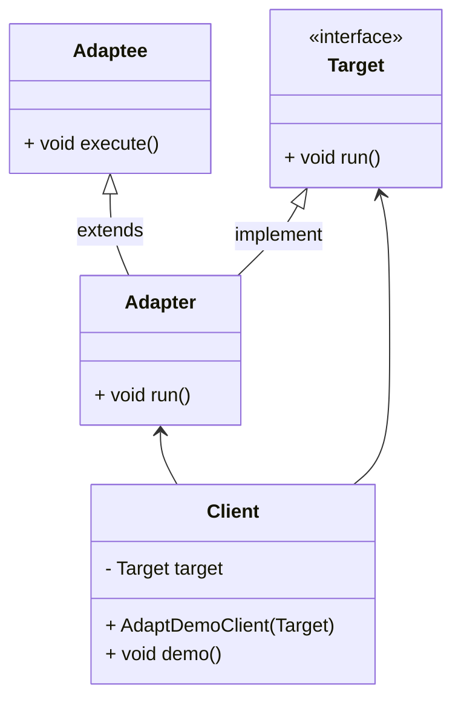
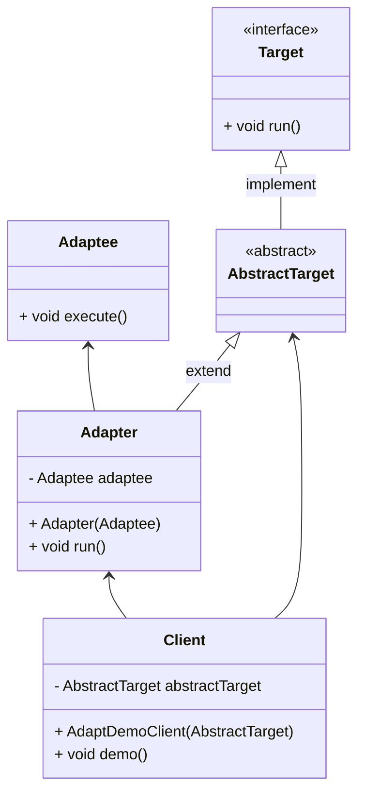
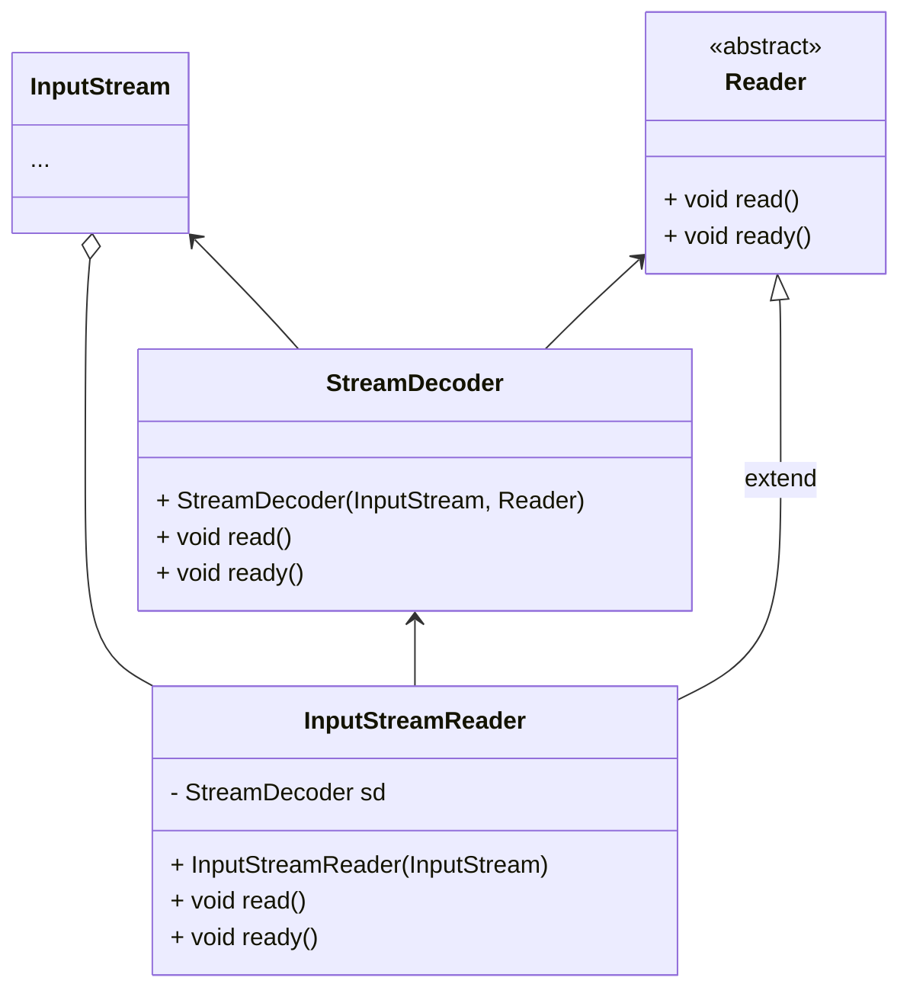

# 适配器

>   Adapter

交流电压220V, 手机充电电压5V, 头子充当了变压器的作用


适配器模式就是将一个类的接口转换为客户希望的另一个接口, 使原本由于接口不兼容而不能一起工作的类一起工作

适配器分为*类适配器模式* 和 *对象适配器模式*  

*类适配器模式*  用继承 

*对象适配器模式* 用聚合和组合

*类适配器模式*  耦合度比 *对象适配器模式*  高

*类适配器* 要求了解现有组件库中相关组件的内部结构


*接口适配器模式*  当不希望实现目标接口中所有的方法时, 可以创建AbstractAdapter, 实现所有方法但没有实际业务, 通过继承该抽象类实现方法实现部分功能的转换

## 适用场景

老版本系统的类**满足功能**, 但**接口规范**不同

第三方组件接口的定义和自己要求的接口定义不同


## 结构

-   目标
    -   Target
    -   **当前系统**业务所期待的接口, 可以是抽象类或接口
-   适配者
    -   Adaptee
    -   被访问和适配的现存组件库中的组件接口
-   适配器
    -   Adapter
    -   转换器
    -   通过几次或引用适配者对象, 把适配者接口转换成目标接口, 让客户按照目标接口的格式访问适配者
    -   Adaptee --> Target
    -   看起来好像在用Target完成业务, 其实业务逻辑都是Adaptee的

## 类适配器模式



### Target

```java
public interface Target {
    void run();
}
```

规范在接口


### Client

```java
public class AdaptDemoClient {
    private final Target target;

    public AdaptDemoClient(Target target) {
        this.target = target;
    }
    public void runTarget(){
        target.run();
    }
}
```

需求在Client


### Adaptee

```java
public class Adaptee {
    public void execute() {
        System.out.println("Adaptee start executing");
        System.out.println("Adaptee finish executing");
    }
}
```

实现在适配者

### Adapter

```java
public class ClassAdapter extends Adaptee implements Target {
    @Override
    public void run() {
        System.out.println("Adapter start running");
        super.execute();
        System.out.println("Adapter finish running");
    }
}
```

用适配器转换

### Demo

```java
AdaptDemoClient client = new AdaptDemoClient(new ClassAdapter());
client.runTarget();
```
### 缺陷

类适配器违背合成复用原则

如果没有接口规范, 都是类, 要继承, 而Java不支持单继承, 故不可用

## 对象适配器模式




### Target&Adaptee

同上

### Client

基本同上

### AbstractTarget

```java
public abstract class AbstractTarget implements Target {

}
```

### Adapter

```java
public class ObjectAdapter extends AbstractTarget{
    private final Adaptee adaptee;
    public ObjectAdapter(Adaptee adaptee) {
        this.adaptee = adaptee;
    }

    @Override
    public void run() {
        System.out.println("Adapter start running");
        adaptee.execute();
        System.out.println("Adapter finish running");
    }

}
```

### Demo

```java
AdaptDemoClient client = new AdaptDemoClient(
        new ObjectAdapter(new Adaptee())
);
client.runTarget();
```


## JDK中的使用

-   Target
    -   Reader 字符流
-   Adaptee
    -   InputStream 字节流
    -   StreamDecoder 字节流-字符流解码器, 将字节转换为字符
    -   在InputStreamReader构造器中, InputStream + Reader -> StreamDecoder存入InputStreamReader的字段
-   Adapter
    -   InputStreamReader
    -   继承java.io.Reader, 对Reader未实现的方法进行实现




```java
package java.io;

import sun.nio.cs.StreamDecoder;

public class InputStreamReader extends Reader {

    private final StreamDecoder sd;

    public InputStreamReader(InputStream in) {
        super(in);
        sd = StreamDecoder.forInputStreamReader(in, this,
                Charset.defaultCharset()); // ## check lock object
    }
	
    // 其他用于高可用的构造器...
    
    public String getEncoding() {
        return sd.getEncoding();
    }
    
	@Override
    public int read() throws IOException {
        return sd.read();
    }

    @Override
    public int read(char cbuf[], int offset, int length) throws IOException {
        return sd.read(cbuf, offset, length);
    }

    @Override
    public boolean ready() throws IOException {
        return sd.ready();
    }

    @Override
    public void close() throws IOException {
        sd.close();
    }
}
```

其实去掉注释真的就是差不多这么短了

