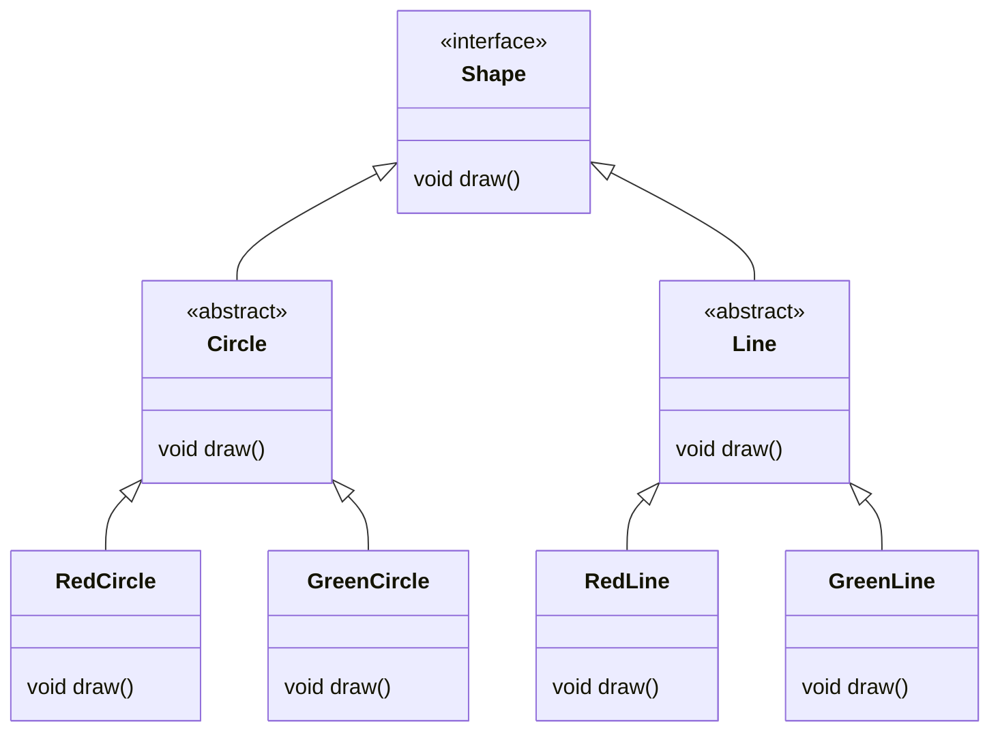
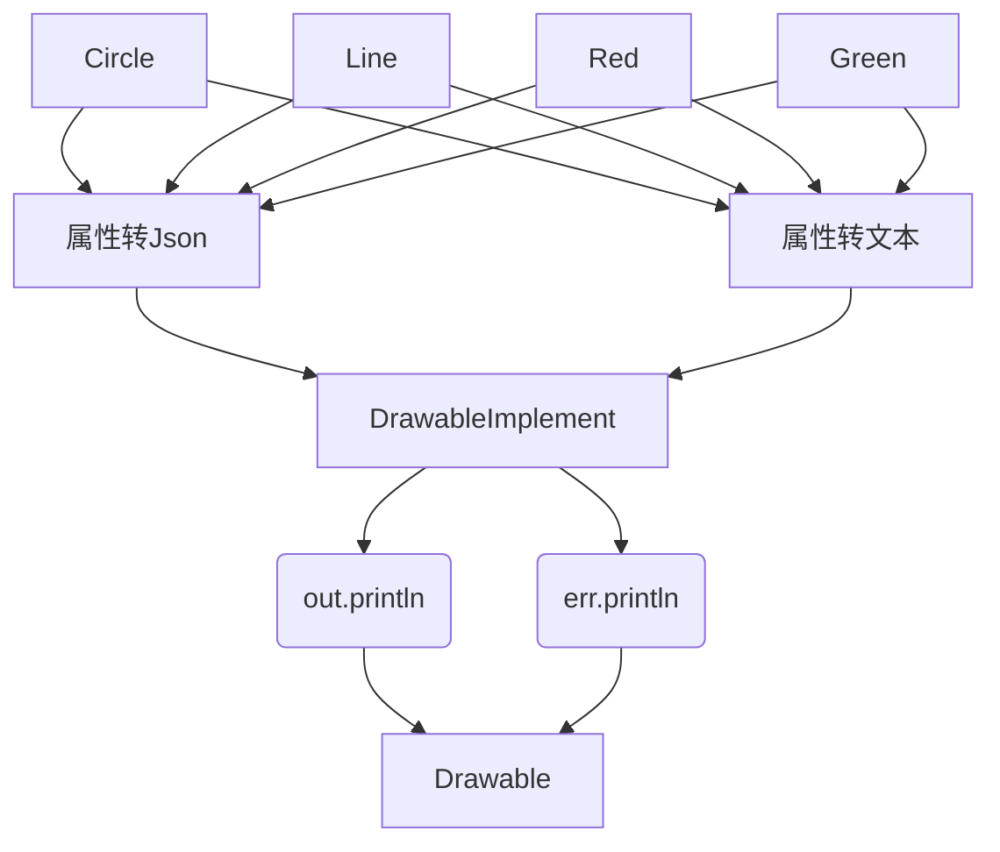
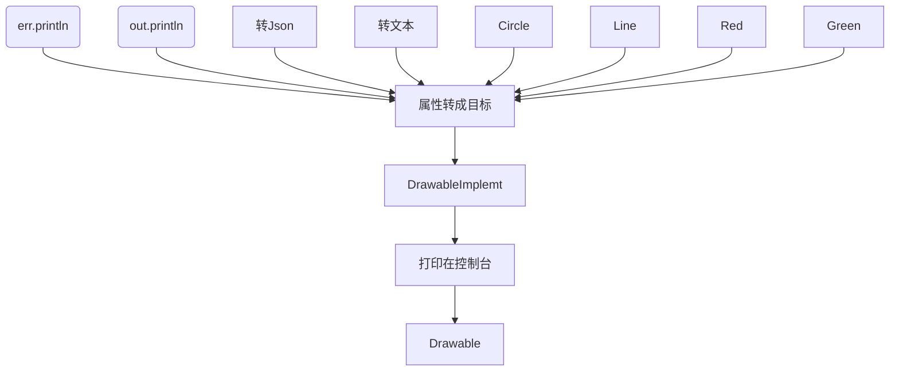
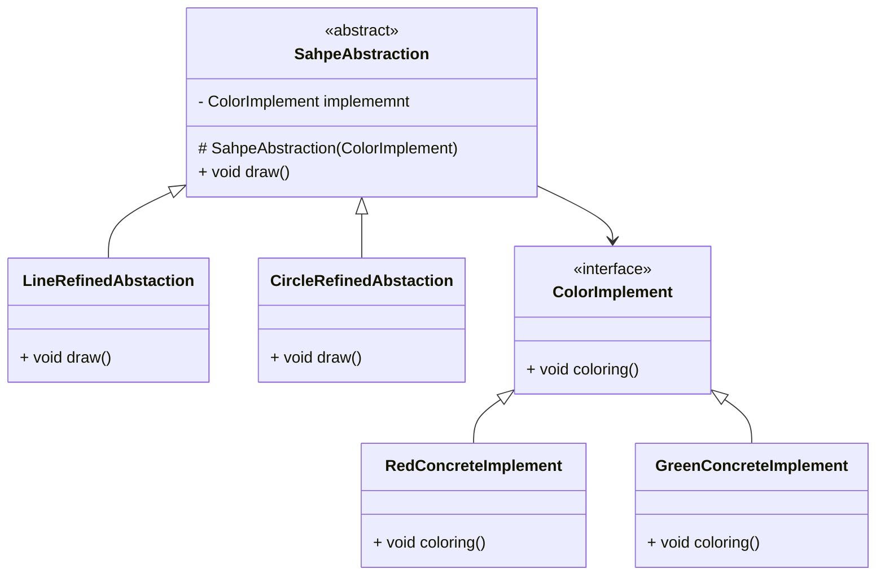

# 桥接

将抽象和实现分离, 各自独立变化

通过组合关系代替继承关系实现, 降低了抽象和实现这两个可变维度的耦合度

##需求

有两个互不相关的两个属性,在坐标系中表现为两个坐标轴垂直, 即两个维度

如果要描述同时拥有这两个属性中的一个类, 两个属性排列组合

例如

如果两种属性中的任意一种需要增加一种情况, 或者要增加一种新属性, 造成类爆炸

## 结构

-   抽象
    -   Abstaction
    -   包含一个对实现化角色的引用
-   扩展抽象
    -   Refined Abstaction
    -   抽象化的子类
    -   实现父类中的业务
    -   组合调用实现化中的业务
-   实现化
    -   Implementor
    -   实现化接口
    -   供拓展抽象化调用
-   具体实现化
    -   Concrete Implement
    -   给出实现化接口的具体实现

什么? 桥接模式只能使用于两个维度, 那还有什么意义?

```mermaid
classDiagram
class SahpeAbstraction{
	<<abstract>>
	- ColorImplement implememnt
	# SahpeAbstraction(ColorImplement)
	+ void draw()
}
class LineRefinedAbstaction{
	+ void draw()
}
class CircleRefinedAbstaction{
	+ void draw()
}
SahpeAbstraction <|-- CircleRefinedAbstaction
SahpeAbstraction <|-- LineRefinedAbstaction
class ColorImplement{
	<<interface>>
	+ void coloring()
}
class RedConcreteImplement{
	+ void coloring()
}
class GreenConcreteImplement{
	+ void coloring()
}

ColorImplement <|-- RedConcreteImplement
ColorImplement <|-- GreenConcreteImplement

SahpeAbstraction --> ColorImplement
```

这两个类有一个调用关系, 说明两个属性不是等价的, 而是有主从的, 但是从意义上来说Shape和Color有主从吗?

遥控器(电视/空调/风扇)-操作(on/off/turn) 倒是有主次+两维度, 这个例子更适合桥接模式

###绘画图形案例

以下皆扯淡

凡Abstaction有多个Refined Abstaction实现, 就一定可以在Refined Abstaction中抽离属性最终只留下一个Refined Abstaction

凡Implementor有多个Concrete Implement实现, 就一定可以在Concrete Implement中抽离属性最终只留下一个Concrete Implement

## 优势与使用场景

两个维度中, 拓展任意一个维度, 只需要在该维度的抽象下实现这个维度的抽象, 就可以实现拓展, 而不用侵入另外一个维度

实现细节对客户透明

-   适合用于两维度且两维度都需要扩展
-   不希望继承或因为多层次继承导致系统类急剧增加时
-   需要在构件的抽象化角色和具体化角色之间增加灵活性, 避免继承转用桥接

## 遗留问题

如何增加维度(增加到三个以上)而不会侵入其他维度?

装饰者? 也不对啊? 

考虑一个问题: 一个维度A依赖其他维度X, 这个A维度在设计的时候需要知道维度X的含义吗? 维度X的含义会影响维度A的设计吗?

如果A设计要考虑X, X会影响A, 那么, 装饰者和桥接都不可避免侵入

当然这里的X指父类抽象所带有的含义, 而不是子类实现的含义

X抽象的范围越广, X的含义越广, 可拓展的子类越多, 对A的侵入越少, 同时, X的定义就越不清晰, A在一开始的设计就越难

