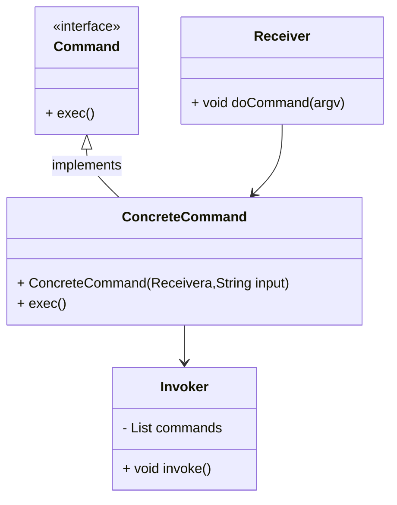

# 命令

将一个请求封装为一个对象

发出请求的职责和执行请求的职责分开, 实现解耦

命令的发起者和命令的执行者, 两者之间通过命令对象进行沟通

增加删除命令方便, 满足开闭原则

实现宏命令, 与组合模式结合, 多个命令结合成宏命令

**和备忘录模式结合, 实现Undo(撤销)和Redo(恢复)**

## 缺点

导致系统有过多具体命令类

## 适用场景

-   将请求的调用者和请求的接收者解耦
-   要在不同时间指定请求, 将请求排队和执行
-   系统需要支持命令的Undo和Redo

## 结构

-   抽象命令
    -   Command
-   具体命令
    -   Concrete Command
    -   持有接收者, 并调用接收者的功能来完成命令执行操作
-   实现者/接收者
    -   Receiver
    -   执行命令的对象

-   调用者/请求者
    -   Invoker
    -   要求命令对象执行请求, 通常会持有命令对象
    -   持有很多命令对象
    -   是客户端真正触发命令并要求命令执行响应操作的地方
    -   使用命令对象的入口



## JDK中的命令

Runnable是抽象命令

Thread是调用者Invoker

start()是Invoker的执行方法

Lambda表达式是ConcreteCommand

没有接收者Receiver?

```java
public ConcreteCommand implements Runnable{
    private Receiver receiver; // 自定义
    private String[] argv;
    public ConcreteCommand(Receiver receiver, String input){
        this.receiver = receiver;
        this.argv = input.splite(" ");
    }
    @Override
    public void run(){
        System.out.println(receiver.exec(argv));
    }
}
```

## Undo&Redo

