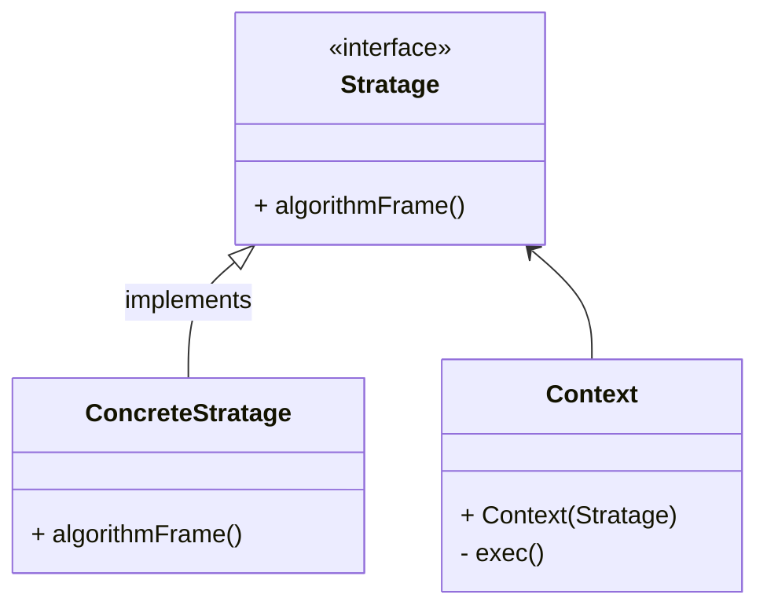

# 策略

定义一系列算法, 并将每个算法封装, 使它们能够相互替换

算法的变化不会影响使用算法的客户

通过对算法进行封装, 把使用算法的责任和算法实现分割, 委派给不同对象对算法进行管理


策略类之间可以互相切换

易于拓展, 增加策略实现就能增加功能, 不会对代码产生侵入, 符合开闭原则

避免使用if-else, 用策略做参数进行选择, 而不是值来做选择

## 缺点

客户端必须知道所欲的策略类并自行决定使用哪个策略类

可能产生很多策略类实现, 可以通过享元来减少对象数量

## 使用场景

-   系统需要动态地在几种算法中选择一种
-   一个类定义多种行为, 并且这些行为在类的操作种以多个条件语句出现, 可将分支移入策略类
-   系统中个算法彼此完全独立, 且要求对客户隐藏具体算法实现细节
-   系统要求使用算法的客户不应该知道其操作的数据, 策略模式隐藏算法相关的数据结构
-   多个类只区别在表现行为的不同, 可以用策略模式抽取共有部分, 在运行时动态选择具体要执行的行为

## 结构

-   抽象策略类
    -   Strategy
    -   给出所有的具体策略所需的接口
-   具体策略类
    -   Concrete Strategy
    -   实现了抽象策略定义的接口, 提供具体算法实现或行为
-   环境类
    -   Context
    -   持有一个策略类的引用, 最终给客户端调用



## JDK中的应用

Comparator

```java
System.out.println(Arrays.toString(numbers));
// BubbleSort是自己写的
BubbleSort.sort(numbers, Comparator.comparingInt(n -> n)); // 子类实现
System.out.println(Arrays.toString(numbers));
BubbleSort.sort(numbers, (n1, n2) -> n2 - n1);// 用Lambda产生新策略
```