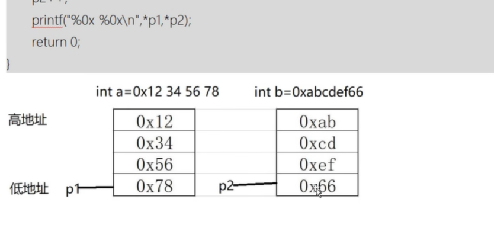

# 指针与内存

虚拟内存-操作系统做映射->物理内存

## 虚拟内存(4G)

32位平台下0x0000_0000~0xffff_ffff

我是64位的平台啦


每一个存储单元是一个字节

-   无论什么类型,都是用四个字节去编号的
-   多字节的变量,在内存中占用多个字节(连续储存),它的地址认为是最小的那个

## 内存分区

1.  堆(stock)

    -   在动态申请内存

2.  栈

    -   局部变量

3.  静态代码区

    -   未初始化的静态全局区

        静态变量,全局变量,没有初始化的

    -   初始的静态全局区

        静态变量,全局变量,有初始化的

4.  代码区

5.  文字常量区

    -   存放常量的

## 动态申请内存

```cpp
void *malloc(size_t size);
```

**功能**：在内存空间堆区中申请一段**size字节**大小的**连续存储空间。**

**参数**：size 为需要申请内存空间的大小，单位为Byte.

**返回值**：若申请成功，返回空间的首地址；

​				否则，返回NULL.

```cpp
void *calloc(size_t n, size_t size);
```

**功能**：在内存空间堆区中申请一段**n个size字节**大小的**连续存储空间**，总空间大小即为 n*size Bytes.

**参数**：n 为需要申请size字节大小的个数；

​			size为每个单元的字节大小。

**返回值**：申请成功，返回首地址

​				否则，返回NULL.

```cpp
void *realloc(void *_ptr, size_t size);
```

**功能**：**重置(re\*)**一段内存空间的大小，可使该内存空间**扩容或缩容。**

**参数**：_ptr 为需要重置内存空间的首地址；

​			size为重置后该内存空间的容量。

**返回值**：若重置成功时，

​								返回**可为**原内存空间的首地址，

​								**也可为**一段**新**的内存空间首地址；

​				失败时返回NULL。

### 区别：

***malloc()\***申请的内存空间默认不会被清空的

***calloc()\***默认是会被清空的，其默认值都为0值。

***realloc()\***函数其工作原理为：

​			若是将原内存空间进行缩容的话，realloc仅仅改变了内存空间的索引信息即可。

​			若是将原内存空间进行扩容的话，

​						（1）先是在原内存空间的后面进行探索寻找，看是否有满足要求的一段连续存储空间，

​												若是有则表示申请成功，直接返回原来内存空间首地址即可，

​												若是没有则在一段新的存储空间上进行申请，申请一段满足需求大小的连续存储空间，同时还会进行 ***将原空间上的值悉数拷贝到新内存空间的相应位置上来\*** 以及***主动释放掉原来内存空间\*** 等一系列操作；牛逼

（3）使用realloc函数申请失败的话，返回NULL；此时原内存空间仍有效。

# 定义指针

```
数据类型 * 指针名;
```

```C
int * p;
```

-   \*是修饰变量的,说明变量p是一个指针变量,变量名是p

### 野指针

指向的对象不确定的指针,如上面的p

这种需要马上给他一个确切的地址;

## 指针运算符

### & 取变量的地址

```C
int a=0x1234abcd;
int *p;//定义执政变量的时候*代表修饰,修饰p是个指针变量
p=&a;//a的地址赋值给了p,p指向了a
```

### * 取指针指向的值

```C
int num;
num = *p;//等价于num=a;
```

### 拓展

>   一行中定义多个指针变量,每一个指针变量前面都需要加*来修饰

```C
int *p0,*q0;//定义指针p0,q0
int *p1,q1;//定义指针p1和整形q1
```

### 实践

```C
#include<stdio.h>
int main(){
	int a=100,b=200;
	int *ap,*bp=&b;

	printf("ap=%p,bp=%p,*ap=%d,*bp=%d\n",ap,bp,*ap,*bp);
	//这句话,ap是野指针的话死活不打印
	//我怀疑可能是野指针ap的值是"程序结束符"
	//程序运行到这里就直接结束了
	//因为ap的地址指向0000_0000_0000_0001,很适合做程序结束符
	return 0;
}
```

#### 实验

-   猜测:在小熊猫的编译器(GCC10.3.0-64bit),野指针默认是结束符

	```C
	#include<stdio.h>
	int main() {
		int a = 100, b = 200;
		int *ap, *bp = &b;
		b = *ap; // 加上这一句,果然,连Hello World也不打印了,果然是结束符
		printf("Hello World\n");
		printf("ap=%p,bp=%p,*ap=%d,*bp=%d\n", ap, bp, *ap, *bp);
		return 0;
	}
	```

-   猜测:可以用十六进制直接显式地给指针赋值

    ```C
    #include<stdio.h>
    int main() {
    	int a = 100, b = 200;
    	int *ap, *bp = &b;

    	int *p = (int*)1;
    	printf("Hello\n");//止步于此
    	b = *p;
    	printf("World\n");

    	b = *ap;
    	printf("Hello World\n");
    	printf("ap=%p,bp=%p,*ap=%d,*bp=%d\n", ap, bp, *ap, *bp);
    	return 0;
    }
    ```

-   **但是\*p=(int\*)1;\*p=(int\*)2;\*p=(int\*)3;,都会结束qwq,我不理解,不要尝试去理解**

# 指针的分类

1.  字符指针

    只能存放字符型数据

    `char ch = 'A';char *p = &ch`

2.  某某指针

    只能存放某某型数据

    `A数据类型 变量名 = 变量值;A数据类型 *指针名 = &变量名;`

3.  函数指针

4.  结构体指针

5.  指针指针(二级指针)

6.  数组指针

7.  通用指针 void *

#### 注意:

```C
char ch = 'A';char *p = &ch;
printf("%lld,%lld\n",sizeof(ch),sizeof(p));//1,8
```

## 实践

```c
#include<stdio.h>
int main() {
	char ch = 'A';char *p = &ch;
	*p = 'B';
	printf("ch=%c\n",ch);//B

	char ch2='C';
	*p=ch2;
	printf("ch=%c\n",ch);//C

	p=&ch2;
	*p='B';
	printf("ch=%c,ch2=%c\n",ch,ch2);//C
	return 0;
}
```

## 类型转化



-   例如char->int,一个字节转四个字节,**char的地址作为低地址,再往上加三个高地址**
-   例如int->char,四个字节转一个字节,**int低地址作为char的地址**

```C
#include<stdio.h>
//指针的类型转换
int main() {
	int a=0xffffff62;
	char c = 'A';

	int *p1 =(int*) &c;
	printf("%c,%p,%d\n",c,p1,*p1);
	//A,00000017047ff833,25665
	// ,				,应该是前面的三个字节不干净

	char *p2 =(char*) &a;
	printf("%d,%p,%c\n",a,p2,*p2);
	//-158,0000007a8e5ffc9c,b
	//	,				,很合理

	return 0;
}
```

## 指针运算

```C
int a=10;
int *p1=&a;
printf("%p\n",p1);
p1++;
printf("%p\n",p1);
char c='A';
char *p2=&c;
printf("%p\n",p2);
p2++;
printf("%p\n",p2);
```
-   法则:

    -   p++=>p=p+sizeof(p的数据类型)
    -   p+1=>p+sizeof(p的数据类型)

*p++->(\*p)++

\*(p++)->p++,\*P

## 数组指针

-   数组中每一个元素都有地址编号
-   是连续开辟的空间

### 数组元素的引用方法

```C
#include<stdio.h>

void test1(void);

//Point and Array
void test2(void);
void test3(void);
void test4(void);//存在疑点
void test5(void);

int main() {
	test5();
	return 0;
}
//指针的类型转换
void test1(void) {
	for (int i = 0; i < 10; i++) {
		int a = 10;
		int *p1 = &a;
		printf("%p\n", p1);
		p1++;
		printf("%p\n", p1);
		char c = 'A';
		char *p2 = &c;
		printf("%p\n", p2);
		p2++;

		printf("%p\n", p2);
		printf("=========================\n");
	}

}

void test2(void) {
	static int a[5] = {1, 2, 3, 4, 5};
	//数组的名字,就是数组的首地址,即第0个元素的地址
	int *p1 = &a[0];
	int *p2 = a;
	//p1和p2等价

	p1[1] = 100;
	p2[2] = 100;
	//这也完全等价

	//p1/p2和a有所不同
	printf(" *(a+3)=%d\n", *a);//这个可
	//a是常量,p是变量

	//没有a++,a--之流
	printf(" *(a+3)=%d\n", *(a + 3)); //常量也可以加减,正常,++--不行罢了
	//a也不能再一次被赋值
	static int b[10] = {9, 8, 7, 6, 5, 4, 3, 2, 1, 0};
	//b = a;
	//b = &a;
	//b = *a;
	//*b = a;
	//*b = &a;
	*b = *a;//????居然行?不过好像也对

}

void test3(void) {

	int b = 12;
	int *p3 = &b;

	printf("p3=\t%p\n", p3);
	printf("(p3+1)=\t%p\n", (p3 + 1));
	printf("(p3++)=\t%p\n", (++p3));
	printf("b=%d\n", b);

	for (int i = 0; i < 50; i++)putchar('=');
	putchar('\n');

	int *p4 = &b;
	p4[0] = 13;
	//这也行?!

	printf("*p4=%d\n", *p4);
	printf("p4[0]=%d\n", p4[0]);
	printf("b=%d\n", b); //b的值被成功改变

	p4[1] = 230; //这个不行,卡住了
	printf("p4[1]=%d\n", p4[1]);

	//p++能改,随便改
	//p[1]会卡住
	//p[0]和p完全等价

	for (int i = 0; i < 50; i++)putchar('=');
	putchar('\n');

	int c = 10;
	int *p5 = &c;
	printf("p5=%p\n", p5);
	printf("*p5=%d\n", *p5);
	printf("p5[0]=%d\n", p5[0]);
	p5++;
	printf("p5=%p\n", p5);
	printf("*p5=%d\n", *p5);
	printf("p5[0]=%d\n", p5[0]);
	*p5 = 400;
	printf("p5=%p\n", p5);
	printf("*p5=%d\n", *p5);
	printf("p5[0]=%d\n", p5[0]);

}

//奇怪,非常的奇怪
void test4() {
	int a = 18;
	int *p0 = &a;

	//这两步正常操作
	printf("p0=%p\n", p0);
	printf("p0[0]=%d\n", p0[0]);

	//这里开始发癫
	p0[1] = 230;
	//在这一步,不知为何p1的值改变了,
	//难道在C语言的底层,
	//每一个指针变量的值都会在指针变量的值变化之时变化,
	//为了让b能又一个好地址存?

	printf("p0[1]=%d\n", p0[1]);

	for (int i = 0; i < 50; i++)putchar('=');
	putchar('\n');

	int b = 10;
	int *p1 = &b;
	printf("p1=%p\n", p1);

}

//
void test5() {
	int a = 10;
	int b = 20;
	int *ap = &a;
	int *bp = &b;
	printf("a = %d,b = %d\n", a, b);
	printf("ap = %p,bp = %p\n", ap, bp);
	//ap[1]=40;没有改变bp的值,bp被改变了
	//ap++;*ap=40;有改变bp的值,bp被改变了
	ap--;
	*ap = 40;//可以给b赋值
	printf("a = %d,b = %d\n", a, b);
	printf("ap = %p,bp = %p\n", ap, bp);
	//bp++;
	//*bp = -10;
	bp[1]=-10;
	printf("a = %d,b = %d\n", a, b);
	printf("ap = %p,bp = %p\n", ap, bp);

	//先创建的变量可以用--改变后创建的变量的值
	//后创建的变量可以用++改变先创建的变量的值
	//后创建的变量可以用p[n]改变先创建的变量的值
	//就很离谱
	//这应该是GCC编译器的缘故,它的虚拟内存是连续的,不同变量是由高位往低位存的
}
```

# 指针的运算

-   **不同类型之间计算需要先强制类型转换**

指针可以加一个整数(加一个负数)

两个相同类型的指针可以做比较运算

两个相同类型的指针可以做减法

两个相同类型的指针可以相互赋值

## 指针加整数(自增,自减)

```C
int a=10;
int *p1=&a;
printf("%p\n",p1);
p1++;
printf("%p\n",p1);
char c='A';
char *p2=&c;
printf("%p\n",p2);
p2++;
printf("%p\n",p2);
```

-   法则:

    -   p++=>p=p+sizeof(p的数据类型)
    -   p+1=>p+sizeof(p的数据类型)

*p++->(\*p)++

\*(p++)->p++,\*P

## 比较运算

1.  两个相同类型的指针
2.  指向同一个数组元素
3.  指向前面元素的指针小于指向后面元素的指针

## 指针相减

-   返回相隔的类型数量

## 赋值

我想着整形数组可以把数组名赋值给字符串,所以这个是属于相同的类型

# 数组指针

```C
/*PointArray*/
#include<stdio.h>
void test1() {
	int array[10] = {1, 3, 5, 7, 9, 11, 23, 31, 45, 12};
	int *pArray[10];
	printf("sizeof(pArray)=%d\n", sizeof(pArray));

	int a  = 100;
	pArray[0] = &a;
	printf("&a=%p\n", &a);
	pArray[1] = array;
	printf("pArray[0]=%p\n", pArray[0]);

	//*p和p[0]是完全等价的,都是a的地址
	//*(pArray+2)和pArray[2]是完全等价的,都是地址

	printf("*pArray[0]=%d\n", *pArray[0]);
	printf("*(pArray[0])=%d\n", *(pArray[0]));
	printf("(*pArray)[0]=%d\n", (*pArray)[0]);
	for (int i = 1; i < 10; i++) {
		pArray[i] = array + i;
	}
	for (int i = 0; i < 10; i++) {
		printf("%d ", *pArray[i]);
	}
}
void test2(){
	int a;
	int *p[10]={&a};

    int *p2[10];
	p2[0] = &a;
	//等价

    printf("%p,%p\n",&a,p[0]);

}
```

## 字符串指针

```C
/*字符串数组*/
void test2() {
	//加上const,因为字符串是常量
	const char *names[5] = {"Mike", "Amy", "Jhon", "Mickel", "Dog"};
	//实际上数组里的五个值指向五个首字母
	for (int i = 0; i < 5; i++) {
		//printf打印字符串的时候只要给到字符串的首地址就可以了
		printf("%s\n", names[i]);
	}

	char i = 'C';
	names[0] = &i;
	for (int i = 0; i < 5; i++) {
		printf("%s\n", names[i]);
	}
}

```

# 指针的指针

-   二级指针
-   三级指针
-   ............

```C
/*PointPoint*/
#include<stdio.h>
void test1() {
	int a = 10;
	int *p = &a;
	int * *pP = &p;

	printf("a=%d,&a=%p\n",a,&a);
	printf("p=%p,&p=%p,*p=%d\n",p,&p,*p);
	printf("pP=%p,*pP=%p,**pP=%d\n",pP,*pP,**pP);
}
```

# 字符串与指针

## 定义与引用

```C
/*StringPoint*/
/*PointPoint*/
#include<stdio.h>
#include<string.h>
void test1() {
	char name[] = "Mike";
	//字符串的指针是第一个字母的地址
	//Mike存在文字常量区

	char *pName = name;//创建和声明
	printf("%s\n", name);
	printf("%s\n", pName);

	int i;
	for (i = 0; i < strlen(name); i++) {
		putchar(name[i]);
	}
	printf("\n%d\n", i); //4

	for (i = 0; i < strlen(name); i++) {
		putchar(pName[i]);
	}
	printf("\n%d\n", i); //4

	while (*pName != '\0') {
		putchar(*pName++);
		//putchar(*(pName++));等价
	}
	printf("\n%d\n", *pName == '\0'); //1

}
```

## 字符串的可修改性

```C
/*字符串的可修改性*/
void test2() {
	// 1.存放数组中的字符串(没有被const修饰)
	char str[100] = "I love C!\0!";
	printf("str=%s\n",str);
	*str = 'X';
	str[1] = '!';
	printf("str=%s\n",str);

	// 1.存放在文字常量区的字符串不能被修改
	char *pStr = "I love C~";//[Warning] ISO C++ forbids converting a string constant to 'char*' [-Wwrite-strings]
	// pStr指向文字常量区的"I love C~"的首字母I的地址 
	printf("*pStr=%s\n",*pStr);
	pStr[0] = 'X';//不成
	printf("pStr=%p\n",pStr);	

	//改成这样为佳:
	const char *pStr1 = "I love C~";//就可以显式地提示不能做修改了

	//但是
	const char *pStr2 = "I love C~";
	pStr2 = "你好啊";
	//这是可以的,没有改变字符串常量,而是让pSter2指向了另一个字符串常量

	// 3.堆区的值是可以修改的
	test3();
}

```

### 堆区里的字符串可以被修改

```C
// 3.堆区的值是可以修改的
#include<stdlib.h>
void test3() {
	char* str;
	str = (char*) malloc(10);//动态申请十个字节的堆内存
	printf("str = %s\n",str);
	strcpy(str,"U! love C!");//字符常量区里的字符串存入堆区
	printf("str = %s\n",str);
	str[1] = '~'; //改变
	*str = 'I';//你可不要直接赋字符
	//str = "你好";警告
	printf("str = %s\n",str);
}
```

## 字符串三种存储形式及其初始化

1.  字符数组存字符串

    ```C
    void test4() {
    	char str[] = "I love C!";
    	printf("str = %s\n",str);
    	strcpy(str,"I hate PHP");//对
    	//str = "hi";错
    	//*str = "hello";错
    	printf("str = %s\n",str);
    	scanf("%s",str);//可
    	printf("str = %s\n",str);
    }
    ```

2.  指针指向文字常量区

    ```C
    void test4() {
    	const char *str = "I love C!";
    	printf("str = %s\n",str);
    	//strcpy(str,"I hate PHP");,这里传入的str是地址,改的也是地址处的字符串,不可以!
    	str = "hi";
        //*str = "hello";错
    	printf("str = %s\n",str);
    	scanf("%s",str);//不对,程序终止
    	printf("str = %s\n",str);
    }
    ```

3.  指针指向堆区

    ```C
    void test4() {
    	char* str;
    	str = (char*) malloc(10);//动态申请十个字节的堆内存
    	scanf("%s",str);
    	printf("str = %s\n",str);
        strcpy(str,"U! love C!");//字符常量区里的字符串存入堆区
        printf("str = %s\n",str);
    }
    ```

# 数组指针

