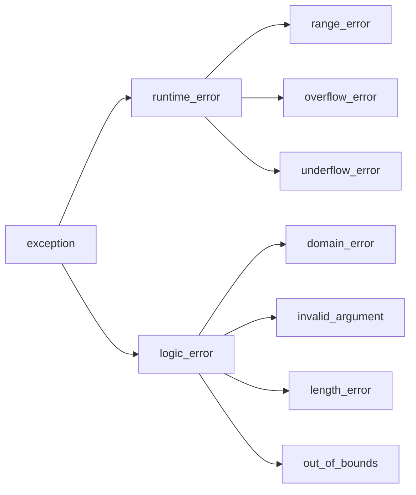

# 异常

##基本使用

```java
#include <exception>
#include <iostream>

class DividedByZeroException : public std::exception {
public:
    static const char msg[];
    char * newMsg = nullptr;
	DividedByZeroException(char * msg=nullptr):newMsg(msg){}
    [[nodiscard]] const char *what() const _GLIBCXX_TXN_SAFE_DYN _GLIBCXX_NOTHROW override {
        return newMsg==nullptr?msg:newMsg;
    }
};

const char DividedByZeroException::msg[] = "DividedByZeroException";

void throwException() {
    throw DividedByZeroException();
}

int main() {
    int a;
    int b;
    while (true) {
        std::cin >> a >> b;
        try {
            if (b == 0) {
                throwException();
            }
            std::cout << a / b << std::endl;
        } catch (DividedByZeroException &e) {
            std::cerr << "/0 " << e.what() << std::endl;
        } catch (std::exception &e) {
            std::cerr << "exception " << e.what() << std::endl;
        }
    }
}
```

可以抛出任意类型

```cpp
#include <iostream>

int main() {
    int a;
    int arr[1] = {2};
    while (true) {
        std::cin >> a;
        try {
            if (a >= 1) {
                throw 404; // 可以, 但是会被警告
            }
            arr[a] -= 2;
            std::cout << arr[a]/* a / b*/ << std::endl;
        } catch (int &e) {
            std::cerr << "error code: " << e << std::endl;
        }
    }
}
```

## 异常, 构造与析构

不会析构

```java
#include <iostream>

class MyClass {
public:
    MyClass() {
        std::cout << "MyClass" << std::endl;
    }

    virtual ~MyClass() {
        std::cout << "~MyClass" << std::endl;
    }
};

int main() {
    MyClass m;
    throw 1;
    std::cout << "Continue" << std::endl;
//    try {
//        throw 1;
//    } catch (int &e) {
//        std::cerr << "error code: " << e << std::endl;
//    }
}
```

会析构

```shell
#include <iostream>

class MyClass {
public:
    MyClass() {
        std::cout << "MyClass" << std::endl;
    }

    virtual ~MyClass() {
        std::cout << "~MyClass" << std::endl;
    }
};

int main() {
    MyClass m;
    try {
        throw 1;
    } catch (int &e) {
        std::cerr << "error code: " << e << std::endl;
    }
}
```

## 异常关系树




## 异常继承

子类异常可以被父类异常匹配捕获, 顺序是从上到下优先匹配

奇妙↓

```cpp
int main() {
    try {
        int a = 1;
        throw a;
    } catch (const int &e) {
        // 此处解决
        std::cerr << "error const code: " << e << std::endl; 
    } catch (int &e) {
        std::cerr << "error code: " << e << std::endl;
    }
}
```

```cpp
int main() {
    try {
        const int a = 1;
        throw a;
    } catch (int &e) {
        // 此处解决
        std::cerr << "error code: " << e << std::endl;
    } catch (const int &e) {
        std::cerr << "error const code: " << e << std::endl;
    }
}
```

