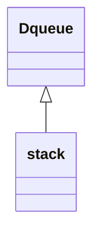
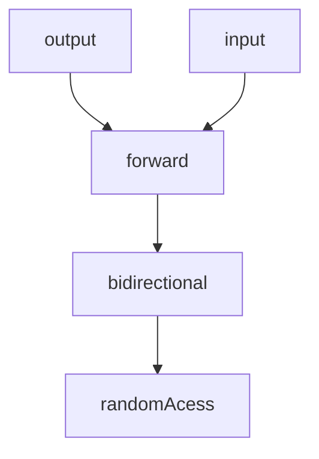

# C++标准模板库

STL是泛型程序设计的一个范例

-   容器 container
-   适配器 Adapter
-   迭代器 iterator
-   算法 algorithms
-   函数对象 function object

## Container

-   vector
    -   有序
-   deque
    -   双端队列
    -   有序
-   list
    -   双向链表
    -   有序


-   set
    -   hash_set
    -   multimap 多重集合
    -   无序
-   map
    -   hash_map
    -   multimap 多重映射
    -   无序

### 运算符


### iterator

看作指向对象的指针

```cpp
container#begin() ;// 指向容器头的迭代器
container#end() ;// 指向容器尾的下一个(不存在)的迭代器
```

```cpp
T operator *(); // 被重载的运算符方法
```


### 顺序容器

last指size的最后

end指capacity的最后


#### 增

```cpp
push_front(T element); // queue
push_back(T element); // 在末尾加入元素
insert(iterator<T> position, T value); // 在中间插入数据
```

#### 删

```cpp
pop_back();
erase(iterator<T> position); // 删除指定位置
erase(iterator<T> first, iterator<T> last); // 删除某段位置的元素
clear(); 
```

#### 查

```cpp
front();
back();
begin(); // 指向容器头的迭代器
end();	// 指向容器尾的下一个(不存在)的迭代器
front(); // 返回值
back() ; // 返回值
下标+[];
at(index) ; // 使用下目标返回
```

#### 改

```cpp
assign(beg,end) //将[beg; end)区间中的数据赋值给c。
assign(index,element) //将n个elem的拷贝赋值给c
```


#### 判断

```cpp
empty(); // 是否为空
```


#### vector

用于容纳不定长, **采用2倍扩容** 创建时0, 然后增加数据1->2->4.....

有序, 连续, 快速随机访问(通过下标直接访问)

-   构造器

    ```cpp
    vector<T> v;
    vector<T> v(int size=0);
    vector<T> v(int size,T value);
    vector<T> v(vector<T> b);
    vector<T> v(v1.begin(),v1.end()); 
    ```

    ```cpp
    int main() {
        vector<MyClass> v(12); // 会构造出12个对象, 指针就默认NULL
        cout << v.size() << endl; // 12
        cout << v.capacity() << endl; // 12
        vector<MyClass *> v1(12);
        cout << v1[2] << endl; // 0
    }
    ```

-   遍历

    ```cpp
    int main() {
        vector<MyClass *> v(12);
        for (auto item = v.begin(); item != v.end(); ++item) {
            (*item)->show();
        }
    }
    ```


#### deque

双端队列, 允许插队, 允许从头入, 从尾出

底层采用数组+链表, 小数组存储部分数据, 小数组之间用链表连接

```cpp
push_front();
pup_back();
```


stl的\<algorithm\>

```cpp
copy(values.begin(), values.end(), output); // 左闭右开
```


```cpp
deque<double> values;    //声明一个双精度型deque序列容器
ostream_iterator<double> output(cout, " ");
values.push_front(2.2);    //应用函数push_front在deque容器开头插入元素
values.push_front(3.5);
values.push_back(1.1);    //应用函数push_back在deque容器结尾插入元素
cout << "values contains: ";
for (int i = 0; i < values.size(); ++i) {
    cout << values[i] << ' ';
}

values.pop_front();    // 应用函数pop_front从deque容器中删除第一个元素
cout << "\nAfter pop_front values contains: ";
copy(values.begin(), values.end(), output); // 左闭右开
values[1] = 5.4;    // 应用操作符[]来重新赋值
cout << "\nAfter values[ 1 ] = 5.4 values contains: ";
copy(values.begin(), values.end(), output);
cout << endl;
```

#### 列表

双向链表, 离散存储

没有哨兵

```cpp
List.erase(itor);  List.remove(20);  
List.remove_if(比较函数);
List.insert(itor,40);

```

**融合两个容器**

```cpp
void splice (iterator position, list& x);
void splice (iterator position, list& x, iterator i);
void splice (iterator position, list& x, iterator first, iterator last);  // target src start end
```


```java
list<int> my_list1, my_list2;
list<int>::iterator it;
// set some initial values:
for (int i = 1; i <= 4; i++) {
    my_list1.push_back(i);
        //  my_list1: 1 2 3 4
}
for (int i = 1; i <= 3; i++) {
    my_list2.push_back(i * 10);
        //  my_list2: 10 20 30
}
it = my_list1.begin();
++it;
    // points to 2
my_list1.splice(it, my_list2);
    // my_list1: 1 10 20 30 2 3 4
    // my_list2 (empty)
    // "it" still points to 2 (the 5th element)
my_list2.splice(my_list2.begin(), my_list1, it);
    //  my_list1: 1 10 20 30 3 4
    //  my_list2: 2
    // "it" is now invalid. 失效了, 指向的位置不再有效
it = my_list1.begin();
advance(it, 3);
    // "it" points now to 30
my_list1.splice(my_list1.begin(), my_list1, it, my_list1.end());
    //  my_list1: 30 3 4 1 10 20
```

### 关联容器

-   set
-   multiset
    -   **可包含多个数值相同的元素**
-   map
-   multimap

#### multiset

```cpp
const int size = 16;
int a[size] = {17, 11, 29, 89, 73, 53, 61, 37, 41, 29, 3, 47, 31, 59, 5, 2};
INTMS intMultiset(a, a + size);    //用a来初始化INTMS容器实例
// typedef multiset<int> INTMS

cout << "这里原来有" << intMultiset.count(17) << "个数值17" << endl;
//查找有几个关键字17

intMultiset.insert(17);                   //插入一个重复的数17
cout << "插入后这里有" << intMultiset.count(17) << "个数值17" << endl;
INTMS::const_iterator result; //const_iterator使程序可读INTMS的元素
//但不让程序修改它的元素，result为INTMS的迭代子
result = intMultiset.find(18);
//找到则返回所在位置，设找到返回与调end()返回的同样值
if (result == intMultiset.end()) {
    cout << "没找到值18" << endl;
} else {
    cout << "找到值18" << endl;
}

ostream_iterator<int> output(cout, " ");
//整型输出迭代器output，可通过cout输出一个用空格分隔的整数
cout << "intMultiset容器中有" << endl;
copy(intMultiset.begin(), intMultiset.end(), output); //输出容器中全部元素
cout << endl;
```


#### cmp

法一定义新类cmp, 重载括号表明比较方式

```cpp
#include<iostream>
#include<set>

using namespace std;
typedef struct {
    int num;
    char character;
} Object;

struct cmp {
    bool operator()(const Object &a, const Object &b) const {
        return a.character < b.character;
    }
};

int main() {
    set<Object, cmp> element;
    Object a, b, c, d;
    a.num = 1;
    a.character = 'b';
    b.num = 2;
    b.character = 'c';
    c.num = 4;
    c.character = 'd';
    d.num = 3;
    d.character = 'a';
    element.insert(a);
    element.insert(b);
    element.insert(c);
    element.insert(d);
    set<Object, cmp>::iterator it;
    for (it = element.begin(); it != element.end(); it++) {
        cout << (*it).num << " ";
    }
    cout << endl;
    for (it = element.begin(); it != element.end(); it++) {
        cout << (*it).character << " ";
    }
}
```

法二, 在类中重载小于号运算符


#### map

```cpp
map<int, string> intStrMap;
intStrMap.insert(make_pair(1, "你好"));
intStrMap.insert(make_pair(2, "在吗"));
intStrMap.insert(make_pair(3, "人呢"));
intStrMap.insert(make_pair(3, "是吗"));
// 或者：
pair<int,string> p1(1, "is");
intStrMap.insert(p1);
// 或者：
intStrMap.insert(map<int,string>::value_type (1,"is"));
// 或者：
intStrMap[1]="is";

intStrMap.insert(make_pair(4, "呵呵"));
for (const auto &item: intStrMap) {
    cout << item.first << "=" << item.second << ", ";
}
cout << endl;
```


### multimap

```cpp
m = m_map.find(s);
multimap<int, string>::iterator it = m_map.equal_range(2).first;
```

## 容器适配器

**适配器是一种接口类**

-   为已有的类提供新的接口。
-   目的是简化、约束、使之安全、隐藏或者改变被修改类提供的服务集合。

**三种类型的适配器：**

-   容器适配器

    -   用来扩展7种基本容器，它们和顺序容器相结合构成栈、队列和优先队列容器

    -   stack 严格先进后出

    -   queue 严格先进先出

    -   piority_queue 优先级队列

        基本数据类型如int, 按照数值大小排序

        对于其他类型, 一定要实现重载运算符, 否则编译报错

        ```cpp
        #include <iostream>
        #include <queue>
        
        using namespace std;
        
        struct Node {
            int x, y;
        
            explicit Node(int a = 0, int b = 0) : x(a), y(b) {}
        };
        
        struct cmp {
            bool operator()(Node a, Node b) {
                return a.x == b.x ? a.y > b.y : a.x > b.x;
            }
        };
        
        int main() {
            priority_queue<Node, vector<Node>, cmp> q;
            for (int i = 0; i < 10; ++i) {
                q.emplace(rand(), rand());
            }
            while (!q.empty()) {
                cout << q.top().x << " " << q.top().y << endl;
                q.pop();
            }
            return EXIT_SUCCESS;
        }
        ```

-   迭代器适配器
-   函数对象适配器。

**容器适配器是用来扩展**7种基本容器的

**栈容器**

-   使用适配器与一种基础容器相结合来实现




## Iterator

可以看作面向对象形式的指针

例如对于链表来说, 空间上不连续, 逻辑上连续

使用迭代器, 来实现对外界"类容器指针"的封装

每种容器必须拥有自己的迭代器

### 分类

-   输入迭代器 InputIterator
    -   可以用来从序列中读取数据
-   输出迭代器 OutputIterator
    -   允许向序列中写入数据
-   前向迭代器 ForwardIterator
    -   既是输入迭代器又是输出迭代器，并且可以对序列进行单向的遍历
-   双向迭代器 Bidirectional Iterator
    -   与前向迭代器相似，但是在两个方向上都可以对数据遍历
-   随机访问迭代器 RandomAccessIterator
    -   也是双向迭代器，但能够在序列中的任意两个位置之间进行跳转。




### find()

是STL中的find算法

```cpp
template<typename InputIterator, typename T>
InputIterator find(InputIterator first, 
                   InputIterator last,
                   const T value) {
    for (; first != last; ++first) {
        if (value == *first)
            return first;
    }
    return last;
}
```

泛型算法不直接访问容器的元素，与容器无关。

元素的全部访问和遍历都通过迭代器实现。

并不需要预知容器类型。

```java
#include<algorithm>
#include<iostream>
using namespace std;
int main(){
    int search_value,ia[9]={47,29,37,23,11,7,5,31,41};
    cout<<"请输入需搜索的数："<<endl;
    cin>>search_value;
    int* presult=find(&ia[0],&ia[9],search_value);
    cout<<"数值"<<search_value<<(presult==&ia[9] ?"不存在":"存在")<<endl;
    return 0;
}
```


# 例

用istream iterator从标准输入读入一个整数集到vector中。

```cpp
istream_iterator<int> input(cin); //输入流迭代器
istream_iterator<int> end_of_stream;
vector<int> vec;
copy(input, end_of_stream, inserter(vec, vec.begin()));
//输入^Z结束流
sort(vec.begin(), vec.end(), greater<int>()); //降序排列
/*
 *   template<typename _Tp>
 *   struct greater : public binary_function<_Tp, _Tp, bool>{
 *   _GLIBCXX14_CONSTEXPR
 *           bool operator()(const _Tp& __x, const _Tp& __y) const {
 *              return __x > __y;
 *           }
 *   };
 * */
ostream_iterator<int> output(cout, " "); //输出流跌代器
unique_copy(vec.begin(), vec.end(), output);
```

