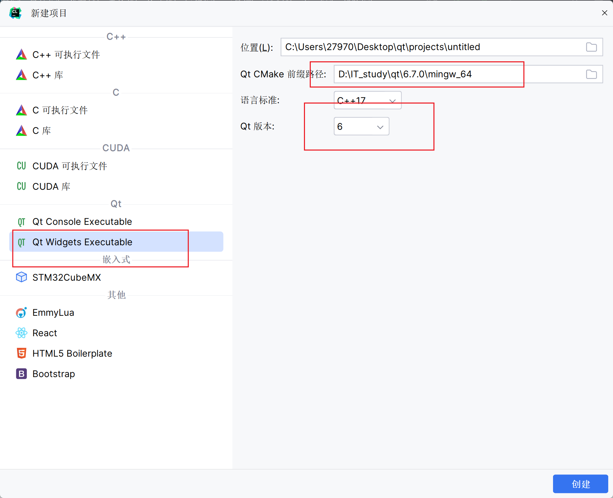
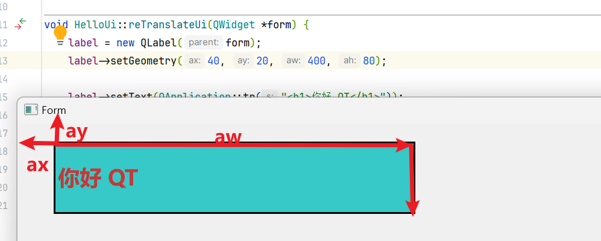
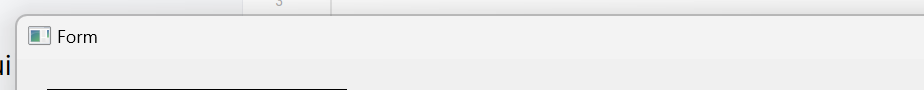

# Qt

## 介绍

>   跨平台的C++图形用户界面应用程序框架。

-   完全面向对象
-   容易扩展
-   允许组件编程

## 优点

-   跨平台，几乎支持所有的平台
-   接口简单，容易上手
-   一定程度上**简化了内存回收机制** 
-   开发效率高
-   很好的社区氛围，市场份额在缓慢上升
-   可进行嵌入式开发

## 应用

-   Linux桌面环境KDE
-   WPS Office(臃肿屎山?)
-   Skype网络电话
-   Goggle Earth 谷歌地图
-   VLC 多媒体播放器
-   VirtualBox


## 组件


-   按钮控件
-   对象树
-   坐标系统
-   信号和槽
-   带菜单栏窗口
-   资源文件
-   对话框
-   界面布局
-   常用控件
-   自定义控件
-   事件处理
-   定时器
-   Event事件分发器
-   事件过滤器
-   Qpainter绘图
-   绘图设备
-   Qfile文件读写


## 下载安装

清华Qt源下载安装包


```shell
installer.exe --mirror https://mirrors.tuna.tsinghua.edu.cn/qt
```

-   `installer.exe` 安装包名

### 使用Clion创建Qt项目




## 文档

[中文文档](https://qtguide.ustclug.org/)

[API](http://qt6.digitser.top/6.6/zh-CN/index.html)

## Hello Qt

```cpp
#include <QApplication>
#include <QLabel>

int main(int argc, char *argv[]) {
    QApplication application(argc, argv);
    QLabel label(
            QLabel::tr("Hello Qt!")
    ); 
    label.show();
    return QApplication::exec();
}
```

### QApplication

Qt 应用程序对象，是 Qt 图形界面**程序的入口**(类似main是c程序的入口)

```cpp
QApplication::exec();
```

 * exec() 函数会**循环**等待用户操作
 * 如果用户点击窗口的关闭按钮
 * 程序就会自动结束并返回一个值，默认是 0 。
 * 但一个Application可以有复数个窗口

### QLabel

标签控件窗口

 QLabel 就是简单地显示一小段文本，提示用户文本信息，

#### tr函数

tr 函数封装字符串

```cpp
QLabel::tr("Hello Qt!")
```

 * 所有的 Qt 类里面都有 tr 函数
 * 因为 tr 函数在所有 Qt 类的顶级基类 QObject 里定义了, 但它不是全局定义的
 * 所以上面使用了 QLabel 类的 tr 函数


 * tr 函数是代表**可翻译字符串**的意思
 * 因为 Qt 不仅跨平台的, 也是跨国跨语种的
 * 所以很注重多国语言的支持

## Hello Widget

Widget就是一个页面


-   **QWidget 是 Qt 各种窗口和控件的基类**
-   是一个功能丰富的**窗口类**
-   继承它来构造自定义的主界面。
-   QtWidgets 是 Qt 的一个大模块
-   有很多窗口和控件类继承QWidget


在编写Qt程序时, 不采用**h文件继承Qt类, cpp文件实现Qt方法, 主函数调用自定义Qt实现类的规范**, 而在Main函数所在文件里一通实现的话, 就要在主函数文件的末尾加上`#include "主函数所在文件名.moc"`

见后文

### HelloWidget.h

从 QWidget 类派生一个窗口作为主界面，在主界面里面显示一个 QLabel 控件。

```cpp
#include <QWidget>
#include <QLabel>

class HelloWidget : public QWidget {
Q_OBJECT

public:
    explicit HelloWidget(QWidget *parent = nullptr);

    ~HelloWidget() override;

    //label
    QLabel *m_labelInfo;
};
```

#### Q_OBJECT 宏

这个宏声明了 Qt 元对象系统必需的函数和成员变量


之后我们会用 moc 工具生成元对象系统的实体函数代码


### HelloWidget.cpp

```cpp
#include "HelloWidget.h"
```


```cpp
HelloWidget::HelloWidget(QWidget *parent) : QWidget(parent) {
    int width = 850;
    resize(width * 16 / 9, width);
    m_labelInfo = new QLabel(
        tr("<h1>Hello Widget!</h1>"),  // `tr`采用的是本类的父类的`tr`
        this // 指定本窗口为 QLabel 对象的父窗口
    );
    m_labelInfo->setGeometry(10, 10, 200, 40);

}
```

QLabel 会自动解析 HTML 标记, 有多强大? 未知, 至少不能解析按钮

`setGeometry`

-   设置 QLabel 显示的矩形区域

-   显示的矩形区域左上角坐标是:
    -   距离左边框 10 像素，
    -   距离上边缘 10 像素（不计窗口标题栏）
    
-   标签控件大小
    -   宽度 200 像素
    -   高度 40 像素
    
    
    
-   居中

    ```cpp
    label->setAlignment(Qt::AlignCenter);
    label->setText(QApplication::tr("<h1>你好 QT</h1>"));
    ```

    


```cpp
HelloWidget::~HelloWidget() {
    delete m_labelInfo;
    m_labelInfo = nullptr;
}
```


这里看不到 Qt 元对象系统的实际函数代码，因为还没有生成

以后需要用 **moc 工具**生成相应代码，这个 HelloWidget 类的代码才会完整

### main.cpp

```cpp
#include <QApplication>
#include "widget/HelloWedget.h"

int main(int argc, char *argv[]) {
    QApplication application(argc, argv);
    HelloWidget widget;
    widget.show();
    return QApplication::exec();
}
```

show 函数是在 HelloWidget 父类里实现的

### main.moc

在编写Qt程序时, 不采用**h文件继承Qt类, cpp文件实现Qt方法, 主函数调用自定义Qt实现类的规范**, 而在Main函数所在文件里一通实现的话, 就要在主函数文件的末尾加上`#include "主函数所在文件名.moc"`

```cpp
#include <QApplication>
#include <QWidget>
#include <QLabel>
class HelloWidget : public QWidget {
Q_OBJECT

public:
    explicit HelloWidget(QWidget *parent = 0);

    ~HelloWidget() override;

    //label
    QLabel *m_labelInfo;
};
HelloWidget::HelloWidget(QWidget *parent) : QWidget(parent) {
    int width = 850;
    resize(width * 16 / 9, width);
    m_labelInfo = new QLabel(tr("<h1>Hello Widget!</h1>"), this);
    m_labelInfo->setGeometry(10, 10, 200, 40);
}

HelloWidget::~HelloWidget() {
    delete m_labelInfo;
    m_labelInfo = nullptr;
}
int main(int argc, char *argv[]) {
    QApplication application(argc, argv);
    HelloWidget widget;
    widget.show();
    return QApplication::exec();
}
innclude "main.moc"
```

### 元对象系统(未尝试)

元对象系统是 Qt 专门为 C++ 做的扩展功能，用于支持非常强大的信号/槽机制、运行时类型定义、动态属性系统等

1.  打开 Qt 命令行，进入代码所在文件夹：

    ```shell
    cd /d D:\QtProjects\ch02\hellowidget
    ```

2.  使用 moc 工具生成 HelloWidget 类的元对象系统代码文件 moc_hellowidget.cpp ：

    ```shell
    moc hellowidget.h -o moc_hellowidget.cpp
    ```

    moc 工具会

    -   搜索头文件 hellowidget.h 里面所有的 Q_OBJECT 宏
    -   生成相应的元对象系统实际源代码
    -   输出保存为 moc_hellowidget.cpp 文件。

    加上刚才手动编写的 hellowidget.cpp 和 main.cpp，我们总共要编译三个 cpp 源码文件。

3.  编译三个源代码文件：

    注意Qt版本和Cpp编译器版本的对应

    ```shell
    g++ -c moc_hellowidget.cpp -I"C:\Qt\Qt5.4.0\5.4\mingw491_32\include" -o moc_hellowidget.o
    ```

    ```shell
    g++ -c hellowidget.cpp -I"C:\Qt\Qt5.4.0\5.4\mingw491_32\include" -o hellowidget.o
    ```

    ```shell
    g++ -c main.cpp -I"C:\Qt\Qt5.4.0\5.4\mingw491_32\include" -o main.o
    ```

    -   g++ 的 -c 选项是将代码只编译成目标文件 .o 而不链接
    -   -I 选项参数是添加 Qt 库的头文件路径
    -   -o 选项参数是指明输出的目标文件名字。

4.  链接到 Qt 库，生成可执行程序：

    ```cpp
    g++ moc_hellowidget.o hellowidget.o main.o -L"C:\Qt\Qt5.4.0\5.4\mingw491_32\lib" -lQt5Core -lQt5Gui -lQt5Widgets -o hellowidget
    ```

    g++ 会调用链接器，将 moc_hellowidget.o、hellowidget.o、main.o 这三个目标文件与 Qt 库链接生成可执行程序

    -L 选项参数指定了 Qt 链接库的路径

    选项 -lQt5Core、-lQt5Gui、-lQt5Widgets 是指链接到 Qt 图形界面的三个基本库

    分别对应动态库链接声明文件 libQt5Core.a、libQt5Gui.a、libQt5Widgets.a

     运行时会依赖动态库 Qt5Core.dll、Qt5Gui.dll、Qt5Widgets.dll。

    最后的 -o hellowidget 指定了生成的可执行程序名字

    在 Windows 系统里扩展名默认为 exe。

生成 hellowidget.exe 之后，就可以在 Qt 命令行里执行该程序

### 其他有关方法

设置窗口标题


```cpp
widget->setWindowTitle(QApplication::translate(
        "Form", 
    	"Form", // 这个是真正决定title的
    	nullptr
));
```




设置Label样式

```cpp
label->setStyleSheet(QApplication::tr(
        "color: rgb(202, 124,63 ); " // 设置字体颜色
        "background-color: rgb(124, 63, 202);" // 设置背景颜色
        "border:2px solid black" // 设置边框
));
```


