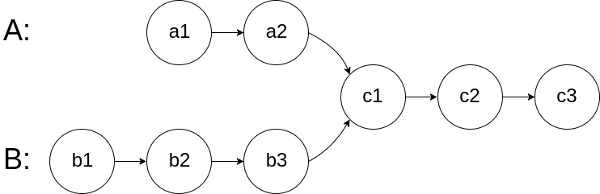
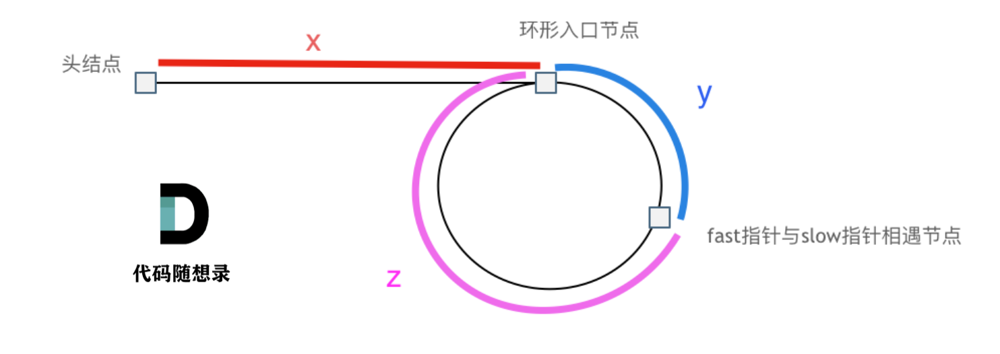

# 链表

-   单向链表
-   双向链表
-   循环链表

哨兵节点, 不存储数据, 指向head, 用于减少对头的判断

## 操作

### 定义

```C
typedef struct Node {
    char value;
    struct Node *next;
} Node;
typedef struct LinkList {
    struct Node *sentinel;
} LinkList;
```

### 初始化链表与节点

```C
void initNode(Node *node, char value) {
    node->value = value;
    node->next = NULL;
}


void initLinkList(LinkList *list, Node *sentinel) {
    list->sentinel = sentinel;
}
```

```C
int main() {
    LinkList list;
    Node sentinel;
    initNode(&sentinel, 0x7f);
    initLinkList(&list, &sentinel);
    show(&list);
}
```


### 删

```c
int removeByIndex(LinkList *list, int index) {
    Node *p = list->sentinel;
    if (p->next == NULL) {
        return -1;
    }
    while (index-- > 0) {
        p = p->next;
        if (p->next == NULL) {
            return -1;
        }
    }
    p->next = p->next->next;
    return 0;
}

```

```C
int removeByValue(LinkList *list, char value) {
    Node *p = list->sentinel;
    Node *pre = p;
    p = p->next;
    int count = 0;
    while (p != NULL) {
        if (p->value == value) {
            pre->next = p->next;
            count++;
        }
        pre = pre->next;
        if (pre == NULL) {
            break;
        }
        p = pre->next;
    }
    return count;
}
```

### 增

```C
int insert(LinkList *list, Node *node, int index) {
    Node *p = list->sentinel;
    while (index-- > 0) {
        p = p->next;
        if (p == NULL) {
            return -1;
        }
    }
    node->next = p->next;
    p->next = node;
    return 0;
}
```

```C
void add(LinkList *list, Node *node) {
    Node *p = list->sentinel;
    while (p->next != NULL) {
        p = p->next;
    }
    p->next = node;
}
```

### 查

```C
char get(LinkList *list, int index) {
    Node *p = list->sentinel;
    while (index-- > 0) {
        p = p->next;
        if (p == NULL) {
            return -1;
        }
    }
    return p->next->value;
}
```

### 遍历

```C
void show(LinkList *list) {
    Node *p = list->sentinel;
    while (p->next != NULL) {
        p = p->next;
        printf("%d->", p->value);
    }
    puts("NULL");
    fflush(stdout);
}
```

### 倒置

```C
void reverse(LinkList *list) {
    Node *p = list->sentinel;
    if (p == NULL) {
        return;
    }
    p = p->next;
    Node *pre = p;
    if (p == NULL) {
        return;
    }
    p = p->next;
    if (p == NULL) {
        return;
    }
    Node *post = p->next;
    pre->next = NULL;
    while (post != NULL) {
        p->next = pre;
        pre = p;
        p = post;
        post = post->next;
    }
    p->next = pre;
    list->sentinel->next = p;
}
```

## 删除链表的倒数第N个节点

双指针, pre和p相隔N

## 链表相交



求相交节点的位置, 保证不会循环

1.  求出两长度
2.  B比A长N, pB向前走N格
3.  pB和pA一边比较, 一边同时走


## 双向链表

### 增


## 环形链表

### 判断链表有环


快慢俩指针, 一个一轮走俩, 一个一轮走一, 终会在环内相遇, 如果快的那个都NULL了, 还没相遇, 就是无环了

```C
Node *hasCircle(LinkList *list) {
    Node *fast = list->headSentinel;
    Node *slow = fast;
    while (fast != NULL && fast != slow) {
        fast = fast->next;
        if (fast == NULL) {
            break;
        }
        fast = fast->next;
        if (fast == slow) {
            break;
        }
        slow = slow->next;
    }
    return fast;
}

```

### 找环的入口

1. 保证slow和fast的相遇一定是在slow的第一轮
   $$
   易得, slow和fast相遇时, 一定差且只差了一轮\\
   设在slow的第k轮相遇 \\
   S_{slow} = x+y+(k-1)(y+z) \\
   S_{fast} =x+y+k*(y+z)\\
   2\times S_{slow} = S_{fast} \\
   得: x+y + (k-2)(y+z)= 0;\\
   x+y = (2-k)(y+z)\\
   又x+y>0,k>0,故 2-k>0, 即k=1 \\
   即 x+y = y+z;\\
   x = z;
   $$
   

   

2. 从头结点出发一个指针

3. 从相遇节点 也出发一个指针，这两个指针每次只走一个节点

4. 当这两个指针相遇的时候就是 环形入口的节点 

