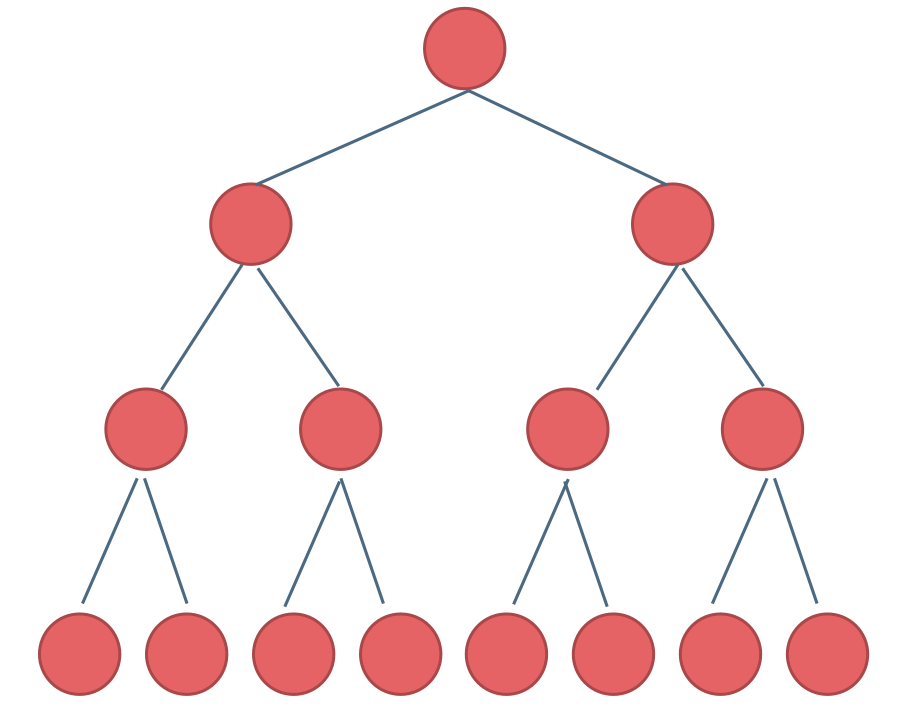
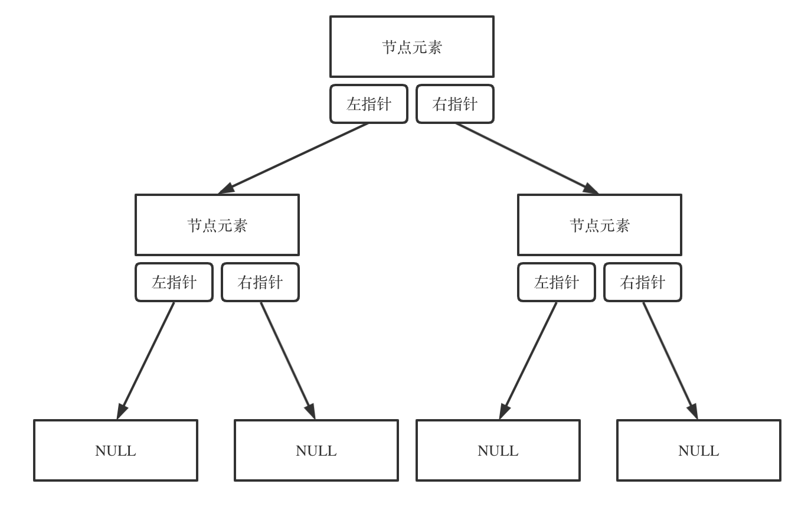
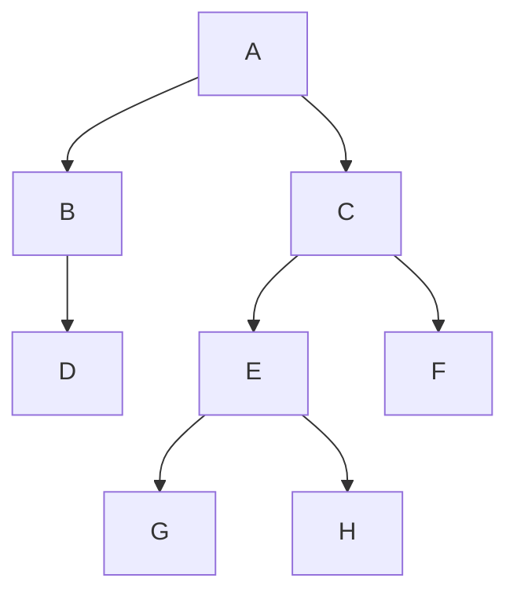
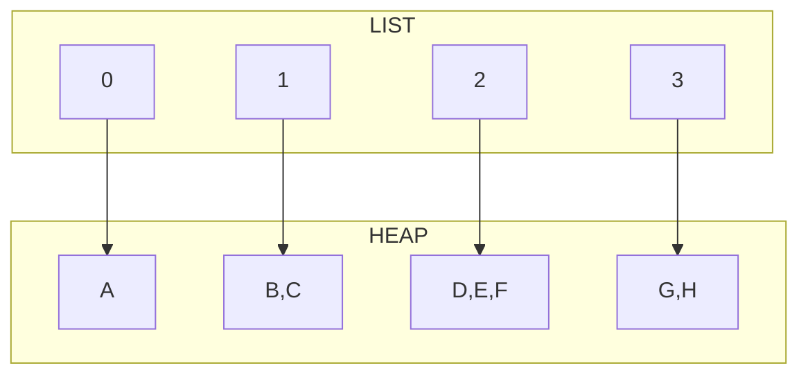
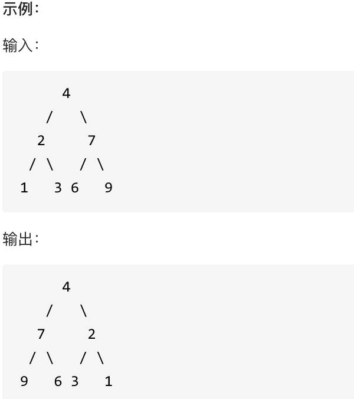
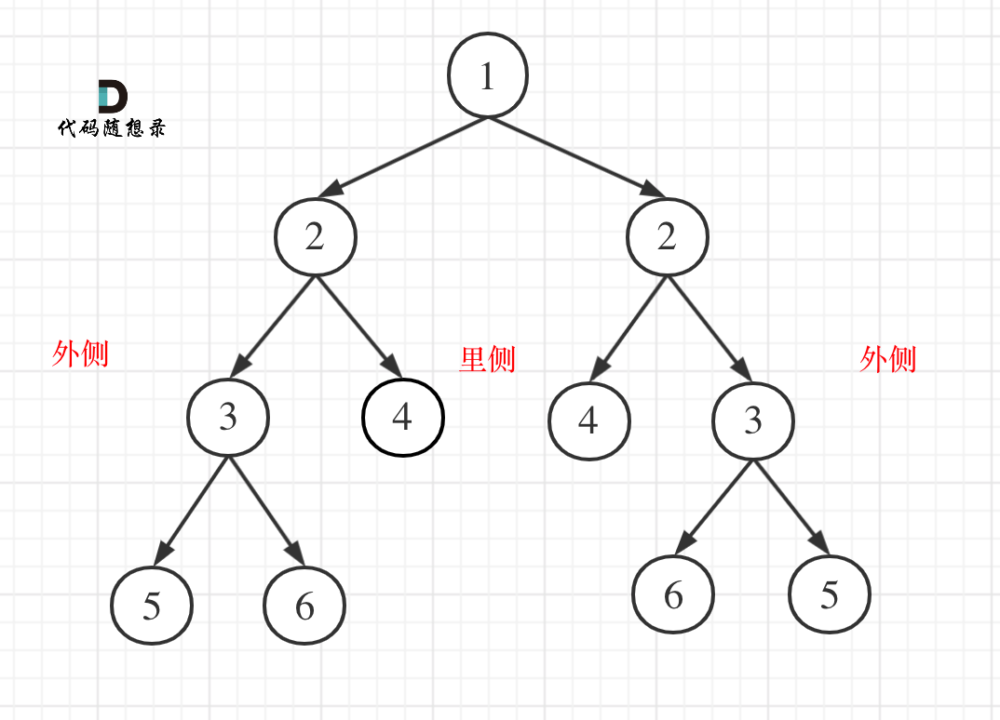
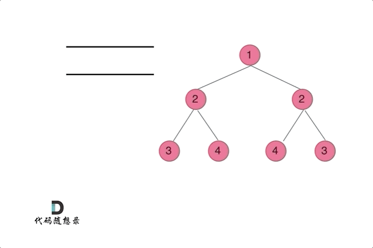
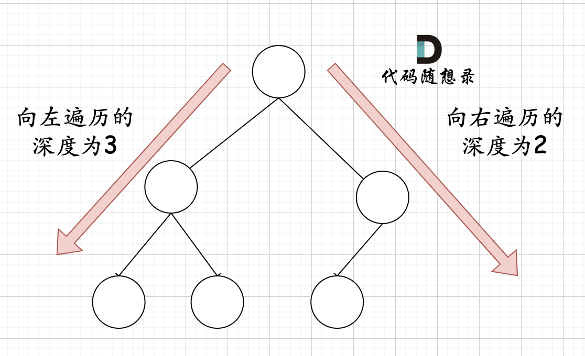

# 二叉树

## 种类

### 满二叉树



### 完全二叉树

满二叉树是一种完全二叉树

完全二叉树优先填满上层, 上层填满了才开始填叶子, 叶子能往左靠就往左靠


### 二叉搜索树

中序遍历能得到一个升序数列


### 平衡二叉搜索树

首先, 是二叉搜索树

其次, 所有叶子节点的深度不超过1


## 存储

### 数组

父节点的数组下标是 i，那么它的左孩子就是 i \* 2 + 1，右孩子就是 i \* 2 + 2。

### 链式



## 遍历

### 深度优先

-   中序遍历 左根右
    -   升序数组
-   前序遍历 根左右
-   后续遍历 左右根
    -   逆波兰表达式

递归实现略

栈+循环, 

自己实现一个栈, 包装一个自己习惯的API

```cpp
template<typename T>
class Stack {
    deque<T> queue;
public:
    void push(const T &t) { queue.push_back(t); }
    T pop() {
        // 出栈
        T top = this->top();
        queue.pop_back();
        return top;
    }
    T top() { return queue.back(); }
    bool empty() { return queue.empty(); }
};
```

用null标记表示前面这个节点元素不需要再向深度遍历了, 直接来吧

```cpp
void traversal(Node *root, vector<int>* result) {
    result->clear();
    if (root == nullptr) {
        return;
    }
    Stack<Node *> st;
    st.push(root);
    while (!st.empty()) {
        Node *node = st.pop(); // 将空节点弹出
        if (node == nullptr) {
            // 只有遇到空节点的时候，才将下一个节点放进结果集
            node = st.pop();    // 重新取出栈中元素
            result->push_back(node->getValue()); // 加入到结果集
            continue;
        }

        if (node->getRight()) {
            st.push(node->getRight());  // 添加右节点（空节点不入栈）
        }

        st.push(node);                          // 添加中节点
        st.push(nullptr); // 中节点访问过，但是还没有处理，加入空节点做为标记。

        if (node->getLeft()) {
            st.push(node->getLeft());    // 添加左节点（空节点不入栈）
        }
    }
}
```

### 广度优先

-   层次遍历（迭代法）

目标:





用数组存储树, 天然适合层次遍历

自己封装一个队列, 使用熟悉的API

```cpp
#include "list"

template<typename T>
class Queue {
    list<T> linkList;
public:
    void push(const T &t) { linkList.push_back(t); }
    T pull() {// 出队
        T t = linkList.front();
        linkList.pop_front();
        return t;
    }
    bool empty() {return linkList.empty();}
    int size() { return linkList.size(); }
};
```

然后队列+循环

```cpp
void levelOrder(Node *root, list<list<int>> *result) {
    if (root == nullptr) {
        return;
    }
    deque<int> a;
    Queue<Node *> que;
    que.push(root);
    while (!que.empty()) {
        int size = que.size();
        list<int> vec;
        // 这里一定要使用固定大小size，不要使用que.size()，因为que.size是不断变化的
        for (int i = 0; i < size; i++) {
            Node *node = que.pull();
            vec.push_back(node->getValue());
            if (node->getLeft()) {
                que.push(node->getLeft());
            }
            if (node->getRight()) {
                que.push(node->getRight());
            }
        }
        result->push_back(vec);
    }
}
```

### 翻转二叉树



如果使用递归+中序遍历, 就会存在一个问题, 🤔

部分子节点会被反转两次(就算发现会反转两次, 要搞明白具体有哪些会被翻转两次还是有点....)

答案是全部翻转了两边/双数遍

所以前序或者后序遍历会比较好

栈+中序会不会存在这个问题呢, 🤔

层序遍历实现

```cpp
void (Node *root) {
    if (root == nullptr) {
        return;
    }
    deque<int> a;
    Queue<Node *> que;
    que.push(root);
    while (!que.empty()) {
        int size = que.size();
        list<int> vec;
        // 这里一定要使用固定大小size，不要使用que.size()，因为que.size是不断变化的
        for (int i = 0; i < size; i++) {
            Node *node = que.pull();
            Node * left = node->getLeft();
            Node * right = node->getRight();
            node->setLeft(right);
            node->setRight(left);
            if (node->getLeft()) {
                que.push(node->getLeft());
            }
            if (node->getRight()) {
                que.push(node->getRight());
            }
        }
    }
}
```

### 对称二叉树



1.  左子树的值和右子树相等
2.  左子树的左子树和右子树的右子树完全相等
3.  左子树的右子树和右子树的左子树完全相等
4.  符合以上三条的是为对称



```cpp
if (root == NULL) return true;
Queue<Node*> que;
que.push(root->left);   // 将左子树头结点加入队列
que.push(root->right);  // 将右子树头结点加入队列

while (!que.empty()) {  // 接下来就要判断这两个树是否相互翻转
    Node* leftNode = que.front(); que.pop();
    Node* rightNode = que.front(); que.pop();
    if (!leftNode && !rightNode) {  // 左、右节点为空，对称
        continue;
    }

    // 左右一个节点不为空，或者都不为空但数值不相同，返回false
    if ((!leftNode || !rightNode || (leftNode->val != rightNode->val))) {
        return false;
    }
    que.push(leftNode->left);   // 加入左节点左孩子
    que.push(rightNode->right); // 加入右节点右孩子
    que.push(leftNode->right);  // 加入左节点右孩子
    que.push(rightNode->left);  // 加入右节点左孩子
}

return true;
```
左右子树, 名字搞错了, 有影响吗? 没有

先内层还是先外层, 有影响吗? 没有

所以可以用栈实现

```cpp
if (root == NULL) return true;
Stack<Node*> st;
st.push(root->left);   // 将左子树头结点加入队列
st.push(root->right);  // 将右子树头结点加入队列

while (!st.empty()) {  // 接下来就要判断这两个树是否相互翻转
    Node* leftNode = st.top(); que.pop();
    Node* rightNode = st.top(); que.pop();
    if (!leftNode && !rightNode) {  // 左、右节点为空，对称
        continue;
    }

    // 左右一个节点不为空，或者都不为空但数值不相同，返回false
    if ((!leftNode || !rightNode || (leftNode->val != rightNode->val))) {
        return false;
    }
    st.push(leftNode->left);   // 加入左节点左孩子
    st.push(rightNode->right); // 加入右节点右孩子
    st.push(leftNode->right);  // 加入左节点右孩子
    st.push(rightNode->left);  // 加入右节点左孩子
}

return true;
```

### 最大深度/最小深度

左右孩子都没有的, 是为叶子节点

最大深度问题需要全部遍历完

最小深度+广度优先=> 找到一个叶子节点就返回

### 完全二叉树节点个数

考虑完全二叉树特点, 节点优先填满前面的层, 优先往左边靠

也就是说, 一棵子树, 如果有左节点, 一定会有右节点

一棵子树, 其向左遍历到左端最深处的深度, 和向右端最深处的深度, 一定相等或多一



```cpp
int countNodes(Node *root) {
    if (root == nullptr) return 0;
    Node *left = root->getLeft();
    Node *right = root->getRight();
    int leftDepth = 0, rightDepth = 0; // 这里初始为0是有目的的，为了下面求指数方便
    while (left) {  // 求左子树深度
        left = left->getLeft();
        leftDepth++;
    }
    while (right) { // 求右子树深度
        right = right->getRight();
        rightDepth++;
    }
    if (leftDepth == rightDepth) {
        return (2 << leftDepth) - 1; // 注意(2<<1) 相当于2^2，所以leftDepth初始为0
    }
    return countNodes(root->getLeft()) + countNodes(root->getRight()) + 1;
}
```

这种方法, 循环的次数总是比实际节点个数要多, 最后一层节点越少, 多余的动作就越多, 而且使用递归

1.  往最左边遍历, 获取最大深度
2.  非最后一层都是满的, 毫无悬念, 只需要求最后一层有几个元素
3.  用二分查找的思想, 先看最后一层的中间部分有元素吗? 有, 向右半边; 无, 向左半边探索
4.  如果找到了边界, 可以根据到达这一个叶子的路径判断最底层有几个元素
5.  查找一次最后一层, 也就是一层深度优先探索, O(log(n)), 路径左右左左右, 就有叶子节点(01001)~2~+1个
6.  路径和个数既然有如此关系, 可以由节点个数->二进制->路径的方式来查找试探最后一层
7.  查找最后一层的次数, 参考二分查找, 需要O(log(n/2))
8.  整体来看, 时间复杂度O(log(n)+log(n)log(n/2))≈O(log^2^(N)), N表示节点个数
9.  优化不明显, 实现复杂容易犯错, 中间需要判断的条件多,节点数量少(10个以下)的情况下不好使
10.  节点巨他妈多的时候倒是好使了, 但我觉得还是开一片内存存在字段里吧😓, 这样时间复杂度就是O(1)了, 最最好使了

