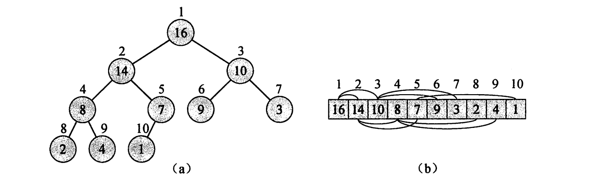
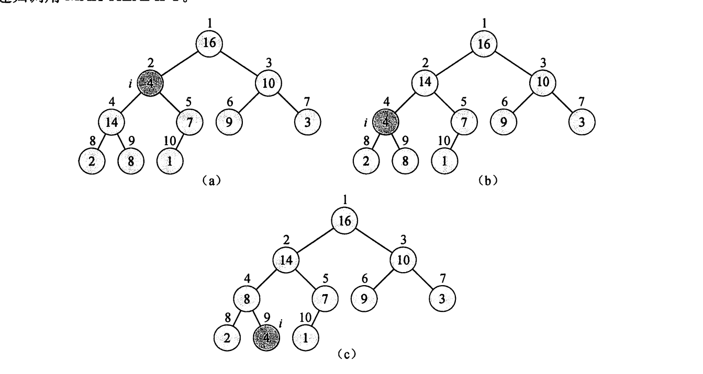
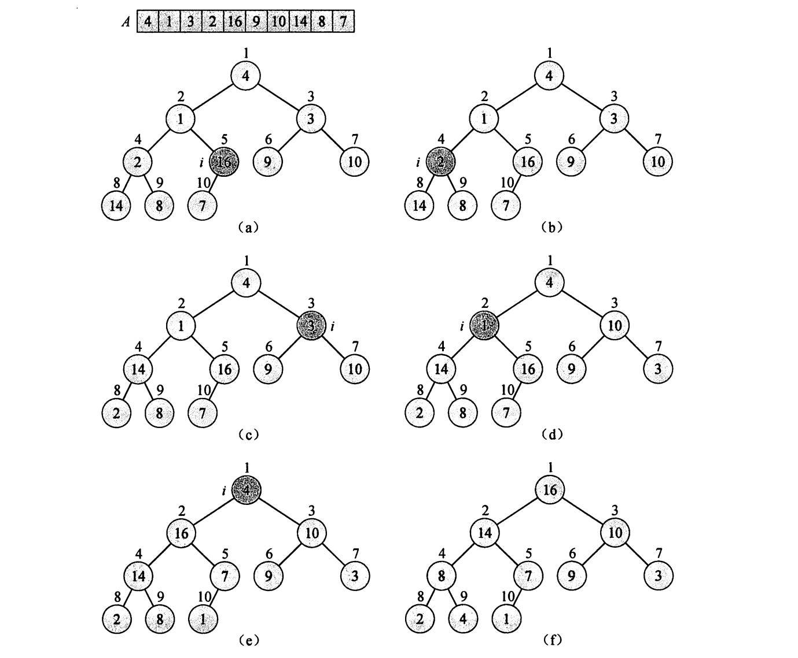

# 堆

“堆”这一词源自堆排序，但是目前它巳经被引申为“垃圾收集存储机制“，例如在 Java和Lisp 语言中所定义的。

但除此之外, 都应该认为堆是一种数据结构

## 结构

二叉堆是一个数组, 可以看作完全二叉树



可以方便地找到左孩子`(i<<1)+1`, 和右孩子`(i<<1)+2`和父亲`i>>1`

```cpp
static int parent(int child) {
    return (child - 1) >> 1;
}

static int left(int parent) {
    return (parent << 1) + 1;
}

static int right(int parent) {
    return (parent << 1) + 2;
}
```

-   最大堆(大根堆)
    -   Array[Parent(i)]>=Array[i]
    -   越往上越大
    -   用于堆排序
-   最小堆(小根堆)
    -   Array[Parent(i)]<=Array[i]
    -   越往上越小
    -   用于构造优先队列
-   上图是最大堆

## 维护最大堆

Array[i]可能小于其左右孩子导致不符合最大堆的性质

通过让 Array[i] 的值 在最大堆中“逐级下降“，从而使得以下标 i 为根结点的子树重新遵循最大堆的性质。



的时间复杂度是 O(h)

```cpp
template<class T>
void Heap<T>::maxHeapify(int parentIndex) {
    T *heap = this->arr;
    int leftIndex = (parentIndex << 1) + 1;
    int rightIndex = (parentIndex << 1) + 2;
    int largest = parentIndex;
    if (rightIndex < this->heapSize && heap[rightIndex] > heap[largest]) {
        largest = rightIndex;
    }
    if (leftIndex < this->heapSize && heap[leftIndex] > heap[largest]) {
        largest = leftIndex;
    }
    if (largest != parentIndex) {
        this->elementSwap(largest, parentIndex);
        this->maxHeapify(largest);
    }
}
```

### 由cmp函数决定维护最大堆还是最小堆

```cpp
if (rightIndex < this->heapSize && heap[rightIndex] > heap[largest]) {
    largest = rightIndex;
}
if (leftIndex < this->heapSize && heap[leftIndex] > heap[largest]) {
    largest = leftIndex;
}
```
改为

```cpp
if (rightIndex < this->heapSize && this->cmp(heap[rightIndex],heap[largest])>0) {
    largest = rightIndex;
}
if (leftIndex < this->heapSize && this->cmp(heap[leftIndex],heap[largest])>0) {
    largest = leftIndex;
}
```

构建最小堆可以在不改变堆排序的代码的情况小实现降序排序

## 建堆

维护最大堆的方法是建立在子树已经构建好的基础上的

因此自底向上地遍历每个元素, 用maxHeapify将数组中的每个元素都经过"逐级下降"的调整

考虑到调整叶子节点没有意义, 对于长度为len的堆来说, 叶子节点的范围在heap[len/2+1:len], 那么只调整非叶子的节点



```cpp
template<class T>
void Heap<T>::buildMaxHeap() {
    heapSize = this->len;
    for (int i = (heapSize >> 1)  - 1; i >= 0; --i) {
        maxHeapify(i);
    }
}
```

