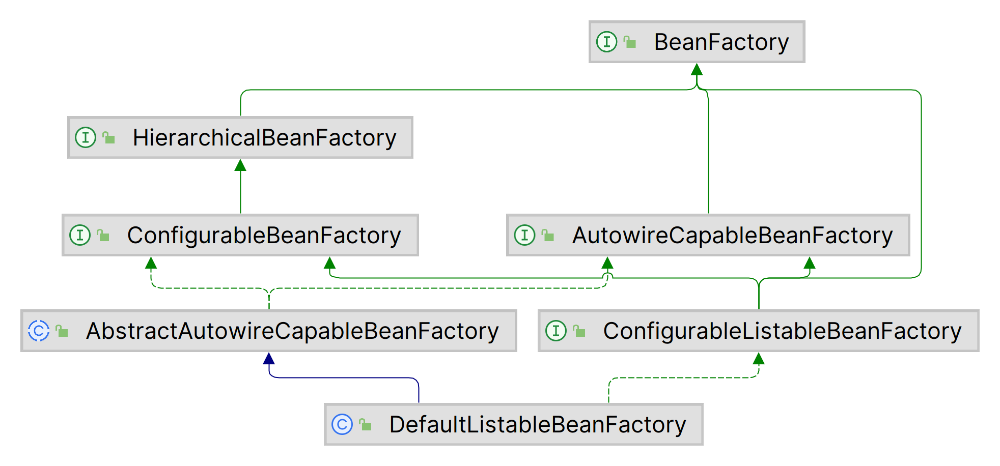
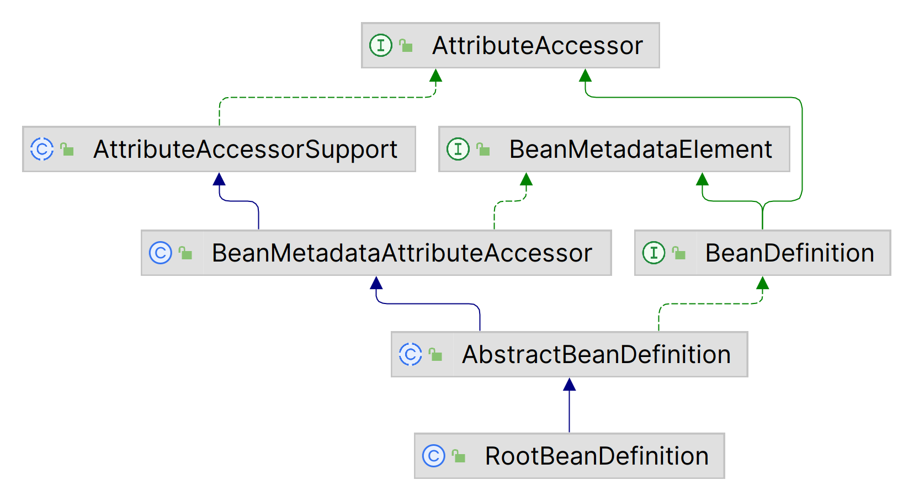
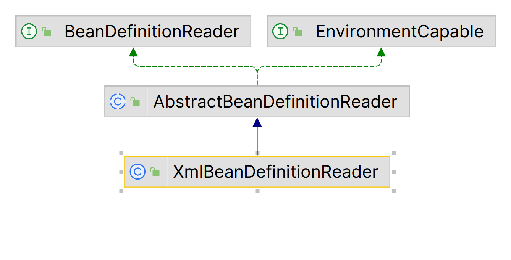
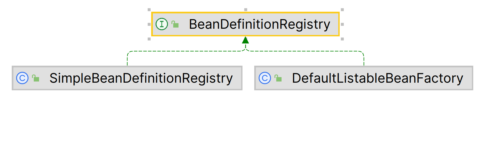
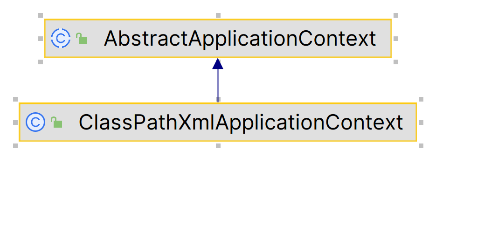

# IoC

控制反转

## Core Container

-   Beans
-   Core
-   Context
-   Expression

### Beans&Core

控制反转 Inversion of Control IoC

依赖注入 Dependency Injection DI

BeanFactory 使用 IOC 对Application的配置和Dependency规范与实际代码分离

BeanFactory属于Lazy Loading

```java
private static void beanFactoryDemo() {
    // 懒加载, 此时不创建
    XmlBeanFactory beanFactory = new XmlBeanFactory(new ClassPathResource(PROPERTY_FILE));
    // ↓此时创建
    UserController controller = beanFactory.getBean(UserController.class);
    System.out.println(controller.sayHello("A"));
    System.out.println(controller.sayHello("X"));
}

private static void applicationDemo() {
    // ↓此时创建所有Bean
    ClassPathXmlApplicationContext context =
            new ClassPathXmlApplicationContext(PROPERTY_FILE);
    UserController controller = context.getBean(UserController.class);
    System.out.println(controller.sayHello("A"));
    System.out.println(controller.sayHello("X"));
}
```

### context

扩展BeanFactory, 添加生命周期, 框架事件体系, 资源加载透明化等功能

提供邮件访问, 远程访问, 任务调度

ApplicationContext, 核心, 继承BeanFactory,

ApplicationContext实例化后自动对所有的单实例Bean进行实例化与Dependency装配

### context-support

对IoC容器和Ioc子容器的拓展支持

### context-indexer

类管理组件

Classpath扫描组件

### Expression

Spring  Expression Language

用于查询, 管理运行中的对象, 调用对象方法, 操作数组集合

同SpringIoC交互

## Bean

>   Bean Oriented Programming BOP


Spring 通过配置文件或注解管理Bean对象之间的依赖关系

Bean用于对一个类进行封装

```xml
<bean id="userMapper" class="com.harvey.dp.spring.demo.UserMapper"/>
<bean id="userService" class="com.harvey.dp.spring.demo.UserServiceImpl">
    <property name="userMapper" ref="userMapper"/>
</bean>
```
### BeanFactory



Bean工厂, 也就是IoC容器, 使用简单工厂+配置

-   `ListableBeanFactory`, 可将Bean在List中存储
-   `HierarchicalBeanFactory` Bean有继承关系, 每个父皆可能有父Bean
-   `AutowireCaoableBeanFactory` 定义Bean的自动装配原则

### ApplicationContext

是BeanFactory的子接口, 规范容器中的Bean是非延迟加载的

-   `ClasspathXmlApplicationContext`
    -   根据类路径加载配置(resource文件夹下就不用加前缀)
-   `FileSystemXmlApplicationContext`
    -   根据系统路径加载配置
-   `AnnotationConfigApplicationContext`
    -   加载注解类配置

## BeanDefinition

解析Xml的Bean标签, 封装成BeanDefinition对象

BeanDefinition是接口



### BeanDefinitionReader



解析Bean的配置文件

因为Bean的配置, 可拓展的点很多, 为保证灵活性, BeanDifinitionReader的职责及其复杂

```java
public interface BeanDefinitionReader {
    BeanDefinitionRegistry getRegistry();
    ClassLoader getClassLoader();
    ResourceLoader getResourceLoader();
    BeanNameGenerator getBeanNameGenerator();
    
    // ...
    
    int loadBeanDefinitions(String/Resource) throws ...;
}
```

### BeanDefinitionRegistry

多个BeanDefinition存储在一个Registry

往注册表中注册Bean信息



## 创建容器-ApplicationContext

`ClassPathXmlApplicationContext`通过调用父类`AbstractApplicationContext`的`refresh()`方法载入Bean的配置资源 



```java
public ClassPathXmlApplicationContext(
       String[] configLocations, boolean refresh, @Nullable ApplicationContext parent)
       throws BeansException {

    super(parent);
    setConfigLocations(configLocations);
    if (refresh) {
       refresh();
    }
}
```

refresh是一个模板方法, 规定了IoC容器的启动流程, 其中部分逻辑延后到子类实现

1.  加载配置文件
2.  初始化Bean对象
3.  将Bean对象存储在容器中

