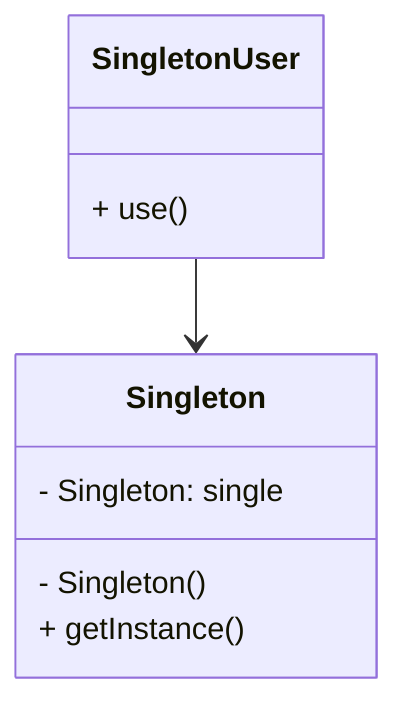
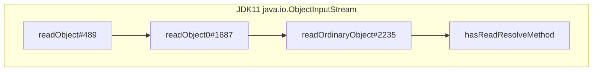

# 单例模式

涉及一个单一的类, 该类负责创建自己的对象, 确保这个类**只能创建单个对象**

这个类提供了一种访问其唯一的对象的方式

可以直接访问, 不需要(不允许?)实例化类

## 结构

-   单例类
    -   只能创建一个实例的类
-   访问类
    -   使用单例的类



## 分类

饿汉式: 类加载就会导致该单实例对象被创建

懒汉式: 类加载不会导致单例被创建, 而是该对象首次使用时才会被创建

## 饿汉式

### 构建流程

1.  私有构造方法

    ```java
    private HungrySingletonObject() {
        System.out.println("构造方法被调用"); // 只被调用一次
    }
    ```

2.  在本类中创建本类对象

    ```java
    private static final HungrySingletonObject SINGLETON = new HungrySingletonObject();
    ```

    或

    ```java
    private static final HungrySingletonObject SINGLETON;

    static {
        SINGLETON = new HungrySingletonObject();
    }
    ```

3.  提供一个公共的访问方式`instance`, 让外界获取该对象

    ```java
    public static HungrySingletonObject getInstance() {
        return SINGLETON;
    }
    ```

4.  使用运行

    ```java
    public static void hungryDemo() {
        HungrySingletonObject obj1 = HungrySingletonObject.getInstance();
        HungrySingletonObject obj2 = HungrySingletonObject.getInstance();
        obj1.run();
        obj2.run();
        System.out.println(obj1 == obj2);// true
    }
    ```


### 缺陷

instance对象是随着类的加载而创建的。

如果该对象足够大的话，而一直没有使用就会造成内存的浪费。

### 代码清单

```java
public class HungrySingletonObject {
    private static final HungrySingletonObject SINGLETON;

    static {
        SINGLETON = new HungrySingletonObject();
    }

    private HungrySingletonObject() {
        System.out.println("构造方法被调用");
    }

    public static HungrySingletonObject getInstance() {
        return SINGLETON;
    }

    public void run() {
        System.out.println("对象运行");
    }
}
```

## 懒汉式

### 构建流程

1.  私有构造方法

    ```java
    private LazySingletonObject() {
        System.out.println("构造方法被调用"); // 只被调用一次
    }
    ```

2.  在本类中声明单例对象

    ```java
    private static LazySingletonObject singleton = null; // 显式写null是为了笔记
    ```

3. 提供一个公共的访问方式`instance`, 让外界获取该对象, 同时创建对象

   ```java
   public static LazySingletonObject getInstance() {
   }
   ```

   -   线程不安全

       ```java
       if (singleton == null) {
           // 线程不安全
           singleton = new LazySingletonObject();
       }
       return singleton;
       ```

   -   悲观锁有性能问题, 而且很大, 因为只要锁住最开始的一次创建的过程就像了, 但是直接上悲观锁会导致后面所有`getInstance`都会走悲观锁

   -   双重检查锁, 线程安全, 且改善悲观锁性能问题

       ```java
       //第一次判断，如果instance不为null，不进入抢锁阶段，直接返回实际
       if(singleton == null) {
           synchronized (LazySingletonObject.class) {
               //抢到锁之后再次判断是否为空
               if(singleton == null) {
                   singleton = new LazySingletonObject();
               }
           }
       }
       return singleton;
       ```

       JVM多线程环境下, 在实例化对象的时候会进行优化和指令重排序操作, 使用简单的**双重检查锁可能导致空指针**

   -    `volatile` 关键字+双重检查锁,解决空指针问题,  `volatile` 关键字可以保证可见性和有序性。

       ```java
       private static volatile LazySingletonObject singleton = null;

       public synchronized static LazySingletonObject getInstance() {
           //第一次判断，如果instance不为null，不进入抢锁阶段，直接返回实际
           if (singleton == null) {
               synchronized (LazySingletonObject.class) {
                   //抢到锁之后再次判断是否为空
                   if (singleton == null) {
                       singleton = new LazySingletonObject();
                   }
               }
           }

           return singleton;
       }
       ```
       
       

4.  使用运行

    ```java
    public static void hungryDemo() {
        LazySingletonObject obj1 = LazySingletonObject.getInstance();
        LazySingletonObject obj2 = LazySingletonObject.getInstance();
        obj1.run();
        obj2.run();
        System.out.println(obj1 == obj2);// true
    }
    ```

### 静态内部类的懒汉式实现流程

JVM在加载外部类的时候不会加载内部类, 静态内部类的属性或方法被调用才会被加载

**静态内部类保证只被实例化一次, 且严格保证实例化顺序**

1.  私有构造方法

    ```java
    private LazySingletonObject() {
        System.out.println("构造方法被调用"); // 只被调用一次
    }
    ```

2.  在本类中声明静态内部类和单例对象

    ```java
    private static class LazySingletonObjectHolder{
        private static final LazySingletonObject SINGLETON = new LazySingletonObject();
    }
    ```

3.  提供一个公共的访问方式`instance`, 让外界获取该对象, 同时创建对象

    ```java
    public static LazySingletonObject getInstance() {
        return LazySingletonObjectHolder.SINGLETON;
    }
    ```

## 枚举类实现单例

枚举类是线程安全的

枚举类只会加载一次, 是懒汉式

枚举是单例实现中唯一一种不会被破坏的单例模式

```java
public enum EnumSingletonObject {
    SINGLETON,
    ;

    /**
     * 默认就是私有
     */
    EnumSingletonObject() {
        System.out.println("构造方法被调用");
    }

    public void run() {
        System.out.println("枚举对象运行");
    }
}
```

```java
public static void enumDemo() {
    EnumSingletonObject obj1 = EnumSingletonObject.SINGLETON;
    EnumSingletonObject obj2 = EnumSingletonObject.SINGLETON;
    obj1.run();
    obj2.run();
    System.out.println(obj1 == obj2);
}
```

## 破坏单例模式

使单例类能创建多个对象, 方法有序列化和反射

enum是JVM底层实现的单例, 不会有破坏问题

### 序列化

#### 破坏

```java
public static boolean serializeBreakSingleton() {
    String filename = "C:\\Users\\27970\\Desktop\\obj.data";
    HungrySingletonObject obj1 = saveAndRead(filename);
    HungrySingletonObject obj2 = saveAndRead(filename);
    obj1.run();
    obj2.run();
    return obj1 == obj2; // false
}

private static HungrySingletonObject saveAndRead(String filename) {
    try (FileOutputStream fos = new FileOutputStream(filename);
         ObjectOutputStream oos = new ObjectOutputStream(fos)) {
        // 需要HungrySingletonObject实践Serializable
        oos.writeObject(HungrySingletonObject.getInstance());
    } catch (IOException e) {
        throw new RuntimeException(e);
    }
    HungrySingletonObject obj1;
    try (FileInputStream fis = new FileInputStream(filename);
         ObjectInputStream ois = new ObjectInputStream(fis)) {
        obj1 = (HungrySingletonObject) ois.readObject();
    } catch (IOException | ClassNotFoundException e) {
        throw new RuntimeException(e);
    }
    return obj1;
}
```

#### 解决



要在类内定义ReadResolveMethod

```java
public class XXXSingletonObject implements Serializable {
    private static final XXXSingletonObject SINGLETON;
    // ...
    /**
     * @return 要求是Object类不能边
     * @throws Exception 可以抛出异常, 也可以不抛出
     */
    public Object readResolve() throws Exception {
        System.out.println("readResolve");
        return SINGLETON;
    }
}
```

### 反射

#### 破坏

```java
public static boolean reflectBreakSingleton()
        throws NoSuchMethodException,
        InvocationTargetException,
        InstantiationException,
        IllegalAccessException {
    Constructor<LazySingletonObject> constructor = LazySingletonObject.class.getDeclaredConstructor();
    constructor.setAccessible(true); // 取消访问检查
    LazySingletonObject obj1 = constructor.newInstance();
    LazySingletonObject obj2 = constructor.newInstance();
    obj1.run();
    obj2.run();
    return obj1 == obj2; // false
}
```

#### 解决

用静态字段判断是否是多次调用构造函数

```java
private static final HungrySingletonObject SINGLETON;

static {
    try {
        SINGLETON = new HungrySingletonObject();
    } catch (InstanceAlreadyExistsException e) {
        throw new RuntimeException(e);
    }
}
private static boolean created = false;
private HungrySingletonObject() throws InstanceAlreadyExistsException {
    if (created){
        // 已经创建
        throw new InstanceAlreadyExistsException();
    }
    System.out.println("构造方法被调用");
    created = true;
}
```

## JDK中的单例


