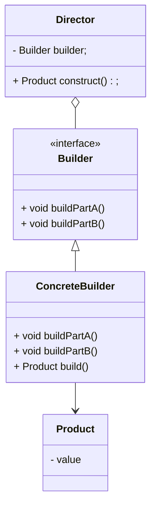

# 建造者模式

将一个复杂对象的构建与表示分离, 使得同样的构建过程可以创建不同的表示

-   构建 - 复杂对象的部分, 一个组件
-   表示 - 最终展现出来的成品

分离了部件的构造和装配, 从而可以构造出复杂的对象

由于实现了构建和装配的解耦, 不同的构建起, 相同的装配, 也可以做出不同的对象

相同的构建器, 不同的装配顺序, 也可以做出不同的对象

实现了构建算法, 装配算法的解耦, 实现了更好的复用

构建者模式将部件和组装过程分开, 一步步创建复杂对象. 用户只需要指定复杂对象的类型就可以得到改对象, 而无需知道其内部的构造细节

要新的产品增加新的建造者, 容易拓展

## 应用场景

**组件容易变化**自由的场景

将主要业务逻辑封装在指挥者类中, 可以获得较好的稳定性

使用**相同创建过程(构建算法)**创建不同的创建对象

创建复杂对象的算法**独立于对象的组成部分以及组装方式**

将创建步骤分解在不同方法里, **使创建过程更加清晰**


## 结构

-   抽象建造者
    -   Builder
    -   规定创建产品的规范
-   具体建造者
    -   Concrete Builder
    -   实现Builder
    -   完成复杂产品的各个部件的具体创建方法
    -   在构造完成后, 提供产品实例
-   产品类
    -   Product
    -   要创建的复杂对象
    -   表现
-   指挥者类
    -   Director
    -   调用具体构建这来创建复杂对象的各个部分
    -   指导者不涉及具体产品的信息, 只负责对象各部分完整创建或按某种顺序创建
    -   常和抽象建造者结合, 但不符合单一职责原则, 如果组装太复杂, 还是分离写



## 构建流程

### 抽象建造者

```java
public interface ComputerBuilder {
    Computer Y7000P = ComputerDirector.buildY7000p();

    ComputerBuilder cpu(String cpu);

    ComputerBuilder memory(String memory);

    ComputerBuilder disc(String disc);

    ComputerBuilder brand(String brand);

    ComputerBuilder gpu(String gpu);

    ComputerBuilder os(String os);

    Computer build();
}
```

### 具体建造者

```java
public class ConcreteComputerBuilder implements ComputerBuilder {
    private final Computer computer;

    public ConcreteComputerBuilder() {
        computer = new Computer();
    }

    @Override
    public ComputerBuilder cpu(String cpu) {
        computer.setCpu(cpu);
        return this;
    }

    @Override
    public ComputerBuilder memory(String memory) {
        computer.setMemory(memory);
        return this;
    }

    @Override
    public ComputerBuilder disc(String disc) {
        computer.setDisc(disc);
        return this;
    }

    @Override
    public ComputerBuilder brand(String brand) {
        computer.setBrand(brand);
        return this;
    }

    @Override
    public ComputerBuilder gpu(String gpu) {
        computer.setGpu(gpu);
        return this;
    }

    @Override
    public ComputerBuilder os(String os) {
        computer.setOperatingSystem(os);
        return this;
    }

    @Override
    public Computer build() {
        return computer;
    }


}
```

### 产品


```java
public class Computer {
    private String cpu;
    private String disc;
    private String memory;
    private String gpu;
    private String brand;
    private String operatingSystem;

    // Setter + toString
}
```

### 指挥者

```java
public class ComputerDirector {
    public static Computer buildY7000p(){
        return new ConcreteComputerBuilder()
                .cpu("13th Gen Intel(R) Core(TM) i7-13700H   2.40 GHz")
                .memory("16.0 GB (15.7 GB available)")
                .disc("200GB+751GB")
                .brand("LEGION")
                .gpu("4060")
                .os("Windows 11 家庭中文版")
                .build();
    }
}
```


### 使用

```java
public static boolean demo() {
    Computer y7000p = ComputerDirector.buildY7000p();
    System.out.println("computer = " + y7000p);
    return ComputerBuilder.Y7000P == y7000p; // false
}
```


## 缺点

创建的产品具有较多的共同点, 产品差异很大就不适合使用建造者模式

