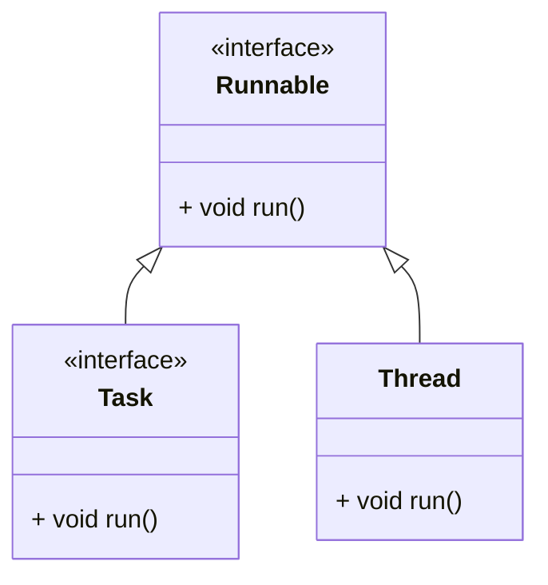

# 软件设计原则

## 目标

-   提高软件系统的
    -   可维护性
    -   可复用性
-   增加软件的
    -   可拓展性
    -   灵活性
-   提高软件的
    -   开发效率
    -   减少开发成本
    -   减少维护成本

降低耦合度: 具体耦合-> 抽象耦合, 使用多态来提高代码的灵活性

## 开闭原则

>   对扩展开放, 对修改关闭

在程序需要进行拓展时, 不能去修改原有代码, 实现一个**热插拔**的效果

使程序拓展性更好, 已于维护和升级

需要使用**接口和抽象类**

因为抽象灵活析构好, 适应性广, 只要抽象合理, **可以基本保持软件架构的稳定**

软件中易变的细节可以从抽象派生来的实现类来进行拓展, **当软件需要变化时, 只需要根据需求重新派生一个实现类来拓展即可** 



## 里氏代换原则

任何基类可以出现的地方, 子类一定可以出现

子类可以拓展父类的功能, 但不能改变父类原有的功能(**尽量不要重写父类的方法**)

如果通过重写父类的方法来完成新功能, 特别是多态运用特别频繁, 整个继承体系的**复用性**会比较差

例如**正方形不是长方形**

```cpp
class Rectangle {
private:
    double length;
    double width;
public:
    explicit Rectangle(double length=0, double width=0) : length(length), width(width) {}

    virtual void setWidth(double width){
        this->width = width;
    }
    virtual void setLength(double length){
        this->length = length;
    }
    // ... Getter
};
class Square : public Rectangle {
public:
    explicit Square(double edge) : Rectangle(edge, edge) {}
    void setWidth(double width) override{
        this->Rectangle::setWidth(width);
        this->Rectangle::setLength(width);
    }
};
```

不符合里氏代换原则可能出现的问题

```cpp

void resize(Rectangle& rec){
    while(rec.getWidth()<=rec.getLength()){
        rec.setWidth(rec.getWidth()+1);
        // 如果传入正方形就形成死循环
    }
}
```

正确的做法应该是有一个`四边形接口`, 让Quare和Rectangle共同实现同一个接口

不过要我来说, 按照逻辑, resize应该放在Rectangle的类里面

可是实际业务要复杂的多, 要怎么察觉到逻辑上存在继承关系的两个类在多态时可能存在隐患呢?

其实对于面向对象来说, 继承是一个*增加的逻辑*, 实质上子类的成员永远不会少于父类, 也就是说, 正方形虽然在数学中存在继承关系, 但不符合面向对象的继承逻辑. 在面向对象的继承中, 子类应该在逻辑上接收所有父类的成员

算是要对面向对象的继承有一个彻底的认知

## 依赖倒转原则

高层模块不能依赖低层模块, 两者应该**依赖其抽象**

抽象不应该依赖细节, 细节应该依赖抽象

要求对抽象进行编程, 不要对实现进行编程, 降低了客户与实现模块的耦合

高层含有的成员应该是抽象的, 至于使用什么实现应该由框架之外决定

## 接口脱离原则

客户端不应该被迫依赖于不使用的方法

一个类对另一个类的依赖应该建立在最小的接口上, 如果要继承不使用的方法, 就拆分父类

安全门A要有防火防水防盗, 功能很全, 但是太贵了

安全门B要有防火防水, 便宜了一点, 没这么贵了

安全门C要有防火防盗

安全门D要有防水防盗

定义接口防水门, 防火门, 防盗门

安全门ABCD各自选择性实现接口

## 迪米特法则

>   Talk only to your immedieate friend and not to stranger

最少知识原则

两个软件实体如果无需直接通信, 那么就不应当发生直接调用, 可通过**第三方转发该调用**

目的是降低类之间的耦合度, 提高模块之间的相对独立性

friend指

-   当前对象本身
-   当前对象的成员对象
-   当前对象所创建的对象
-   当前对象的方法参数

## 合成复用原则

尽量先使用组合或聚合等关联实现, 其次考虑使用继承关系来实现

类的复用分为继承复用和合成复用

-   继承复用

    -   简单易实现

    -   提高了代码的复用性

    -   破坏了类的封装性

        将父类的实现细节暴露给子类, 父类对子类是透明的

        这种复用又被称为 *白箱复用*

    -   子类和父类耦合度高

        父类实现的任何改变都会导致子类实现发生变化, 不利于类的拓展与维护

    -   限制了复用的灵活性

        从父类继承而来的实现是静态的, 在编译时已被定义, 在运行时不能发生变化

-   组合或聚合复用

    -   将对象纳入新对象中, 使之成为新对象的一部分(类加载器的Parent), 新对象可以调用已有对象的功能

    -   维持了类的封装性

        这种复用又被称为 *黑箱复用*

    -   对象间的耦合度低

        可以在类的成员位置声明抽象

    -   复用的灵活性高

        这种复用可以在运行时动态进行, 新的对象可以动态地引用与成分对象类型相同的对象

例如不要做DynamicProgramingMazeHandler, 要写一个DynamicProgramingHandler类作为AlgorithmHandler的子类

MazeHandler有一个AlgorithmHandler的属性,用setAlgorithmHandler来决定MazeHandler使用的是什么算法解决问题

