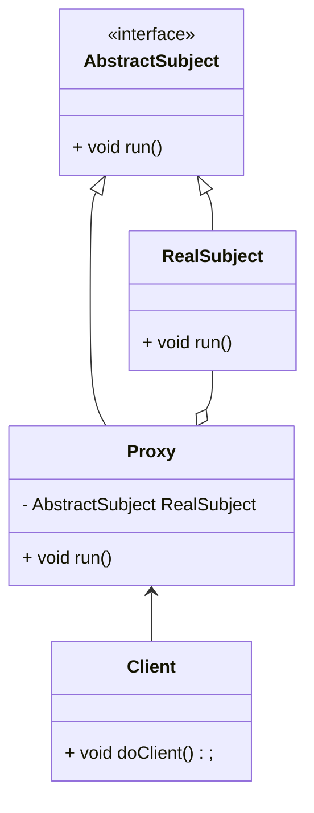
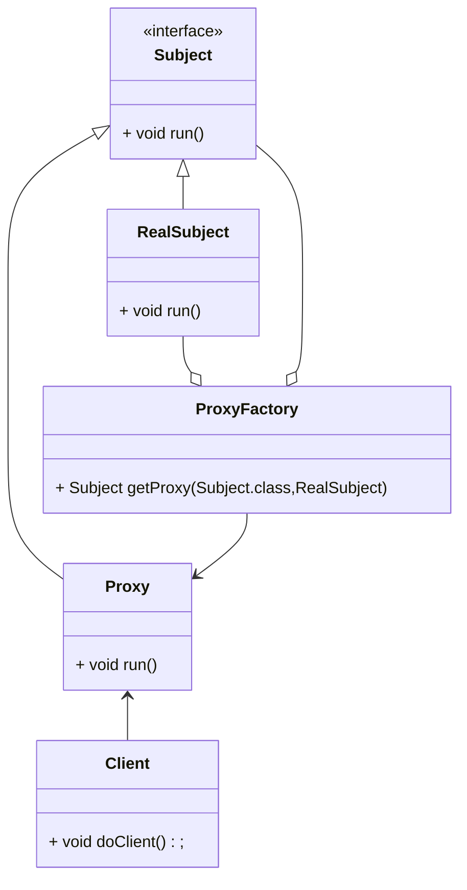
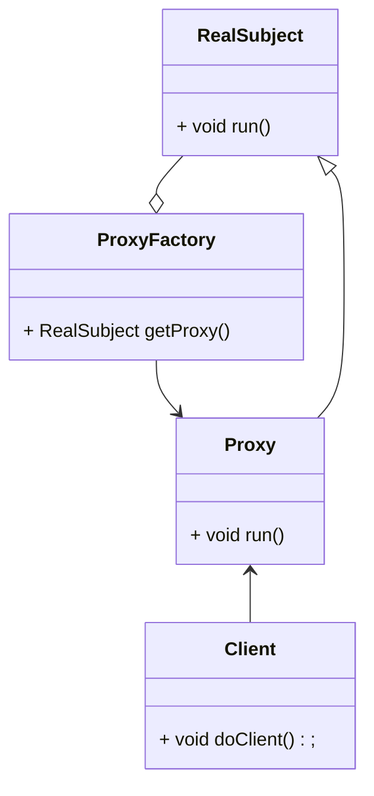

# 代理

访问对象**不能**或**不适合**直接引用目标对象, 提供代理控制对该对象的访问

代理作为访问对象和目标对象之间的中介


Java代理按照代理类生成的时机分为静态代理和动态代理

静态代理代理类在**编译期**就生成

动态代理类在Java**运行时**生产

动态代理又有JDK代理和CGLib代理两种


## 使用场景

对对象进行中介和保护

做增强

将访问者和目标对象分离, 降低一定程度上的系统耦合度

-   RPC
-   Firewall
-   VPN
-   Protect or Access

## 结构

-   抽象主体
    -   Subject
    -   通过接口或抽象类声明真实主题和代理对象共同实现的业务方法
-   真实主体
    -   Real Subject
    -   实现抽象主体种的具体业务
    -   代理对象所代表的真实对象, 是最终要引用的对象
-   代理
    -   Proxy
    -   提供和真实主体相同的接口
    -   内部含有对真实主体的引用, 可以**访问**, **控制**或**拓展**真实主题的功能


一个Proxy可以代理多个真实主体, 一个Proxy和一个抽象主体对应

## 流程实现

动态代理的Factory以对象作为参数, 是因为不能保证所有的类都有公有的无参构造, 故要求另外给出对象创建的逻辑

根据实际需求转变

### 静态代理



### JDK动态代理

Java提供动态代理类Proxy, 提供创建代理对象的静态方法

```java
public class ProxyFactory {

    public static <I, R extends I> I getProxy(Class<I> interfaceType, R realSubject) {
        if (interfaceType == null ||
                !interfaceType.isInterface() ||
                !interfaceType.isInstance(realSubject)) {
            return null;
        }
        Class<?> realType = realSubject.getClass();
        Object proxyInstance = Proxy.newProxyInstance(
                realType.getClassLoader(), // 和具体主体类加载器一致
                realType.getInterfaces(), // 为什么不用参数?
                (proxy, method, args) -> {
                    System.out.println("pre");
                    Object result = method.invoke(realSubject, args);
                    System.out.println("post");
                    return result;
                });
        return (I) proxyInstance;
    }

}
```

```java
public static void demo() {
    Subject proxy = ProxyFactory.getProxy(Subject.class, new RealSubject());
    proxy.run();
    System.out.println(proxy.getClass().getName());
}
```

原理是生成一个继承JDK元素Proxy, 实现自定义接口的类的字节码, 然后实例化这个类`com.sun.proxy.$Proxy0`




### CGLib动态代理

如果没定义接口, 只定义了RealSubject, JDK类无法实现代理

CGLib是在内存中代码生成包, 为没有实现接口的类提供代理

生成代理类继承目标对象

原理是生成主体的子类作为代理类

CGLib不能代理被finnal修饰的类

```xml
<dependency>
    <groupId>cglib</groupId>
    <artifactId>cglib</artifactId>
    <version>3.1</version>
</dependency>
```




```java
public static <R> R getProxy(R realSubject) {
    if (realSubject == null) {
        return null;
    }
    Enhancer enhancer = new Enhancer();
    enhancer.setSuperclass(realSubject.getClass());
    MethodInterceptor interceptor = (proxy, method, args, methodProxy) -> {
        System.out.println("pre");
        System.out.println(proxy.getClass());
        // class com.harvey.dp.structural.proxy.RealSubject$$EnhancerByCGLIB$$908b137d
        Object result = method.invoke(realSubject, args);
        // java.lang.reflect.Method
        Object invoke = methodProxy.invoke(realSubject, args);
        // net.sf.cglib.proxy.MethodProxy
        System.out.println(result);
        System.out.println(invoke);
        System.out.println("post");
        return result;
    };
    enhancer.setCallback(interceptor);
    return (R) enhancer.create();
}
```

## 各代理对比

CGLib底层采用ASM框架

JDK1.8及之后, 反射优化, JDK代理效率优于CGLib代理, 

JDK1.6之前版本, CGLib效率高于JDK

JDK1.6, JDK1.7, 只有大量生成代理的情况, CGLib才能表现出较JDK高效率


动态代理比较静态代理, 所有方法做**集中增强**

## 缺点

增加了代码的复杂度

