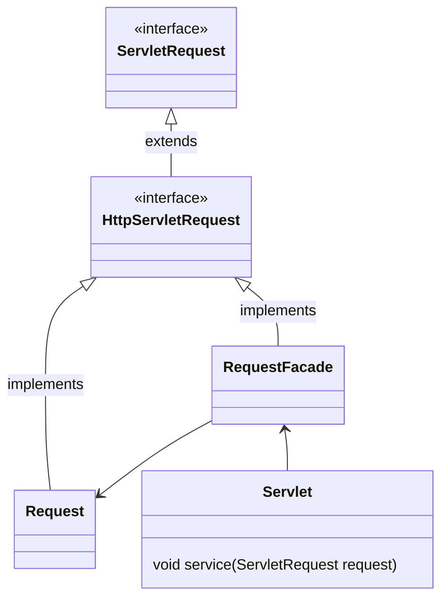

# 外观

>   Facade

又称为门面模式

一个系统对外暴露一个接口

外部程序不关心内部系统的实现细节, 子系统更容易被访问

减少外部程序处理的对象数目, 使子系统使用更容易

降低子系统和客户端的耦合, 使子系统使用起来更容易

降低程序的复杂度, 提高程序的可维护成本

迪米特法则的典型应用

## 结果

-   外观
    -   Facade
    -   为多个子系统对外提供公共接口
-   子系统
    -   Sub System
    -   实现系统部分功能, 客户可以通过外观访问

## 缺点

不符合开闭原则, 子系统改变, 就要修改外观

## 使用场景

-   分层结构构建时, 使用外观模式定义子系统中每层的入口
-   复杂系统的子系统很多, 外观模式设计简单的接口供外界访问
-   客户端与多个子系统之间存在很大的联系, 外观模式来解耦, 提高子系统的独立性和可移植性

## Tomcat源码

浏览器发送请求, 在服务端, Tomcat将请求封装成ServletRequest

ServletRequest的子接口HttpServletRequest, HttpServletRequest的实现类RequestFacade使用外观模式

HttpServletRequest的实现类还有Request , 真正实现业务逻辑

RequestFacade内有私有成员 Request ，并且RequestFacade调用 Request的方法实现业务

传给Servlet的service的本质是RequestFacade, 而不是Request, 防止Request 其中方法被不合理的访问

