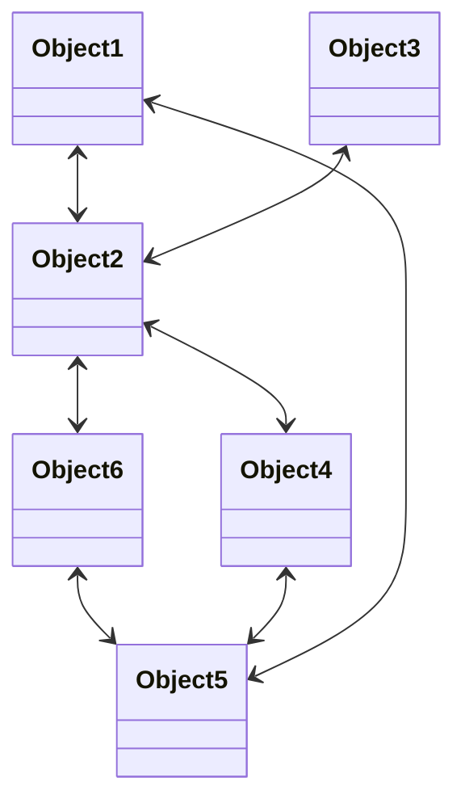
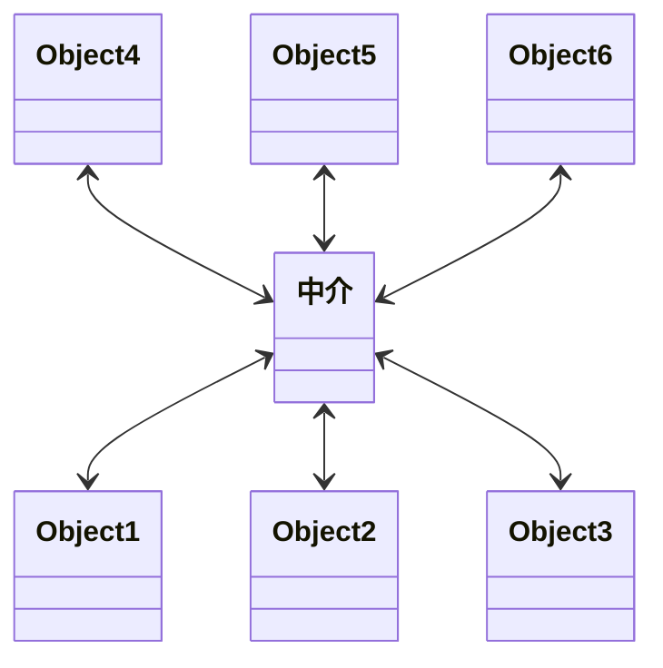
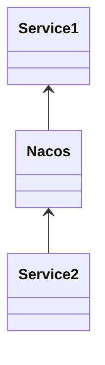

# 中介者

直接调用其他类中的方法, 就会很混乱

一个地方改了方法, 天知道会产生哪些变化

如果有中介

对象只和中介进行关联

中介者模式又叫调停模式, 定义一个中介来封装一系列对象之间的交互, 使原有对象之间的耦合松散

在遇到代码更改时, 只需要更改本类和中介者, 也可以扩展中介对象来遵守开闭原则

可以独立改变对象之间的交互

同事中介者集中控制交互, 多个同事被封装在中介者集中管理

可以将一对多的关联化为一对一的关联, 条例更清晰

## 缺点

同事类太多, 中介者职责太大, 导致复杂而庞大, 难以维护

namespace

## 使用场景

-   系统对象之间存在复杂引用, 系统关系混乱难以理解
-   创建一个运行于多个类之间的对象, 又不想生成新的子类

## 结构

-   抽象中介者
    -   Mediator
    -   提供同事对象注册与转发同事对象信息的抽象方法
-   具体中介者
    -   ConcreteMediator
    -   定义同事集合来管理同事
    -   协调同事之间的关系
-   抽象同事
    -   Colleague
    -   保存中介对象
    -   提供同事对象交互的抽象方法
    -   实现所有相互影响的同事列的公共功能
-   具体同事
    -   Concrete Colleague
    -   由中介者对象负责后续的交互
    -   有发起者和处理者

## 实现流程

注册中心模拟

