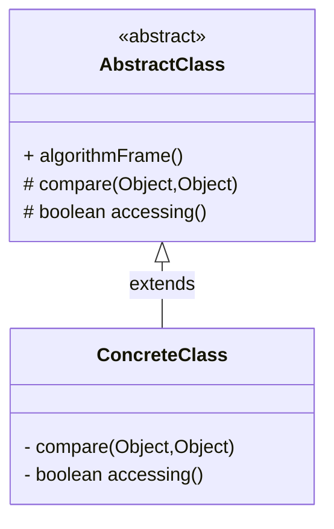

# 模板方法

>   Tmplate Method

定义一个操作中的算法骨架, 而将算法的步骤延迟到子类

子类可以不改变该算法结构的情况下重定义该算法的某些特定步骤


提高代码的复用性, 父类调用子类的实现实现了反向控制, 符合开闭原则


## 结构

-   抽象类

    -   Abstract Class

    -   负责给出一个算法的轮廓和骨架, 由一个模板方法和若干个基本方法构成

    -   模板方法

        定义了算法的骨架, 按照算法的步骤调用其包含的基本方法

    -   基本方法

        实现算法各个步骤的方法, 是模板方法的轮廓组成部分

        -   抽象方法

            Abstract Method

        -   具体方法

            Concrete Method

            由抽象类实现, 其子类可以覆盖也可以采用父类实现

        -   钩子方法

            Hook Method

            一般是用于判断逻辑的方法

-   具体子类

    -   Concrete Class
    -   实现抽象类中定义的抽象方法和钩子方法'是一个顶级逻辑的组成步骤




## 缺点

每个实现都要定义一个子类, 导致类的个数增加, 系统更加庞大

父类中的抽象方法由子类实现, 子类执行的结果会影响父类的结果, 这种反向控制的结构提高了代码阅读的难度

## 适用场景

算法的整体步骤固定, 但其中个别部分易变

需要通过子类决定父类算法中某个步骤是否执行(子类做空方法代表不执行某一段逻辑)

## 泛型+冒泡

不是模板模式, 但是好歹写了

```java
public static <T> void sort(T[] array, Comparator<T> cmp) {
    for (int i = 0; i < array.length; i++) {
        boolean exchanged = false;
        for (int j = 0; j + 1 < array.length - i; j++) {
            if (cmp.compare(array[j], array[j + 1]) > 0) {
                T temp = array[j];
                array[j] = array[j + 1];
                array[j + 1] = temp;
                exchanged = true;
            }
        }
        if (!exchanged) {
            break;
        }
    }
}

public static void main(String[] args) {
    Integer[] numbers = new Integer[12];
    Random random = new Random(System.nanoTime());
    for (int i = 0; i < 12; i++) {
        numbers[i] = random.nextInt() % 10 + 2;
    }
    System.out.println(Arrays.toString(numbers));
    BubbleSort.sort(numbers, Comparator.comparingInt(n -> n)); // 升序
    System.out.println(Arrays.toString(numbers));
    BubbleSort.sort(numbers, (n1, n2) -> n2 - n1);// 降序
    System.out.println(Arrays.toString(numbers));
    BubbleSort.sort(numbers, (n1, n2) -> n2 - n1);// 降序
    System.out.println(Arrays.toString(numbers));
}
```

## JDK中的模板方法

`InputStream`中定义多个`read()`

