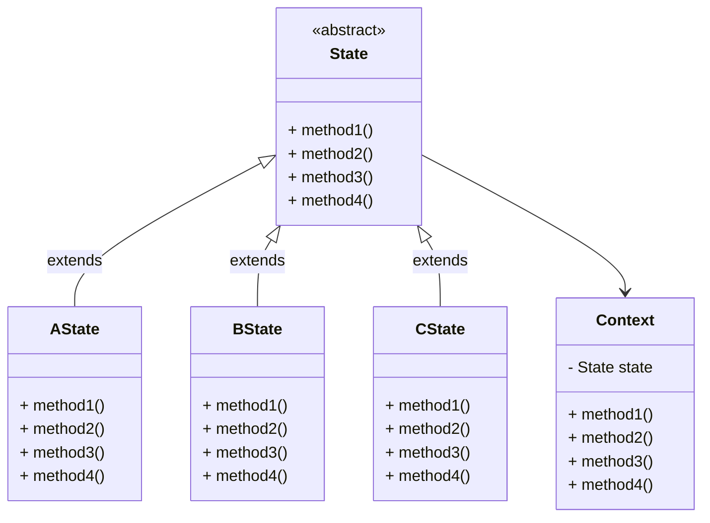

# 状态

如果灯开着, 就可以执行开; 如果灯关着, 就可以执行关

对于不同方法执行之后, 状态可能发生改变

对于不同的状态, 方法执行的逻辑可能不同

对有状态的对象, 把复杂**的判断逻辑提取到不同的状态对象**中, 允许状态对象在其内部状态发生改变时该变其状态

避免了一个方法中需要不断对当前状态的if-else或switch检查

## 缺点

增加系统类和对象的个数

结构和实现都复杂, 可能导致程序结构和代码混乱

不太符合开闭原则, 见下

## 结构

-   上下文
    -   Context
    -   定义客户程序需要的接口, 维护当前状态
    -   **将状态相关的操作委托给当前状态对象**
-   抽象状态
    -   State
    -   定义接口
    -   封装Context中对特定状态的对应行为
-   具体状态
    -   Concrete State
    -   实现抽象状态



如果要拓展就新增类继承abstract方法

```java
public class Context{
    @Getter
    @Setter
    private State state;
	public void method1(){
        state.method1();
    }
    public void method2(){
        state.method3();
    }
    public void method3(){
        state.method3();
    }
    public void method4(){
        state.method4();
    }
}
```

通过setState改变状态从而改变行为

要增加新的状态

如果要Context增加新方法? 那....

还有就是如果在该状态下没有改方法, 或需要调用其他状态的方法, 就需要在State中存贮Context字段进行循环依赖...吧?

## 适用场景

状态的特征特别明显

if-else或switch大量出现

