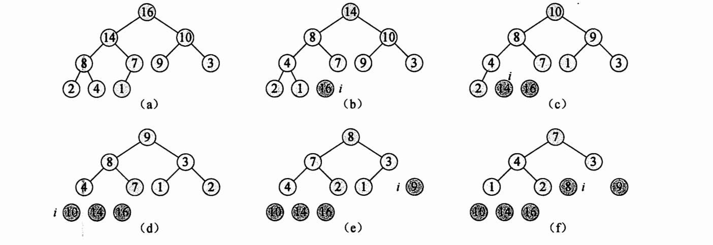

# 堆排序

[堆.md](../../Data-Struction/tree/Day05-Heap.md)

## 堆排序算法

先建成最大堆, 因为最大值总是在根节点, 可以每次抽提出根节点, 来组件升序数组

需要保证拿出根节点之后, 堆要重新调整成最大堆

将根节点拿出后, 把堆最后的节点放到根, 然后调整新根节点的位置




```cpp
template<class T>
void HeapSort<T>::sort() {
    this->buildMaxHeap();
    for (int i = this->len - 1; i > 0; --i) {
        this->elementSwap(i, 0);
        this->heapSize--;
        maxHeapify(0);
    }
}
```

堆排序之后, 如果令heapSize:=array.length, 那么就实现了最大堆到最小堆的转换

