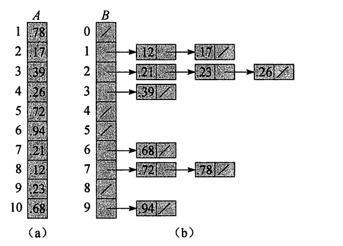

# 桶排序

>   Bucket Sort

适用于在一个区间内均匀分布的数组

## 思想

以下讨论在[0,1)均匀分布的数组, 数组有n个数据

将区间[0,1)均分成n份, 每一份为一个桶

每个桶维护一个链表

可以理解为Hash表差不多的结构



因为是均匀分布的, 所以每个节点落下的数据不会太多, 节点不会太长

将每个节点的链表排序之后, 全局自然就排序号了

## 实现

```cpp
void sort() override {
    int n = this->arr.length();
    list<double> buckets_[n];
    Array<list<double>> buckets(buckets_, n);
    for (int i = 0; i < n; ++i) {
        double &value = this->arr[i];
        buckets[(int) (n * value)].push_back(value);
    }
    for (int i = 0; i < n; ++i) {
        if (!buckets[i].empty()) {
            buckets[i].sort();
        }
    }
    for (int i = 0, j = 0; i < n && j < n; i++) {
        while (!buckets[i].empty()) {
            double front = buckets[i].front();
            buckets[i].pop_front();
            this->arr[j] = front;
            j++;
        }
    }
}
```

