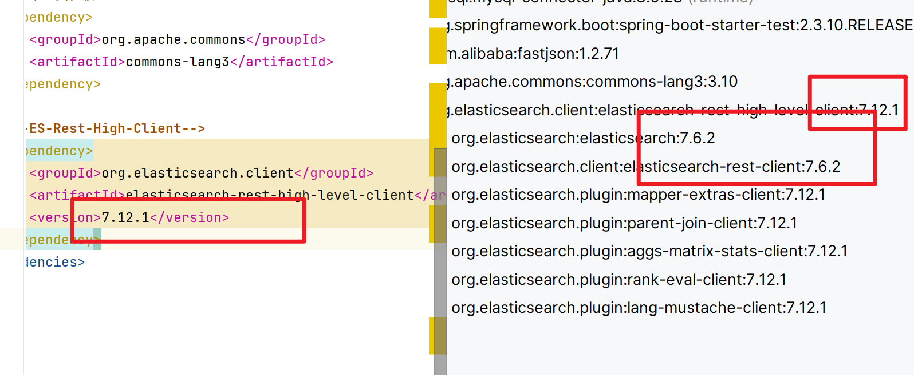
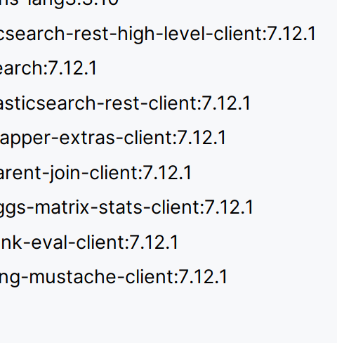

# RestClient操作索引库

>   ES官方提供, 各种不同语言的客户端, 用来操作es. 本质是组装es语句, 通过http请求发送给ES

[RestClient官方文档](https://www.elastic.co/guide/en/elasticsearch/client/index.html)


## 准备数据

-   [CV黑马程序员的sql资源](tb_hotel.sql)

-   [CV黑马程序员的demo](hotel-demo)

    注意版权

## 根据sql表创建mapping表

```mysql
CREATE TABLE `tb_hotel` (
  `id` bigint NOT NULL COMMENT '酒店id',
  `name` varchar(255)  NULL COMMENT '酒店名称',
  `address` varchar(255)  NOT NULL COMMENT '酒店地址',
  `price` int NOT NULL COMMENT '酒店价格',
  `score` int NOT NULL COMMENT '酒店评分',
  `brand` varchar(32)  NOT NULL COMMENT '酒店品牌',
  `city` varchar(32)  NOT NULL COMMENT '所在城市',
  `star_name` varchar(16)  DEFAULT NULL COMMENT '酒店星级，1星到5星，1钻到5钻',
  `business` varchar(255)  DEFAULT NULL COMMENT '商圈',
  `latitude` varchar(32)  NOT NULL COMMENT '纬度',
  `longitude` varchar(32)  NOT NULL COMMENT '经度',
  `pic` varchar(255)  DEFAULT NULL COMMENT '酒店图片',
  PRIMARY KEY (`id`) USING BTREE
) ENGINE=InnoDB DEFAULT CHARSET=utf8mb4 COLLATE=utf8mb4_general_ci ROW_FORMAT=COMPACT
```

### 分析问题

-   字段名
-   数据类型
-   是否参与搜索
-   是否分词
    -   分词器

#### 字段分析

-   `id`, 依据**es的`id`是字符串**

    我们的`id`也作为字符串, 且为`keyword`

-   `idress`, 不被搜索, 设置成`keyword`

-   `brand` , `city` , `starName`,`business`是一个整体,专有名词, 不会被分词, 但会被搜索

-   `latitude`和`longitude`在es中有特殊表示

    -   `geo_point `, 由经纬度确定的一个点, 例如`"32.123124,120.15878932"`
    -   `geo_shape`, 由多个`geo_point `组成的突出, 例如直线: `LINESTRING(-77.1234 32.314,-23.4124 23.124)`

    `latitude`和`longitude`在一起才是一个`geo_point `字段

#### 搜索分析

-   根据多字段查询, 效率不如单个字段, 如何提高效率?

-   **copy_to**属性

    将当前字段拷贝到指定字段, 在一个字段里搜索到多个字段的信息

    ```json
    "合成字段":{
        "type": "text",
        "analyzer": "ik_max_word"
    },
    "组成部分1":{
    	"type": "keyword",
        "copy_to": "合成字段"
    },
    "组成部分2":{
    	"type": "text",
        "analyzer": "ik_max_word"
        "copy_to": "合成字段"
    },
    ...
    ```

    **还做了一定的优化:**

    -   基于copy_to的逻辑创建新的索引
    -   实际上是看不到`"合成字段"`的
    -   但是能根据`"合成字段"`搜索


### 建立索引库DSL

```json
# 酒店mapping创建
PUT /hotel
{
  "mappings": {
    "properties": {
      "id":{
        "type": "keyword" ,
        "index": true
      },
      "all":{
        "type": "text",
        "analyzer": "ik_max_word"
      },
      "name":{
        "type": "text",
        "analyzer": "ik_max_word",
        "copy_to": "all"
      },
      "address":{
        "type": "keyword",
        "index": false
      },
      "price":{
        "type": "integer",
        "index": true
      },
      "score":{
        "type": "integer",
        "index": true
      },
      "brand":{
        "type": "keyword",
        "index": true,
        "copy_to": "all"
      },
      "city":{
        "type": "keyword",
        "index": true
      },
      "starName":{
        "type": "keyword",
        "index": true
      },
      "business":{
        "type": "keyword",
        "index": true,
        "copy_to": "all"
      },
      "location":{
        "type": "geo_point"
      },
      "pic":{
        "type": "text",
        "index": false
      }
    }
  }
}
```


## 初始化RestClient

### 引入es的依赖

```xml
<dependency>
    <groupId>org.elasticsearch.client</groupId>
    <artifactId>elasticsearch-rest-high-level-client</artifactId>
    <version>7.12.1</version>
</dependency>
```


### 覆盖ES的版本

-   Spring boot自带的ES版本是7.6.2

    

    诈骗啊! 妥妥的诈骗啊!

在自己的pom.xml指定elasticsearch的版本

```xml
<properties>
    <java.version>11</java.version>
    <elasticsearch.version>7.12.1</elasticsearch.version>
</properties>
```



### 分词的方法

```json
POST /_analyze
{
    "text": "text",
    "analyzer": "stantard"
}
```


```java
private RestClient client; 

@Autowired
public HotelDocumentDao(Properties properties) {
    // Properties 是自己创建的类, 用来存放配置
    this.client = RestClient.builder(
            new HttpHost("192.168.175.130",9200, "http")
    ).build();
}
public String[] analyze(String analyzer,String text ) throws IOException {
    // 获取请求
    Request request = new Request("POST", "/_analyze");
    if(text==null||"".equals(text)){
        throw new IllegalArgumentException("text can not be null or \"\" .");
    }
    // 2. 准备Json文档
    String source = "{\"text\":\""+ text +"\",\"analyzer\":\""+analyzer+"\"}";
    request.setJsonEntity(source);
    // 3. 发送请求
    Response response = client.performRequest(request);

    // 4. 获取响应结果
    HttpEntity entity = response.getEntity();
    InputStream content = entity.getContent();

    // 5. 转换结果
    byte[] bytes = content.readAllBytes();
    String json = new String(bytes, StandardCharsets.UTF_8);

    // 解析Json为字符串数组
    return parseTokens(json);
}

private String[] parseTokens(String tokens) throws IOException {
    String[] split = tokens.split("\"token\":");
    String[] result = new String[split.length-1];
    for (int j = 1; j < split.length; j++) {
        result[j-1] = split[j].split("\"")[1];
    }
    return result;
}
```


### 初始化RestHighLevelClient

```java
private RestHighLevelClient restClient;// 和上面的有不同

@BeforeEach
public void setUp() {
    this.restClient = new RestHighLevelClient(
            RestClient.builder(
                    HttpHost.create("http://192.168.175.130:9200")
            )
    );
}

@Test
void show(){
    System.out.println(this.restClient);
}
@Test
void show2(){
    System.out.println(this.restClient);
}

@AfterEach
void destroy() throws IOException {
    // 销毁
    this.restClient.close();
}
```

## 操作索引库相关API

>   restClient.indices()

### 创建索引库

```java
private static final String CREATE_HOTEL_INDEX = 
        "{\n" + // 不需要"PUT /hotel"
		"...\n" + 
        "}";
@Test
void createHotelIndex() throws IOException {
    // 1. 创建request对象, 代替"PUT /hotel"
    CreateIndexRequest request = new CreateIndexRequest("hotel");
    // 2. 准备请求的参数: DSL语句
    request.source(CREATE_HOTEL_INDEX,XContentType.JSON)
    // 3. 发送请求
    restClient.indices()// 包含索引库中所有方法
            .create(request, RequestOptions.DEFAULT);// 一般选择默认
}
```

### 判断索引库是否存在

```java
@Test
void existsHotelIndex() throws IOException {
    // 1. 创建request对象
    GetIndexRequest request = new GetIndexRequest("hotel");
    // 2. 发送请求
    boolean exists = restClient.indices()// 包含索引库中所有方法
            .exists(request, RequestOptions.DEFAULT);
    System.out.println(exists);
}
```


### 删除索引库

```java
@Test
void deleteHotelIndex() throws IOException {
    // 1. 创建request对象
    DeleteIndexRequest request = new DeleteIndexRequest("hotel");
    // 2. 发送请求
    restClient.indices()// 包含索引库中所有方法
            .delete(request, RequestOptions.DEFAULT);
}
```

 

## 文档CRUD相关API

>   restClient.index()

### 初始JavaRestClient

见上文

### 新增hotel数据

>   去数据库查询酒店数据, 导入hotel索引库

1.  从数据库查数据

    HotelServiceImpl#databaseToIndex(long hotelId)

    ```java
    HotelDto hotel = super.getById(hotelId);
    ```

2.  转换数据格式

    1.  完成HotelDto到HotelDoc的映射

        因为HotelDoc的经纬度变了

        HotelDoc.class

        ```java
        public HotelDoc(HotelDto hotelDto) {
            this.id = hotelDto.getId();
            this.name = hotelDto.getName();
            this.address = hotelDto.getAddress();
            this.price = hotelDto.getPrice();
            this.score = hotelDto.getScore();
            this.brand = hotelDto.getBrand();
            this.city = hotelDto.getCity();
            this.starName = hotelDto.getStarName();
            this.business = hotelDto.getBusiness();
            this.location = hotelDto.getLatitude() + ", " + hotelDto.getLongitude();
            this.pic = hotelDto.getPic();
        }
        ```

    2.  HotelDoc对象转化Json字符串

        HotelDoc.class

        ```java
        public String toJson() {
            return JSON.toJSONString(this);
        }
        ```

3.  传入hotel索引库

    HotelDocumentDao.class

    ```java
    @Component
    public class HotelDocumentDao {
    
        private static RestHighLevelClient restClient;
    
        static  {
            HotelDocumentDao.restClient = new RestHighLevelClient(
                    RestClient.builder(
                            HttpHost.create("http://192.168.175.130:9200")
                    )
            );
        }
    
        public void addDocument(String documentId,String addSource) throws IOException {
            // 1. 准备Request 对象
            // 代替 "POST /索引库名/_doc/文档id"
            IndexRequest request = new IndexRequest("hotel").id(documentId);
            // 2. 准备Json文档
            request.source(addSource, XContentType.JSON);
            // 3. 发送请求
            HotelDocumentDao.restClient.index(request, RequestOptions.DEFAULT);
            destroy();
        }
    
        public static void destroy() throws IOException {
            // 销毁
            HotelDocumentDao.restClient.close();
        }
    
    }
    ```

4.  将数据库中的数据转到索引库中去

    HotelServiceImpl.class

    ```java
    @Autowired
    private HotelDocumentDao hotelDocumentDao;
    @Override
    public void databaseToIndex(long hotelId) throws IOException {
        // 获取hotel数据
        HotelDto hotelDto = super.getById(hotelId);
        // 将HotelDto转化未HotelDoc
        HotelDoc hotelDoc = new HotelDoc(hotelDto);
        String addSource = hotelDoc.toJson();
        hotelDocumentDao.addDocument(String.valueOf(hotelId),addSource);
    }
    ```


### 根据id查询hotel数据

```java
@Test
void testDatabaseToIndex() throws IOException {
    long hotelId = 39106L;
    //hotelService.databaseToIndex(hotelId);
    // 1. 创建request对象, 代替 "GET /索引库名/_doc/文档id"
    GetRequest request = new GetRequest("hotel",String.valueOf(hotelId));
    // 2. 发送请求, 得到结果
    GetResponse response
            = restClient.get(request, RequestOptions.DEFAULT);
    // 3. 解析结果
    String json = response.getSourceAsString();
    System.out.println(json);
    // 4. 解析JSON获取对象
    HotelDoc hotelDoc = JSON.parseObject(json, HotelDoc.class);
    System.out.println(hotelDoc);
}
```

-   查询不存在的东西, String json为null;

### 修改hotel数据

#### 全量更新

>   如果不存在创建新的文档, 和新增完全一致

```java
public void updateDocument(String documentId,String updateSource) throws IOException {
    // 1. 准备Request 对象
    // 代替 "PUT /索引库名/_doc/文档id"
    IndexRequest request = new IndexRequest("hotel").id(documentId);
    // 2. 准备Json文档
    request.source(updateSource, XContentType.JSON);
    // 3. 发送请求
    HotelDocumentDao.restClient.index(request, RequestOptions.DEFAULT);
    destroy();
}
```
#### 局部更新

>   如果不存在就报错

```java
public void updateDocument(String documentId) throws IOException {
    // 1. 准备Request 对象
    // 代替 "POST /索引库名/_update/文档id"
    UpdateRequest request = new UpdateRequest("hotel",documentId);
    // 2. 参数
    request.doc(
            "price",344,//value是数值,加不加引号好像无所谓?
            "score",42
    );
    // 3. 发送请求
    this.restClient.update(request, RequestOptions.DEFAULT);
    this.destroy();
}
```

-   如果不存在报的错:

    ```txt
    [hotel/SZCZ2b42Tki1Aqh1zsyrUQ][[hotel][0]] ElasticsearchStatusException[Elasticsearch exception [type=document_missing_exception, reason=[_doc][391060]: document missing]
    ]
    ```


### 删除hotel数据

```java
public void delete(long hotelId) throws IOException {
    // 1. 创建request对象
    DeleteRequest request = new DeleteRequest("hotel",String.valueOf(hotelId));
    // 2. 发送请求
    restClient.delete(request, RequestOptions.DEFAULT);
}
```

## 批量新增

>   将数据库中的所有数据移到ES的索引库中
>
>   es原生也是有批量新增的url的, 也是_bulk, 详见百度

1.  利用MP查询酒店数据

    HotelServiceImpl.class

2.  将查询到的酒店数据(HotelDto)转换成文档类型数据(HotelDoc)

    HotelServiceImpl.class

    ```java
    @Override
    public void databaseToIndex() throws IOException {
        // 获取hotel数据
        List<HotelDto> hotelDtos = super.list();
        // 将HotelDto转化未HotelDoc
        List<HotelDoc> hotelDocs = hotelDtos.stream()
            .map(HotelDoc::new).collect(Collectors.toList());
        // 将HotelDoc批量台添加到索引库中去
        hotelDocumentDao.add(hotelDocs);
    }
    ```

3.  利用RestClient中的Bulk批处理, 实现批量新增文档

    HotelDocumentDao.class

    ```java
    public void add(List<HotelDoc> hotelDocs) throws IOException {
        // 1. 创建Request请求
        BulkRequest request = new BulkRequest();
        // 2. 添加要批量提交的请求
        hotelDocs.forEach(hotelDoc -> request.add(
                        new IndexRequest(INDEX)
                                .id(String.valueOf(hotelDoc.getId()))
                                .source(hotelDoc.toJson(), XContentType.JSON)
                )
        );
        // 3. 发起bulk请求, 批量提交
        restClient.bulk(request, RequestOptions.DEFAULT);
    }
    ```

4.  为检查是否完成新增, 使用search批量查询

    HotelDocumentDao.class

    ```java
    public List<HotelDoc> getAll() throws IOException {
        // 1. 创建 SearchRequest搜索请求,并指定要查询的索引
        SearchRequest request = new SearchRequest(INDEX);
    
        // 2. 创建 SearchSourceBuilder条件构造。
        SearchSourceBuilder searchSourceBuilder = new SearchSourceBuilder();
    
        searchSourceBuilder.from(0);
        searchSourceBuilder.size(201);
    
        // 3. SearchRequest搜索请求,并指定要查询的索引
        request.source(searchSourceBuilder);
        System.out.println(searchRequest.source().toString());//{"from":0,"size":201}
    
        SearchResponse response = restClient.search(searchRequest, RequestOptions.DEFAULT);
    
        // 4、解析响应
        SearchHits searchHits = response.getHits();
    
        // 4.1查询总条数
        TotalHits totalHits = searchHits.getTotalHits();
        System.out.println("总共" + totalHits + "条记录");// 201(总是)
    
        // 4.2 获取结果数组
        SearchHit[] hits = searchHits.getHits();
        // 4.3遍历,转化
        return Arrays.stream(hits).map(
                        // 解析Json字符
                        hit -> HotelDoc.parseJson(
                                // 获取数据信息
                                hit.getSourceAsString()
                        ))
                .collect(Collectors.toList());
    }
    ```

