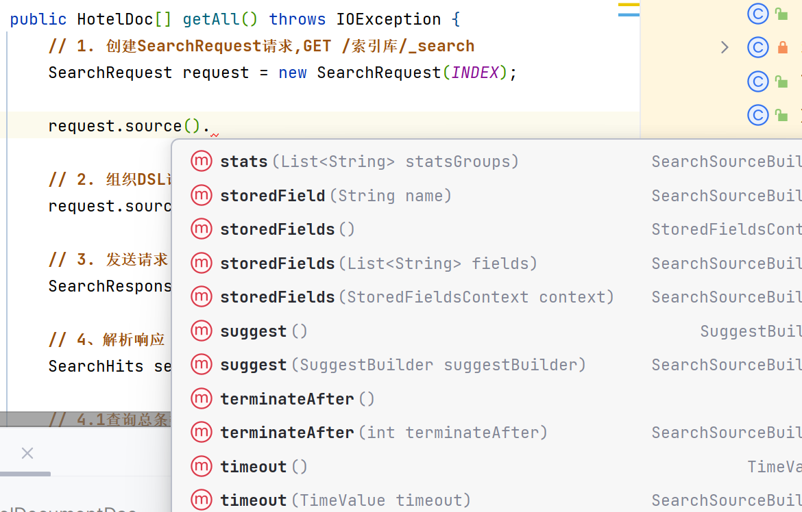
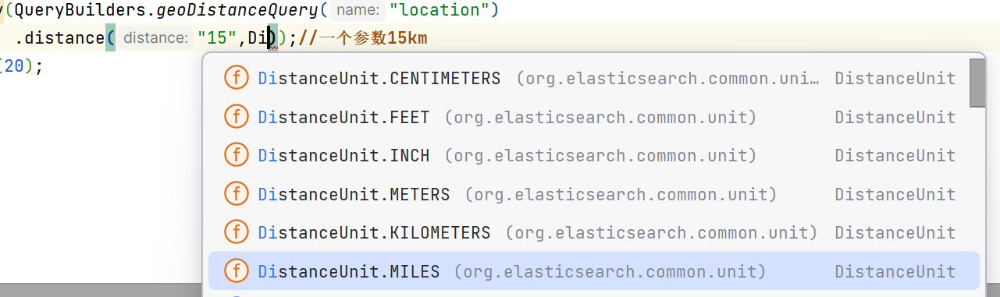

# RestClient与查询



-   从查询到对查询数据的处理, 都有

## `match_all`查询所有

```json
GET /索引库/_search
```

```java
public HotelDoc[] getAll() throws IOException {
    // 1. 创建SearchRequest请求,GET /索引库/_search
    SearchRequest request = new SearchRequest(INDEX);

    // 2. 组织DSL语句 , "query":{"match_all":{}}
    request.source().query(QueryBuilders.matchAllQuery());

    // 3. 发送请求
    SearchResponse response = restClient.search(request, RequestOptions.DEFAULT);

    // 4、解析响应
    SearchHits searchHits = response.getHits();

    // 5. 查询总条数
    System.out.println("总共" + searchHits.getTotalHits().value + "条记录");//201

    // 6, 获取结果数组
    SearchHit[] hits = searchHits.getHits();
    // 7. 遍历,转化
    return Arrays.stream(hits).map(
                    // 解析Json字符
                    hit -> HotelDoc.parseJson(
                            // 获取数据信息
                            hit.getSourceAsString()
                    ))
            .toArray(HotelDoc[]::new);
}
```

-   他还是这么爱流

接下来的查询, 只要套个大纲,然后写组织DSL就好啦,解析JSON和准备请求都是一样一样的

```java
// 1. 创建SearchRequest请求,GET /索引库/_search
SearchRequest request = new SearchRequest(INDEX);

// 2. 组织DSL语句
...

// 3. 发送请求
SearchResponse response = restClient.search(request, RequestOptions.DEFAULT);

// 4、解析响应
SearchHits searchHits = response.getHits();

// 5. 查询总条数
System.out.println("总共" + searchHits.getTotalHits().value + "条记录");//201

// 6, 获取结果数组
SearchHit[] hits = searchHits.getHits();
// 7. 遍历,转化
return Arrays.stream(hits).map(
                // 解析Json字符
                hit -> HotelDoc.parseJson(
                        // 获取数据信息
                        hit.getSourceAsString()
                ))
        .toArray(HotelDoc[]::new);
```
### 搭一个简单的查询的框架

-   准备一个函数式接口

    ```java
    public interface SearchSourceFunction {
        void function(SearchSourceBuilder source) throws IOException;
    }
    ```

-   HotelDocumentDao.class

    ```java
    /**
     * RestClient查询的框架
     * @param getter 组织DSL语句的函数
     * @return 从Hotel索引库查询出来的结果集合
     * @throws IOException restClient.search()抛出的异常
     */
    public HotelDoc[] get(SearchSourceFunction getter) throws IOException {
        // Function<? super T, ? extends R> mapper

        // 1. 创建SearchRequest请求,GET /索引库/_search
        SearchRequest request = new SearchRequest(INDEX);

        // 2. 组织DSL语句
        getter.function(request.source());

        // 3. 发送请求
        SearchResponse response = restClient.search(request, RequestOptions.DEFAULT);

        // 4、解析响应
        SearchHits searchHits = response.getHits();

        // 5. 查询总条数
        System.out.println("总共" + searchHits.getTotalHits().value + "条记录");//201

        // 6, 获取结果数组
        SearchHit[] hits = searchHits.getHits();
        // 7. 遍历,转化
        return Arrays.stream(hits).map(
                        // 解析Json字符
                        hit -> HotelDoc.parseJson(
                                // 获取数据信息
                                hit.getSourceAsString()
                        ))
                .toArray(HotelDoc[]::new);
    }
    ```

-   写全量查询

    ```java
    /**
     * 无参的get认为是全量查询
     * @see this#get(SearchSourceFunction)
     */
    public HotelDoc[] get() throws IOException {
        // 2. 组织DSL语句 , "query":{"match_all":{}}
        return this.get(source -> source.query(QueryBuilders.matchAllQuery()));
    }
    ```

-   使用模块的示例: 分页查询

    ```java
    @Test
    void testGet() throws IOException {
        HotelDoc[] hotels = hotelDocumentDao.get(s->s.size(20));
        System.out.println(hotels.length);//20
    }
    ```

-   这样花里胡哨的玩法就先按下不提:

    ```java
    public class QueryTest {
        private static final HotelDocumentDao HOTEL_DOCUMENT_DAO = new HotelDocumentDao();
        @Test
        void testGet() throws IOException {
            HotelDoc[] result = HOTEL_DOCUMENT_DAO.get(this::query);
            System.out.println("查询的Hit结果个数为 :"+result.length+"个");
            Arrays.stream(result).forEach(System.out::println);
        }
        private void query(SearchSourceBuilder s){
            s.size(20);// 接下来真的只要专精一条语句就够了
        }
    }
    ```

-   简单的附录: 有关Java引用类型传参时可能出现的疑惑

    ```java
    @Test
    void testExchange(){
        Value a = new Value(1);
        Value b = new Value(2);
        System.out.println("a = " + a);//1
        System.out.println("b = " + b);//2
        exchange(a,b);
        System.out.println("a = " + a);//1
        System.out.println("b = " + b);//2

        System.out.println("--------------------c--------------------");
        Value c = b;
        c.setValue(3);
        System.out.println("a = " + a);//1
        System.out.println("b = " + b);//3
        System.out.println("c = " + c);//3
    }

    private void exchange(Value a, Value b) {
        System.out.println("--------------------exchange--------------------");
        Value temp = a;
        a = b;
        b = a;
    }
    ```

## 全文检索查询

>   常用于在搜索框的搜索

### `match`查询

```json
GET /索引库名/_search
{
  "query": {
    "match": {
      "字段": "文本"
    }
  }
}
```

```java
// match查询 , 需要字段名和内容
s.query(QueryBuilders.matchQuery("all","北京如家中心"));
```

### `multi_match`多字段查询

```json
GET /索引库名/_search
{
  "query": {
    "multi_match": {
      "query": "查询文本",
      "fields": ["字段1","字段2","..."]
    }
  }
}
```

```java
// multi_match 
s.query(QueryBuilders.multiMatchQuery("如家","name","business"));
```

## 精准查询

### `ids`根据id查询

```json
GET /索引库名/_search
{
  "query": {
    "ids": {
      "values": ["id1","id2","..."]
    }
  }
}
```

```java
// ids没有?算了反正没啥用
```

### `range`范围查询

-   数值可以范围查询
-   字符串按照字典也可以做范围查询(但是没人用)

```json
GET /索引库名/_search
{
  "query": {
    "range": {
      "字段名": {
        "gte": 上限(包含),
        "lte": 下线(包含)
      }
    }
  }
}
```

-   `gte`		大于等于
-   `lte`        小于等于
-   `gt`		  大于不等于
-   `lt`          小于不等于

```java
s.query(QueryBuilders.rangeQuery("price").gt(1000).lte(500));//不报错, 返回0个值
```

### `term`依据值精确查询

```json
GET /索引库名/_search
{
  "query": {
    "term": {
      "字段": {
        "value": "值"
      }
    }
  }
}
```

```java
s.query(QueryBuilders.termQuery("city","上海"));
```

## 地理坐标查询

### `geo_distance`

```json
GET /hotel/_search
{
  "query": {
    "geo_distance":{
      "distance": "半径",
      "geo_point字段": "中心点经度, 中心点维度" 
    }
  }
}
```

-   关于半径的单位
    -   不支持 `mile`(说不定mile有其他表示方法, 我不造啊),不支持`nm`

    -   真相大白

        

```java
s.query(QueryBuilders.geoDistanceQuery("location")
        .point(31.251433, 121.47522)
        .distance("10", DistanceUnit.KILOMETERS));// 直接一个参数: "15km" 也行
```

### `geo_bounding_box`

```json
GET /索引库名/_search
{
  "query": {
    "geo_bounding_box":{
      "geo_point类型字段":{
        "top_left": {
          "lat": 左上角经度,
          "lon": 左上角维度 
        },
        "bottom_right": {
          "lat": 右下角经度,
          "lon": 右下角维度 
        }
      }
    }
  }
}
```

```java
s.query(QueryBuilders.geoBoundingBoxQuery("location")
        .setCornersOGC(new GeoPoint(31.151433, 121.37522),
                new GeoPoint(31.351433, 121.57522)));
```

## 复合查询

### `function_score` 依据相关度算分

```json
GET /hotel/_search
{
  "query": {
    "function_score": {
      "query": {
        "原始查询类型": {
          ...
        }
      },
      "functions": [
        {
          "filter": {
            "过滤条件的查询类型": {
              ...//符合过滤条件的文档被更改权重
            }
          },
          算分函数: 值
        }
      ],
      "boost_mode": "函数结果的影响模式"
    }
  }
}
```

-   算分函数

    -   ```json
        "weight": 常量
        ```

        直接作为函数结果

    -   ```json
        "field_value_factor": 函数字段
        ```

        函数字段的值做函数结果

    -   ```json
        "random_score": {}
        ```

        随机值作为函数结果

    -   ```json
        "script_score": 自定义公式
        ```

        自定义公式

-   `bost_mood`函数结果的影响模式

    -   `multiply`: query_score*function_score的结果(缺省)
    -   `replase`: 抛弃原始求分, 选择function_score
    -   `sum`, `avg`, `max`, `min ` ....

-   ```java
MatchQueryBuilder matchQuery = new MatchQueryBuilder("all","上海北京如家");
    // 过滤和权重
    FunctionScoreQueryBuilder.FilterFunctionBuilder filterFunctionBuilder =
            new FunctionScoreQueryBuilder.FilterFunctionBuilder(
                    QueryBuilders.termQuery("business", "虹桥地区"), //过滤
                    ScoreFunctionBuilders.weightFactorFunction(100) // 权重
            );

    FunctionScoreQueryBuilder functionQuery = new FunctionScoreQueryBuilder(matchQuery,
            new FunctionScoreQueryBuilder.FilterFunctionBuilder[]{filterFunctionBuilder});

    functionQuery.boostMode(CombineFunction.MULTIPLY);
    // function
    s.query(functionQuery);
  ```

-   对照json

    ```json
    GET /hotel/_search
    {
      "query": {
        "function_score": {
          "query": {
            "match": {
              "all": "上海北京如家"
            }
          },
          "functions": [
            {
              "filter": {
                "term": {
                  "business": "虹桥地区"
                }
              },
              "weight": 100
            }
          ],
          "boost_mode": "multiply"
        }
      }
    }
    ```

-   我觉得仅仅是置顶的话, 用算分是非常没用的: 算分的数据量大! 但是, 如果是在Service层来对几十条数据查找几条数据然后移到最前的话, 我觉得那是极为划算的

    要我说: 

    ``` 
    newList = new [list.length];
    j=0,k=0;
    for(i = 0; i< list.length;i++){
    	if(each.置顶==true){
    		newList[list.length-1-k];
    		k++;
    	}else{
    		newList[j];
    		j++;
    	}
    } 
    ```

    然后到序输出newlist

### `bool` 复合条件查询

-   组合方式
    -   `must`必须匹配每个子查询
    -   `should` 选择性匹配任意个子查询
    -   `must_not` 必须不匹配, **不参与算分**
    -   `filter`: 必须匹配, 但**不参与算分**
-   **除了参与算分的子查询外, 其余所有的查询都应该放入`filter`或`must_not`, 减少算分带来的效率损失**

```json
GET /索引库名/_search
{
  "query": {
    "bool": {
      "组合方式": [
        {
          "子查询查询类型": {
          }
        },
        ...// 其他子查询
      ],
      ...// 其他组合方式+子查询
    }
  }
}
```

```java
// bool
BoolQueryBuilder boolQuery = QueryBuilders.boolQuery();
// must
boolQuery.must(QueryBuilders.termQuery("city","上海"));
boolQuery.must(QueryBuilders.matchQuery("all","连锁"));
// filter
boolQuery.filter(QueryBuilders.rangeQuery("price").lte(500));
// 
s.query(boolQuery);
```

# 搜索结果处理

## 排序

-   默认是按照相关度算分排序
-   一旦自己排序, es就会放弃算分(score=null), 速度也会有所上升
-   接收排序的字段类型有: `keyword` , `数值类型`, `地理坐标`, `日期类型`

```json
GET /索引库名/_search
{
  "query": {
    "match_all": {}
  },
  "sort": [// 注意要放在query同级
    {
      "字段": {
        "order": "desc"
      }// 支持多字段排序, 从上到下优先级
    }
  ]
}
```

```java
s.sort("price", SortOrder.ASC);
```

-   还有相差距离的提示

## 分页

### 普通分页

-   `from`
-   `size`

```json
GET /索引库名/_search
{
  "query": {
    "match_all": {}
  },
  "from": 10, // 缺省为0
  "size": 20 // 缺省为10
}
```

```java
s.query(QueryBuilders.matchAllQuery());
s.size(20);
s.from(10);
```

### `search after`解决分页的限制

分页时需要排序, 从上一次的排序值开始, 查询下一页的数据

```json
GET /hotel/_search
{
    "query": {
        "match_all": {

        }
    },
    "sort": [
      {
        "price":  "desc"
      }
    ],
    "search_after": [1899],
    size="15"
}
```

```java
// 需要先排序
s.query(QueryBuilders.matchAllQuery());
s.sort("price", SortOrder.DESC);
s.searchAfter(new Object[]{1899});//149块钱以上
s.size(15);
```

## 高亮

-   `字段`: 告诉ES在哪些地方加标签
-   `pre_targs`, `post_targs`: 告诉es加什么标签,默认\<em\>\</em\>
-   默认情况下, es的搜索字段必须和高亮字段一致, 否则不会高亮, 通过`"require_field_match": "false"`更改

```json
GET /hotel/_search
{
  "query": {
    "match": {
      "all": "北京"
    }
  },
  "highlight": {
    "fields": {
      "city": {
        "pre_tags": "<strong>",
        "post_tags": "</strong>",
        "require_field_match": "false"
      }
    }
  }
}
```

```java
s.query(QueryBuilders.matchQuery("all","北京酒店"));

HighlightBuilder name = new HighlightBuilder().field("name")// field底层时.add()所以可以放心地链式编程
        .requireFieldMatch(false)
        .preTags("<strong>").postTags("</strong>");
// 结果的解析
s.highlighter(name);

s.size(20);
```

高亮后的结果需要另外解析:

```java
Arrays.stream(hits).map(
                        // 解析Json字符
                        hit -> {
                            Map<String, HighlightField> highlightFields = 
                                hit.getHighlightFields();
                            highlightFields.forEach((k,v)-> System.out.println(k+"->"+v));
                            return HotelDoc.parseJson(
                                    // 获取数据信息
                                    hit.getSourceAsString()
                            );// 原来的解析不变
                        })
                .toArray(HotelDoc[]::new);
```

高亮是这样的:

```
name->[name], fragments[[速8<strong>酒店</strong>（<strong>北京</strong>平谷兴谷环岛店）]]
```

取出fragments的代码是这样的

```java
highlightFields.forEach((k,v)-> System.out.println( Arrays.toString(v.getFragments())));
```

