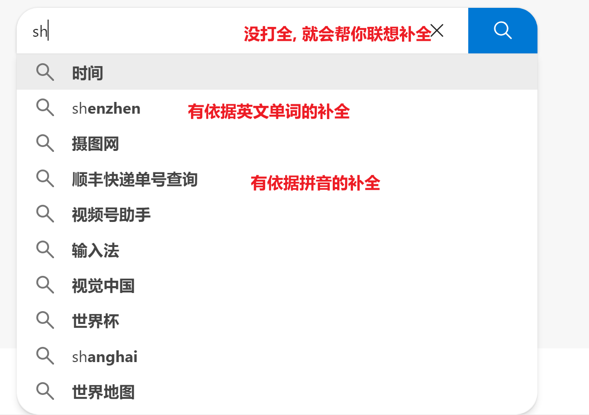
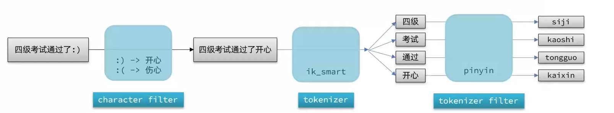
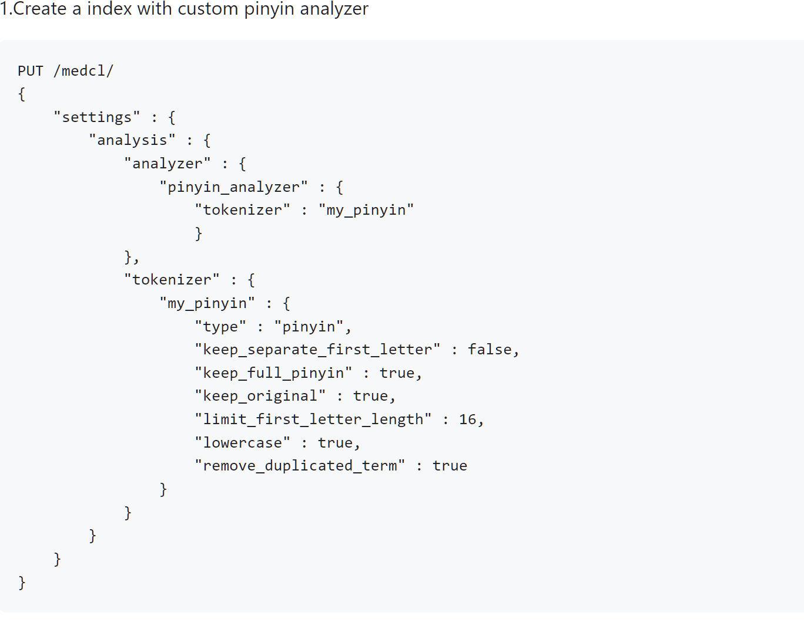
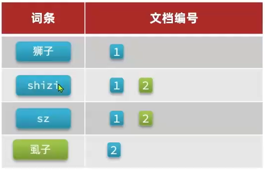
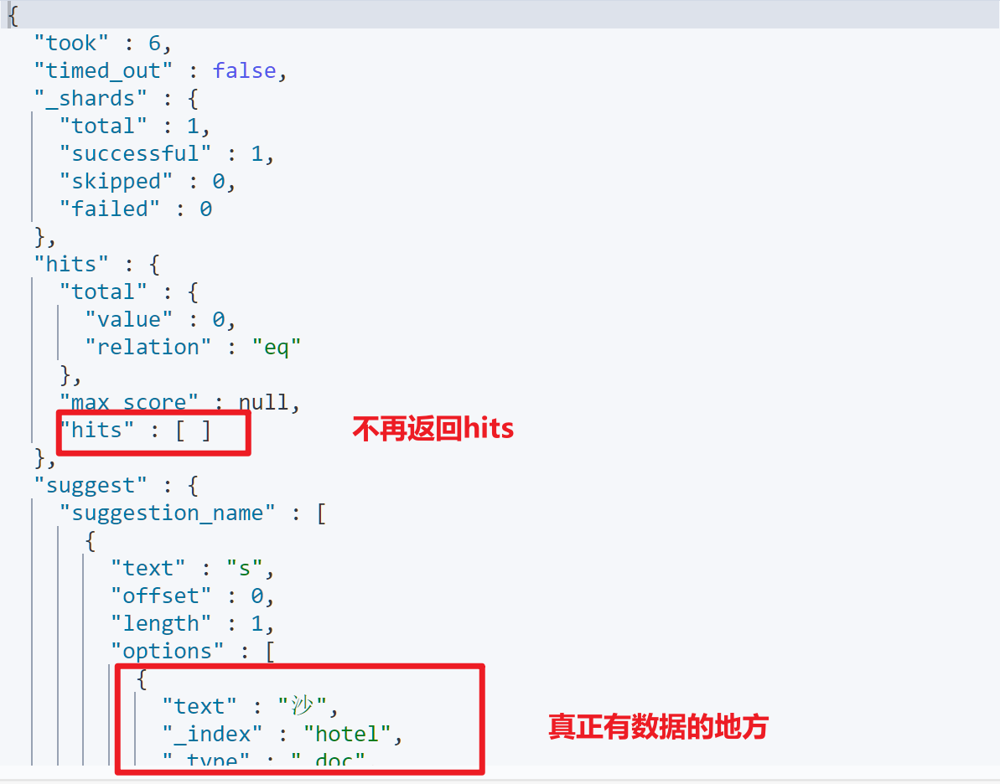
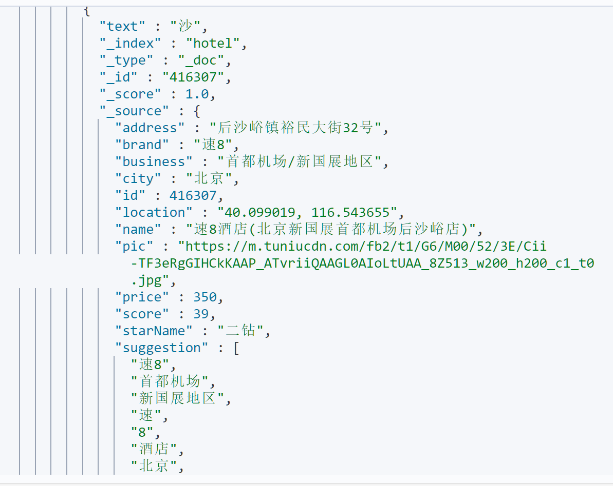

# 自动补全



-   当然, 打了第一个字, 出现后面的词条也很正常是吧

## 拼音分词器

一个插件

[拼音分词器](https://github.com/medcl/elasticsearch-analysis-pinyin)

### 安装

>   😰


#### 简单使用

```json
POST /_analyze
{
  "text": "又双叒叕",
  "analyzer": "pinyin"
}
```


```json
{
  "tokens" : [
    {
      "token" : "you",
      "start_offset" : 0,
      "end_offset" : 0,
      "type" : "word",
      "position" : 0
    },
    {  // 首字母结合
      "token" : "ysrz",
      "start_offset" : 0,
      "end_offset" : 0,
      "type" : "word",
      "position" : 0
    },
    {
      "token" : "shuang",
      "start_offset" : 0,
      "end_offset" : 0,
      "type" : "word",
      "position" : 1
    },
    {
      "token" : "ruo",
      "start_offset" : 0,
      "end_offset" : 0,
      "type" : "word",
      "position" : 2
    },
    {
      "token" : "zhui",
      "start_offset" : 0,
      "end_offset" : 0,
      "type" : "word",
      "position" : 3
    }
  ]
}

```


### 自定义分词器

#### 拼音分词器的缺陷

```json
POST /_analyze
{
  "text": "由于想不出一个好一点的适合分词的句子于是就开始了瞎搞",
  "analyzer": "pinyin"
}
```


```json
{
  "token" : "yyxbcyghyddshfcd",
  "start_offset" : 0,
  "end_offset" : 0,
  "type" : "word",
  "position" : 0
},
```
每个字的拼音都是分开的, 首字母都是连在一起的, 并没有实质上的分词

没有汉字只有拼音( 有拼音锦上添花, 但不能忘了汉字的本 )

而且对英文的处理也不佳

#### ES分词器组成

-   `character filter`

    在`tokenizer`之前对文本进行处理, 例如删除字符, 替换字符

-   `tokenizer`

    将文本按照一定的规则( 例如 `all`会被分词但是其中的 `keyword` 就不会被分词 )切割成词条(`term`), 

-   `tokenizer filter `

    将`tokenizer`输出的词条做进一步的处理, 例如大小写转换, 同义词转换, 拼音处理等




#### 创建自定义分词器

-   **要求在创建索引库时创建自定义分词器,  分词器只对当前索引器起效**

```json
PUT /test
{
  "settings": {
    "analysis": {
      "analyzer": {
        "自定义分词器名":{
          "tokenizer":
        }
      }
    }
  }
}
```

-   但是这样还不够! 还是会分成一个字一个拼音!
-   pinyin分词器官网的解决方案:



```json
PUT /medcl/ 
{
    "settings" : {
        "analysis" : {
            "analyzer" : {
                "pinyin_analyzer" : {
                    "tokenizer" : "my_pinyin"
                    }
            },
            "tokenizer" : {
                "my_pinyin" : {
                    "type" : "pinyin",
                    "keep_separate_first_letter" : false,
                    "keep_full_pinyin" : true,
                    "keep_original" : true,
                    "limit_first_letter_length" : 16,
                    "lowercase" : true,
                    "remove_duplicated_term" : true
                }
            }
        }
    }
}
```


稍作改变:

-   会用到的配置

    -   `keep_first_letter` when this option enabled, eg: `刘德华`>`ldh`, default: true
    -   `keep_full_pinyin` when this option enabled, eg: `刘德华`> [`liu`,`de`,`hua`], default: true
    -   `keep_joined_full_pinyin` when this option enabled, eg: `刘德华`> [`liudehua`], default: false
    -   `keep_original` when this option enabled, will keep original input as well, default: false
    -   `limit_first_letter_length` set max length of the first_letter result, default: 16
    -   `remove_duplicated_term` when this option enabled, duplicated term will be removed to save index, eg: `de的`>`de`, default: false, NOTE: position related query maybe influenced
    -   `none_chinese_pinyin_tokenize` break non chinese letters into separate pinyin term if they are pinyin, default: true, eg: `liudehuaalibaba13zhuanghan` -> `liu`,`de`,`hua`,`a`,`li`,`ba`,`ba`,`13`,`zhuang`,`han`, NOTE: `keep_none_chinese` and `keep_none_chinese_together` should be enabled first

-   默认为true的配置

    -   `keep_none_chinese` keep non chinese letter or number in result, default: true
    -   `keep_none_chinese_in_first_letter` keep non Chinese letters in first letter, eg: `刘德华AT2016`->`ldhat2016`, default: true
    -   `lowercase` lowercase non Chinese letters, default: true
    -   `trim_whitespace` default: true

    

```json
PUT /test
{
  "settings": {
    "analysis": {
      "analyzer": {
        "my_analyzer": {
          "tokenizer": "ik_max_word",
          "filter": "my_pinyin"
        }
      },
      "filter": {
        "my_pinyin": {
          "type": "pinyin",
          "keep_full_pinyin": false,
          "keep_joined_full_pinyin": true,
          "keep_original": true,
          "limit_first_letter_length": 16,
          "remove_duplicated_term": true,
          "none_chinese_pinyin_tokenize": false
        }
      }
    }
  },
  "mappings": {
    "properties": {
      "words":{
        "type": "text",
        "analyzer": "my_analyzer"
      }
    }
  }
}
```


测试使用

```json
POST /test/_analyze
{
  "text": "因为剩余劳动始终只能是工作日的一个部分，或剩余价值始终只能是价值产品的一个部分，所以剩余劳动必然始终小于工作日，或剩余价值必然始终小于价值产品。",
  "analyzer": "my_analyzer"
}
```

取结果的一个例子

```json
{
  "token" : "价值",
  "start_offset" : 30,
  "end_offset" : 32,
  "type" : "CN_WORD",
  "position" : 15
},
{
  "token" : "jiazhi",
  "start_offset" : 30,
  "end_offset" : 32,
  "type" : "CN_WORD",
  "position" : 15
},
{
  "token" : "jz",
  "start_offset" : 30,
  "end_offset" : 32,
  "type" : "CN_WORD",
  "position" : 15
},
```
#### 因为同音字出现的问题

```json
POST /test/_doc/1
{
  "id": 1,
  "words": "狮子"
}
POST /test/_doc/2
{
  "id": 2,
  "words": "虱子"
}
```

-   同音字准备

```json
GET /test/_search
{
  "query": {
    "match": {
      "words": "shizi"
    }
  }
}
```

```json
{
  "_index" : "test",
  "_type" : "_doc",
  "_id" : "1",
  "_score" : 0.47249946,
  "_source" : {
    "id" : 1,
    "words" : "狮子"
  }
},
{
  "_index" : "test",
  "_type" : "_doc",
  "_id" : "2",
  "_score" : 0.47249946,
  "_source" : {
    "id" : 2,
    "words" : "虱子"
  }
}
```

还不错

```json
GET /test/_search
{
  "query": {
    "match": {
      "words": "希望能搜到狮子"
    }
  }
}
```

```json
{
  "_index" : "test",
  "_type" : "_doc",
  "_id" : "1",
  "_score" : 0.17196575,
  "_source" : {
    "id" : 1,
    "words" : "狮子"
  }
},
{
  "_index" : "test",
  "_type" : "_doc",
  "_id" : "2",
  "_score" : 0.16364793,
  "_source" : {
    "id" : 2,
    "words" : "虱子"
  }
}
```

-   非常好的拼音分词器, 使我的小脑坍缩 , 爱来自中国
-   它俩的

分析原因:

1.  将`text`值**狮子**分词 :

    -   狮子
    -   shizi
    -   sz

2.  将`text`值**虱子**分词 : 

    -   虱子
    -   shizi
    -   sz

3.  es创建倒排索引

    

4.  将搜索的文本分词: 

    -   狮子
    -   shizi
    -   sz

5.  es一看:

     en? shizi? 这不是和虱子有点关系的嘛

##### 解决方案

使用两种分词器, 分别在不同场景使用

`analyzer` 创建索引时分词用的分词器

`search_analyzer`  查找时对文本的分词器

```json
"properties": {
  "words":{
    "type": "text",
    "analyzer": "my_analyzer",
    "search_analyzer": "ik_max_word"
  }
}
```


## 自动补全查询

>   Completion Suggester

-   为了提高补全查询的效率, 需要对字段类型有一些约束

    参与补全字段的类型必须时`completion`

    ```json
    PUT test
    {
        "mapping": {
            "properties":{
                "tittle":{
                    "type": "completetion"
                }
            }
        }
    }
    ```

-   字段值是多个词条的数组(分词的意义何在?)

    ```json
    POST 索引库名/_doc
    {
      "字段名": ["词条1", "词条2"]
    }
    ```

    

-   查询语句不再是`query`而是`suggest`

    ```json
    // 自动补全查询
    GET /test/_search
    {
      "suggest": {
        "自定义这个suggest操作名": {
          "text": "搜索的文本", // 关键字
          "completion": {
            "field": "字段名", // 补全查询的字段
            "skip_duplicates": true, // 跳过重复的
            "size": 10 // 获取前10条结果
          }
        }
      }
    }
    ```

    

比如，一个这样的索引库：

```json
// 创建索引库
PUT test
{
  "mappings": {
    "properties": {
      "title":{
        "type": "completion"
      }
    }
  }
}
```

然后插入下面的数据：

```json
// 示例数据
POST test/_doc
{
  "title": ["Sony", "WH-1000XM3"]
}
POST test/_doc
{
  "title": ["SK-II", "PITERA"]
}
POST test/_doc
{
  "title": ["Nintendo", "switch"]
}
```

查询的DSL语句如下：

```json
// 自动补全查询
GET /test/_search
{
  "suggest": {
    "title_suggest": {
      "text": "s", // 关键字
      "completion": {
        "field": "title", // 补全查询的字段
        "skip_duplicates": true, 
          // 跳过重复的,这条设置并非此处描述的一样, 很迷. 配成false感觉才能达到效果
        "size": 10 // 获取前10条结果
      }
    }
  }
}
```

结果查出了**"Sony","SK-II",switch"**


### 拼音和自动补全

#### DSL

1.  准备自己的包含拼音分词和中文分词的分词器

    ```json
    "settings": {
      "analysis": {
        "analyzer": {
          "ik_py_analyzer": {
            "tokenizer": "ik_max_word",
            "filter": "my_pinyin"
          }
        },
        "filter": {
          "my_pinyin": {
            "type": "pinyin",
            "keep_full_pinyin": false,
            "keep_joined_full_pinyin": true,
            "keep_original": true,
            "limit_first_letter_length": 16,
            "remove_duplicated_term": true,
            "none_chinese_pinyin_tokenize": false
          }
        }
      }
    },
    ```

2.  索引库添加新的字段, suggestion , 

    -   类型为completion类型

    -   使用**自定义**的分词器`completion_analyzer`

        ```json
        "completion_analyzer": {
          "tokenizer": "keyword",
          "filter": "my_pinyin"
        }
        ```

        达成了需求

        1.  数组中每个词不参与分词

            ```json
            POST /_analyze
            {
              "text": ["key word still strange"],
              "analyzer": "keyword" // 使用这种分词器, "hello word"也不会被分词
            }
            ```

            

            ```json
            {
              "tokens" : [
                {
                  "token" : "key word still strange",
                  "start_offset" : 0,
                  "end_offset" : 22,
                  "type" : "word",
                  "position" : 0
                }
              ]
            }
            ```

            

        2.  为每个中文准备拼音

    ```json
    "suggestion":{
        "type": "completion",
         "analyzer": "completion_analyzer"
    }
    ```

    suggestion类型不分词, 直接转拼音

3.  改变**`name`字段和`all`字段**

    -   分词器`analyzer`使用自定义的`ik_py_analyzer`分词器

    -   `searcher_analzer`为`ik_max_word`

        ```json
        "name":{
          "type": "text",
          "analyzer": "ik_py_analyzer",
          "search_analyzer": "ik_max_word",
          "copy_to": "all"
        },
        "all":{
          "type": "text",
           "analyzer": "ik_py_analyzer",
           "search_analyzer": "ik_max_word"
        },
        ```

4.  从mysql同步数据

    -   suggest中有什么词? 和copy一样

        -   `name`

            经过分词?

            以上做完之后, name如果查"jiudian",是一点也不会返回的, 分词之后才会有返回

            我想suggest是不是应该输入s,只返回以s打头的文档, 所以是没必要分词的?, 从需求上来说, 我不知道

        -   `brand`
        
        -   `bussiness`
        
        怎样才能让这些词在suggest里呢? 
        
        

#### RestClient

##### 数据转移(新增suggestion字段)

1.  HotelDoc的实体类怎加suggest字段, 类型字符串数组还是集合都行

2.  suggest在构造器里初始化, 此时决定哪些东西作为suggest的成分

    ```java
    public HotelDoc(HotelDto hotelDto,String[] nameSplit) {
        this.id = hotelDto.getId();
        this.name = hotelDto.getName();
        this.address = hotelDto.getAddress();
        this.price = hotelDto.getPrice();
        this.score = hotelDto.getScore();
        this.brand = hotelDto.getBrand();
        this.city = hotelDto.getCity();
        this.starName = hotelDto.getStarName();
        this.business = hotelDto.getBusiness();
        this.location = hotelDto.getLatitude() + ", " + hotelDto.getLongitude();
        this.pic = hotelDto.getPic();
        String[] businesses = business.split("/");
    
        String[] keywords = new String[businesses.length+1];
        keywords[0]=brand;
        System.arraycopy(
                businesses,0,
                keywords,1,businesses.length);
        //System.out.println(Arrays.toString(keywords));
        this.setSuggestion(nameSplit,keywords);
    }
    
    private void setSuggestion(String[] nameSplit,String[] keywords) {
        //this.suggestion = new String[]{name,brand,business};
        suggestion = new String[keywords.length+ nameSplit.length];
        System.arraycopy(
                keywords,0,
                suggestion,0,keywords.length);
        System.arraycopy(
                nameSplit,0,
                suggestion,keywords.length, nameSplit.length);
    }
    ```


#### 查询suggestion

-   查询

```java
GET /hotel/_search
{
  "suggest": {
    "My_suggest": {
      "text": "hai",
      "completion":{
        "field": "suggestion",
        "size": 4
      }
    }
  }
}
```


```java
public HotelDoc[] suggest(String name, String prefix) throws IOException {
    return parseSuggest(sendRequest(s -> s.suggest(
                    new SuggestBuilder().addSuggestion(name, SuggestBuilders
                            .completionSuggestion("suggestion")
                            .prefix(prefix).size(10)
                    )
            )
    ), name);
}
```

-   解析有所不同





```java
private HotelDoc[] parseSuggest(SearchResponse response, String name) {
    CompletionSuggestion suggestion = response.getSuggest().getSuggestion(name);
    List<CompletionSuggestion.Entry.Option> options = suggestion.getOptions();
    return options.stream()
            .map(option -> JSON.parseObject(
                    option.getHit().getSourceAsString(), HotelDoc.class)
            ).toArray(HotelDoc[]::new);
}
```

