# ES集群

## 单体ES存在问题

-   海量存储数据
-   单点故障无高可用

## 结构

-   将数据分别存储与一个个节点(Node),分别存储数据

-   将数据备份(replica), 放在独立的机器

    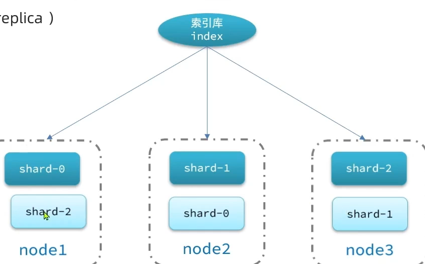

    主分片和备份分片不在同一个机器上, 有机器宕机了,仍能保证数据的完整性


## 搭建

用docker容器模拟多个机器(容器之间相互隔离)


### 准备docker-compose

```yml
version: '2.2'
services:
  es01:
    image: elasticsearch:7.12.1 # 镜像
    container_name: es01 # 容器名称
    environment:
      - node.name=es01 # 集群唯一的节点名, 自己随意取
      - cluster.name=es-docker-cluster # 指定集群名称, 只要集群名称一样, 他们就能形成集群
      - discovery.seed_hosts=es02,es03 
      # 另外两个节点的IP地址, Dokcer同一网络下容联,可以用容器名代替IP
      - cluster.initial_master_nodes=es01,es02,es03
      # 初始化的主节点,通过选举得到的主节点(以上三个节点将赋予选举的资格)
      - "ES_JAVA_OPTS=-Xms512m -Xmx512m"
      # 配置内存大小.  最小内存, 最大内存
    volumes:
      - data01:/usr/share/elasticsearch/data
    ports:
      - 9200:9200
    networks:
      - elastic
  es02:# 容器名要换
    image: elasticsearch:7.12.1
    container_name: es02 # 容器名要换
    environment:
      - node.name=es02 # 节点名要换
      - cluster.name=es-docker-cluster
      - discovery.seed_hosts=es01,es03
      - cluster.initial_master_nodes=es01,es02,es03
      - "ES_JAVA_OPTS=-Xms512m -Xmx512m"
    volumes:
      - data02:/usr/share/elasticsearch/data
    ports: # 端口要换
      - 9201:9200
    networks:
      - elastic
  es03:
    image: elasticsearch:7.12.1
    container_name: es03
    environment:
      - node.name=es03
      - cluster.name=es-docker-cluster
      - discovery.seed_hosts=es01,es02
      - cluster.initial_master_nodes=es01,es02,es03
      - "ES_JAVA_OPTS=-Xms512m -Xmx512m"
    volumes:
      - data03:/usr/share/elasticsearch/data
    networks:
      - elastic
    ports:
      - 9202:9200
volumes:
  data01:
    driver: local
  data02:
    driver: local
  data03:
    driver: local

networks:
  elastic:
    driver: bridge
```

### 配置权限

>   放开虚拟机内存

es运行需要修改一些linux系统权限，修改`/etc/sysctl.conf`文件

```bash
vi /etc/sysctl.conf
```

添加下面的内容：

```bash
vm.max_map_count=262144
```

然后执行命令，让配置生效：

```bash
sysctl -p
```

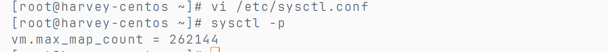

### 启动docker-campose

>   停掉以前的es

```bash
docker-compose up -d
```


## 监控集群状态

可以用kibana, 但是只能监控一个, 而且需要依赖es的x-pack, 比较麻烦,配置复杂, 需要安装其他东西

所以使用[cerebro-0.9.4](https://github.com/lmenezes/cerebro)的管理工具

启动(.\cerebro-0.9.4\bin\cerebro.bat)


访问[cerebro](http://localhost:9000)


输入es节点地址

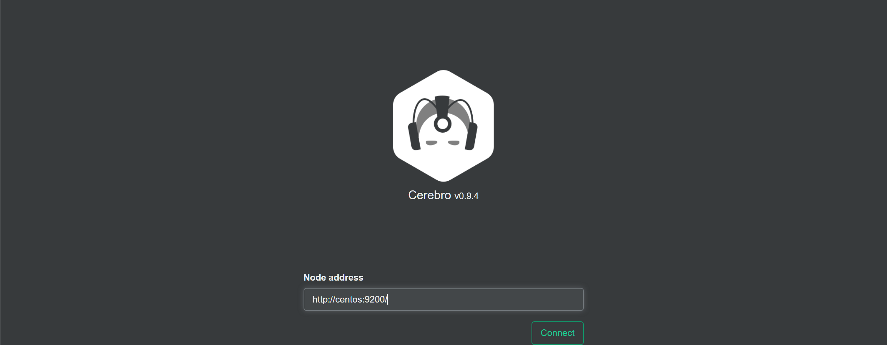

连一个,则全连

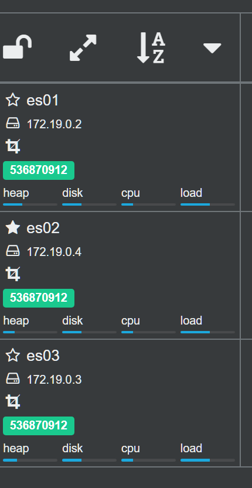

### 主节点与备选节点

slave, 哟, 有机会上位master啦? 

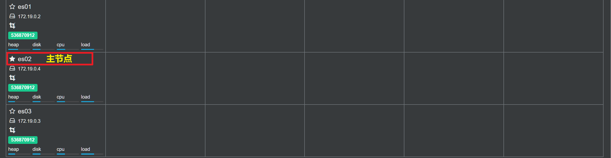

## 创建索引库


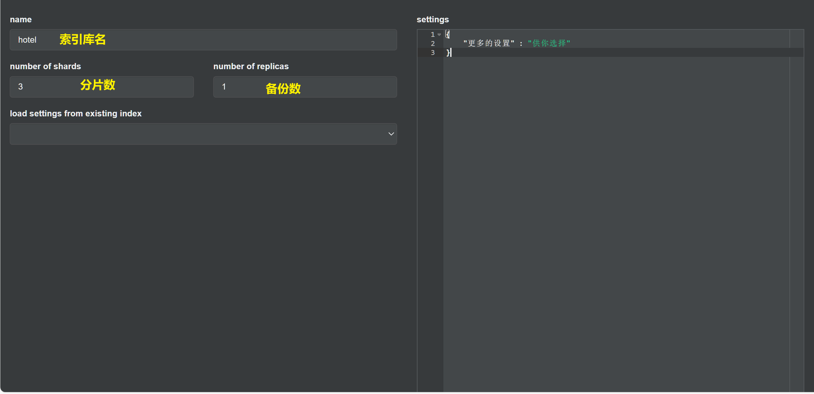

创建成功

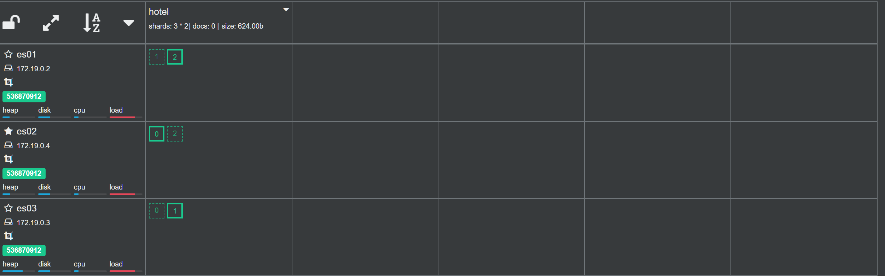

## 节点角色

### 角色和职责

备选主角点都有机会选举成为主节点, 主节点负责管理从节点

备选节点用于高可用, 在不备之时顶替主节点(~~谋权篡位~~)

主节点决定分片落在哪个节点, 处理,创建和删除索引库的请求

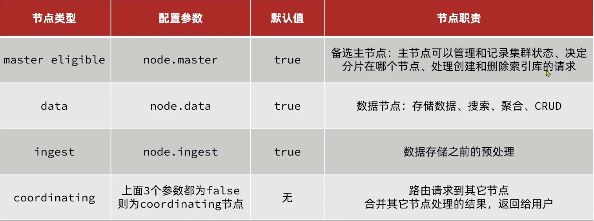

-   预处理
    -   对文档删除一个字段, 加一个字段, 对字段做删除
-   coordinating会做随机分配, 负载均衡
-   因为硬件扛不住, 所以不能让所有节点成为所有节点


### 分配职责

一个节是不是协调节点不能配置, 但可以让他只干协调的不干别的

在配置文件里配置参数

职责分配示例

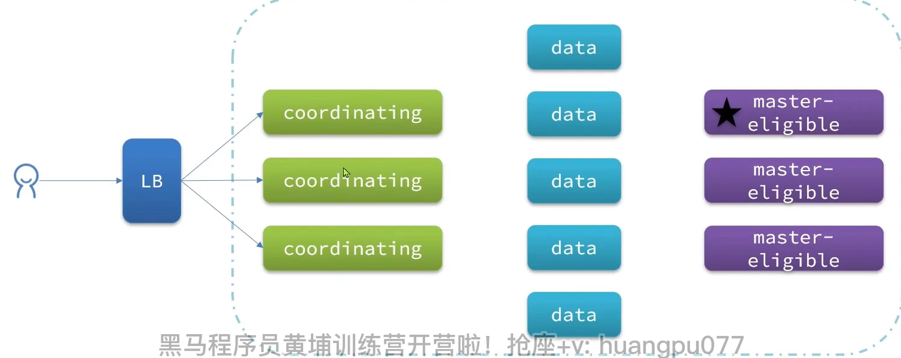

-   `LB`  

    Load Balance

### 脑裂

原主节点NODE1和几个包含备选主节点的节点失联了, 备选主节点选出了新的主节点NODE2

集群中就此出现了俩主节点

网络一恢复, 就会导致数据不一致的情况

#### 避免脑裂方案

要求
$$
选票\geq\frac{集群中全体eligible数量+1}{2}
$$

才能成主

因此要求节点数最好是奇数

因此集群如果裂开, 节点多的那个分部才能出现下一个主节点


### 集群下的数据新增和查询

#### 测试


新增

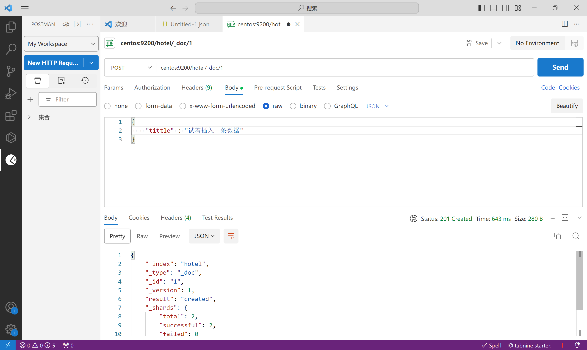

查询

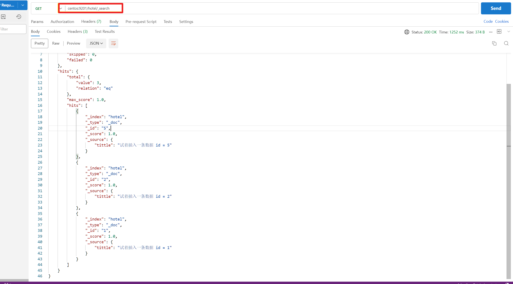

查询文档落于哪个节点

```json
{
    "explain": true
}
```

查询结果

```json
{
    "_shard": "[hotel][0]",
    "_source": {
        "tittle": "试着插入一条数据 id = 5"
    }
},
{
    "_shard": "[hotel][1]",
    "_source": {
        "tittle": "试着插入一条数据 id = 2"
    }
},
{
    "_shard": "[hotel][1]",
    "_source": {
        "tittle": "id = 23"
    }
},
{
    "_shard": "[hotel][2]",
    "_source": {
        "tittle": "试着插入一条数据 id = 1"
    }
}
```


#### 原理

协调节点如何把文档存储到各个分片, 保证了数据均衡

$$
shard = hash(\_routing) \% number\_of\_shards
$$

-   `\_routing`默认是文档ID
-   `number\_of\_shards`分片数量
-   查询和新增都是依据这个算法
-   因此, 倘若更改了分片数量, 就找不到数据了

#### 流程

-   依据ID新增

    1.  从`Node1`依据`id`新增文档
    2.  `Node1`依据Hash算法指定文档落于哪个分片
    3.  文档落于分片的主分片
    4.  主分片将文档同步到另一节点的副本分片
    5.  副本分片将新增结果返回`Node1``
    6.  ``Node1`返回用新增结果

-   查询所有

    1.  分散阶段(**scatter phase**)
        -   `coordinating`将请求发送给**每个分片**
    2.  聚集阶段(**gather phase**)
        -   `coordinating`汇总`data node` 的搜索结果, 并处理为最终结果返回给用户

    -   而每个节点都可以是`coordinating`, 故无论访问谁,都会将请求发送给每个分片,都能查询到全部

## 故障转移

当有节点宕机

1.  如果宕机的是主节点, 速速选出新的主节点
2.  主节点查看集群的健康状态
    -   缺了哪些主分片
    -   缺了哪些副本分片
3.  迁移宕机节点上的数据迁移到健康节点上
    -   迁移之后的结果, 一台节点上的分片数据依旧能做到不重复

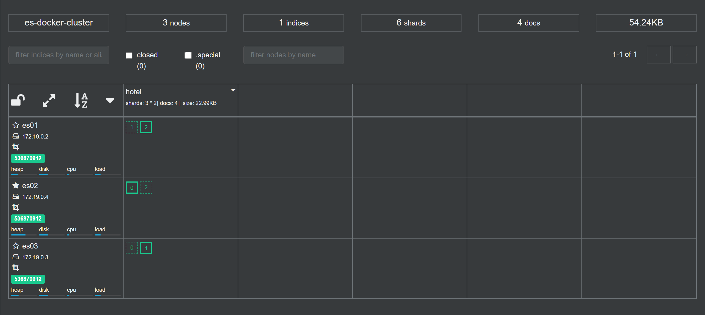

关闭es01, 又重启es01(因为一开始我用es01连接的cerebro, cerebro也没反应了, 我一下子慌了, 我就重启了qwq)

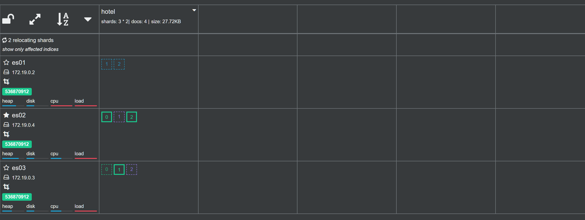


