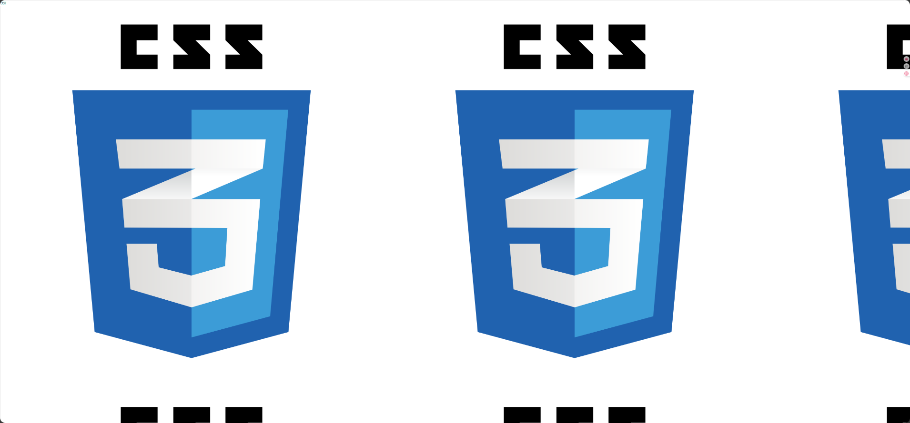
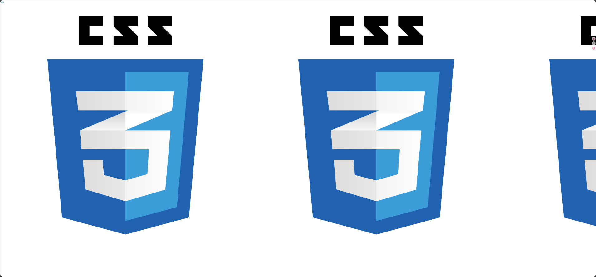
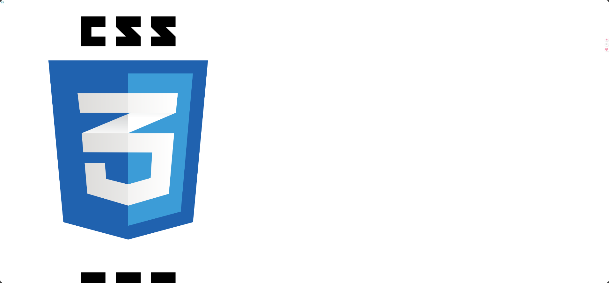
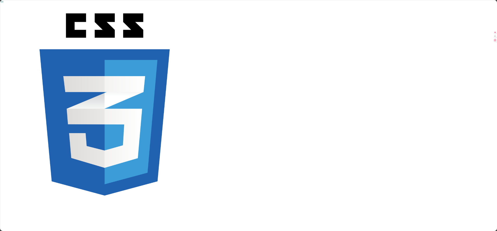
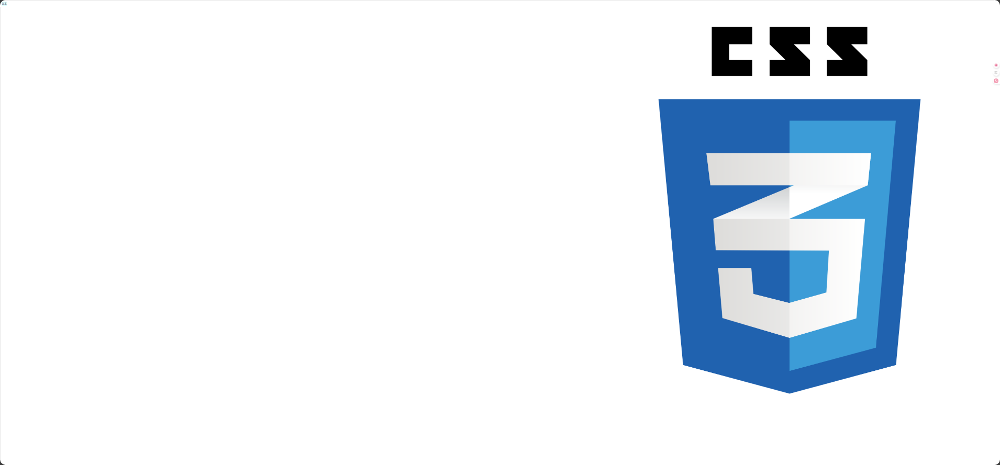

# 属性

## 背景

>   background-color

背景的区域是content+padding

```css
<p style="width:200px;text-align:center;border-style: solid;padding: 20px;background: yellow;margin: 20px;">内容</p>
```

<p style="width:200px;text-align:center;border-style: solid;padding: 20px;background: yellow;margin: 20px;">内容</p>
<p style="width:200px;text-align:center;border-style: solid;padding: 20px;background: yellow;margin: 20px;">内容</p>


-   background-color 背景颜色

-   background-image 背景图片

-   background-repeat 平铺

-   background-position 位置

-   background-attachment 背景附着

  ​    

### 背景颜色

```css
.normal-text {
    background-color:#e0ffff;
}
```

### 背景图片


```css
body {background-image:url('bgdesert.jpg');}
```

-   图片透明的部分会被背景颜色影响
-   图片浮于背景颜色上方

### 平铺

>   background-repeat

-   对image进行平铺(默认会进行平铺)

    

-   repeat-x 值, 在x轴(水平)方向上平铺

    

-   repeat-y 值, 在y轴(垂直)方向上平铺

    

-   no-repeat 值, 不进行平铺

    

### 位置

-   不平铺的情况下可以调整image的位置

```css
body {
    background-image: url("https://cdn.freebiesupply.com/logos/large/2x/css3-logo-png-transparent.png");
    background-repeat: no-repeat;
    background-position:right top
}
```



### 背景附着

背景图像是应该滚动还是固定的, 会不会随页面的其余部分一起滚动


## 文本


| 属性                         | 描述                               |
| :--------------------------- | :--------------------------------- |
| [color](#颜色)               | 设置文本颜色                       |
| direction                    | 设置文本方向                       |
| letter-spacing               | 设置字符间距                       |
| line-height                  | 设置行高                           |
| [text-align](#文本对齐)      | 对齐元素中的文本                   |
| [text-decoration](#文本修饰) | 向文本添加修饰(上划线/下划线/划掉) |
| [text-indent](#文本缩进)     | 缩进元素中文本的首行               |
| [text-shadow](#文本阴影)     | 设置文本阴影                       |
| [text-transform](#文本转化)  | 控制元素中的字母                   |
| unicode-bidi                 | 设置或返回文本是否被重写           |
| vertical-align               | 设置元素的垂直对齐                 |
| white-space                  | 设置元素中空白的处理方式           |
| word-spacing                 | 设置字间距                         |


### 颜色

>   color


```css
<div style="color:red;">文本1</div>
<div style="color:blue;">文本2</div>
<div style="color:green;">文本3</div>
```

<div style="color:red;">文本1</div>
<div style="color:blue;">文本2</div>
<div style="color:green;">文本3</div>


### 文本对齐

>   text-align

```html
<div style="text-align:center;">文本1</div>
<div style="text-align:right;">文本2</div>
<div style="text-align:justify;">文本3</div>
```

justify的对齐方式: 拉伸一行的文本, 使一行最后不会产生空隙(对这段文本的最后一行不起效), 英文较明显

<div>The Supreme Court decided not to uphold an earlier ruling which found that hidden commission payments to car dealers were unlawful.However, the ruling left open the possibility of claims for compensation for large commissions that were unfair.The Financial Conduct Authority (FCA) says it will study the court's judgement and decide whether a compensation scheme is needed before 08:00 BST on Monday.The regulator's chief executive Nikhil Rathi told the BBC any compensation scheme would be up and running by next year if it went ahead.The BBC talked to two of the people who brought the case to the Supreme Court, plus a person who is planning to make a claim.</div>
<div style="text-align:justify;">The Supreme Court decided not to uphold an earlier ruling which found that hidden commission payments to car dealers were unlawful.However, the ruling left open the possibility of claims for compensation for large commissions that were unfair.The Financial Conduct Authority (FCA) says it will study the court's judgement and decide whether a compensation scheme is needed before 08:00 BST on Monday.The regulator's chief executive Nikhil Rathi told the BBC any compensation scheme would be up and running by next year if it went ahead.The BBC talked to two of the people who brought the case to the Supreme Court, plus a person who is planning to make a claim.</div>


### 文本修饰

>   text-decoration

```html
<div style="text-decoration:overline;">有上划线的文本</div>
<div style="text-decoration:line-through;">被线贯穿的文本</div>
<div style="text-decoration:underline;">有下划线的文本</div>
```

<div style="text-decoration:overline;">有上划线的文本</div>
<div style="text-decoration:line-through;">被线贯穿的文本</div>
<div style="text-decoration:underline;">有下划线的文本</div>

### 文本转化

>   text-transform

-   uppercase 转全小写
-   lowercase 转全大写
-   capitalize 首字母大写

```html
<div style="text-transform:uppercase;">word</div>
<div style="text-transform:lowercase;">WORD</div>
<div style="text-transform:capitalize;">word</div> <!--首字母大写-->
```

<div style="text-transform:uppercase;">word</div>
<div style="text-transform:lowercase;">WORD</div>
<div style="text-transform:capitalize;">word</div>

### 文本缩进

>   text-indent

```html
<div style="text-indent:50px; text-align:justify;">The Supreme Court decided not to uphold an earlier ruling which found that hidden commission payments to car dealers were unlawful.However, the ruling left open the possibility of claims for compensation for large commissions that were unfair.The Financial Conduct Authority (FCA) says it will study the court's judgement and decide whether a compensation scheme is needed before 08:00 BST on Monday.The regulator's chief executive Nikhil Rathi told the BBC any compensation scheme would be up and running by next year if it went ahead.The BBC talked to two of the people who brought the case to the Supreme Court, plus a person who is planning to make a claim.</div>
<div style="text-indent:100px;">The Supreme Court decided not to uphold an earlier ruling which found that hidden commission payments to car dealers were unlawful.However, the ruling left open the possibility of claims for compensation for large commissions that were unfair.The Financial Conduct Authority (FCA) says it will study the court's judgement and decide whether a compensation scheme is needed before 08:00 BST on Monday.The regulator's chief executive Nikhil Rathi told the BBC any compensation scheme would be up and running by next year if it went ahead.The BBC talked to two of the people who brought the case to the Supreme Court, plus a person who is planning to make a claim.</div>
```

<div style="text-indent:50px; text-align:justify;">The Supreme Court decided not to uphold an earlier ruling which found that hidden commission payments to car dealers were unlawful.However, the ruling left open the possibility of claims for compensation for large commissions that were unfair.The Financial Conduct Authority (FCA) says it will study the court's judgement and decide whether a compensation scheme is needed before 08:00 BST on Monday.The regulator's chief executive Nikhil Rathi told the BBC any compensation scheme would be up and running by next year if it went ahead.The BBC talked to two of the people who brought the case to the Supreme Court, plus a person who is planning to make a claim.</div>
<div style="text-indent:100px;">The Supreme Court decided not to uphold an earlier ruling which found that hidden commission payments to car dealers were unlawful.However, the ruling left open the possibility of claims for compensation for large commissions that were unfair.The Financial Conduct Authority (FCA) says it will study the court's judgement and decide whether a compensation scheme is needed before 08:00 BST on Monday.The regulator's chief executive Nikhil Rathi told the BBC any compensation scheme would be up and running by next year if it went ahead.The BBC talked to two of the people who brought the case to the Supreme Court, plus a person who is planning to make a claim.</div>


### 文本阴影

>   text-shadow

```html
<div style="text-shadow: -8px 8px #E9979AFF;font-size:200px;">
    属性
</div>
```


<div style="text-shadow: -8px 8px #E9979AFF;font-size:200px;">
    属性
</div>


很丑

## 字体

>   font

| Property                                                     | 描述                                 |
| :----------------------------------------------------------- | :----------------------------------- |
| font      | 在一个声明中设置所有的字体属性       |
| font-family | 指定文本的字体系列                   |
| font-size | 指定文本的字体大小                   |
| font-style | 指定文本的字体样式(斜体)             |
| font-variant | 以小型大写字体或者正常字体显示文本。 |
| font-weight | 指定字体的粗细(粗体)                 |

### Serif和Sans-Serif

>   衬线体和无衬线体

一言以蔽之, 都用**无衬线体**. 衬线体(例如宋体)有过多的点缀造成审美疲劳, 就是一坨狗屎

### Monospace

一类所有字符宽度一致的字体

### 字体系列

>   font family

-   多个字体集
    -   出现了前一个字体集不包含的字体, 则启用后一个字体集
-   引号
    -   当字体名被空格分隔, 则用引号括住字体名

```html
<div style="font-family: 'JetBrains Mono Light','Microsoft YaHei',sans-serif; font-size: 50px">
    Hello World 你好世界
</div>
```

<div style="font-family: 'JetBrains Mono Light','Microsoft YaHei',sans-serif; font-size: 50px">
    Hello World 你好世界
</div>
### 字体样式

>   fort-style

用于设置斜体

这个属性有三个值：

-   normal 正常
-   italic 斜体(使用字体集中的斜体)
-   oblique 倾斜的文字(将字符设置放斜)

```html
<div style="font-style: italic; font-size: 50px">Hello World</div>
<div style="font-style: oblique; font-size: 50px">Hello World</div>
```

<div style="font-style: italic; font-size: 50px">Hello World</div>
<div style="font-style: oblique; font-size: 50px">Hello World</div>


### 字体大小

>   font-size

-   px

    -   像素尺寸
    -   大多是浏览器的默认字符大小是16px
    -   可以放大浏览器页面来放大字体, 但其他元素会一起放大

-   em

    -   1em默认=16px

    -   可以被浏览器设置(Edge为例)

        

```html
<div style="font-size: 1em">1em</div>
<div style="font-size: 16px">16px</div>
```


### 字体粗细

>   font-weight

-   normal
-   lighter 更细
-   bold  粗体
-   900 自定义

```html
<div style="font-weight: normal; font-size: 50px">Hello World</div>
<div style="font-weight: lighter ; font-size: 50px">Hello World</div>
<div style="font-weight: bold  ; font-size: 50px">Hello World</div>
<div style="font-weight: 1000 ; font-size: 50px">Hello World</div>
```


## 链接

链接可以使用color. font, background等

### 有关伪类

在链接不同状态下的样式设置

-   a:link - 正常的，未访问的链接
-   a:visited - 用户访问过的链接
-   a:hover - 用户将鼠标悬停在链接上时
-   a:active - 链接被点击时

```css
/* 未被访问的链接 */
a:link {
  color: red;
}

/* 已被访问的链接 */
a:visited {
  color: green;
}

/* 将鼠标悬停在链接上 */
a:hover {
  color: hotpink;
}

/* 被选择的链接 */
a:active {
 color: blue;
}
```

<video src="../assets/Day01-属性/链接样式演示.mp4"></video>

## 列表

-   list-style-image 图像无法显示时, 显示type
-   list-style-position
-   list-style-type
-   list-style `list-style: type position image` 

### 设置不同的列表项

>   list-style-type

有些值是给有序列表, 有些值给无序列表

-   none 没有列表项标记

无序列表的可选值: 

-   disc 实心圆
-   circle 空心圆
-   square 方形
-   

有序列表的可选值: 

-   decimal 十进制数
-   decimal-leading-zero 十进制数, 01,02,03
-   lower-roman 罗马数字, 小写
-   upper-roman 罗马数字, 大写
-   lower-greek 小写希腊文
-   lower-latin 小写拉丁文
-   upper-latin 大写拉丁文
-   lower-alpha 小写字母
-   upper-alpha 大写字母
-   armenian 奇妙的西亚小国语言
-   georgian 奇妙的欧洲小国语言
-   cjk-ideographic 中文一、二、三、
-   hiragana平假名
-   hiragana-iroha 平假名色叶型
-   katakana 片假名
-   katakana-iroha 片假名色叶型

```html
<ul style="list-style-type: circle;">
    <li>要点</li>
    <li>要点</li>
    <li>要点</li>
</ul>
```

<ul style="list-style-type: circle;">
    <li>要点</li>
    <li>要点</li>
    <li>要点</li>
</ul>

### 图像设置为列表项

>   list-style-image

为列表和列表项添加背景色

```html
<ul style="list-style-image: url('img.png');">
    <li>要点</li>
    <li>要点</li>
    <li>要点</li>
</ul>
```


### 列表项定位

>   list-style-position

-   inside
-   outside

是**列表项**和**`<li>`内元素**两者的相对位置

先设置`<li>` 标签样式

```css
li {
    border: solid;
    width: 100px;
    text-align: center;
    padding: 2px;
    margin: 2px;
}
```

inside(似乎也会和内容一起处于"居中"): 

```html
<ul style="list-style-position: inside">
    <li>要点</li>
    <li>要点</li>
    <li>要点</li>
</ul>
```


outside:

```html
<ul style="list-style-position: outside">
    <li>要点</li>
    <li>要点</li>
    <li>要点</li>
</ul>
```


## 表格

```html
<table>
    <thead>
    <tr>
        <th>COL 1</th>
        <th>COL 2</th>
    </tr>
    </thead>
    <tbody>

    <tr>
        <td>DATA 1-1</td>
        <td>DATA 1-2</td>
    </tr>
    <tr>
        <td>DATA 2-1</td>
        <td>DATA 2-2</td>
    </tr>
    </tbody>
</table>
```

### 表格边框

>   [border](Day01-盒子模型.md#边框)

```css
table, th, td {
  border: 1px solid black;
}
```


-   border-collapse 属性, 用于单一边框

```css
table {
  border-collapse: collapse;
}
table, th, td {
  border: 1px solid black;
}
```

### 悬停效果

>   tr:hover 选择器, 在一行上悬停

```css
tr:hover {background-color: #f5f5f5;}
```

### 斑马纹

在偶数行的颜色进行细微改变

使用伪类`nth-child`, 然后给定`even`偶数

```css
tr:nth-child(even) {background-color: #f2f2f2;}
```


## 透明度

>   opacity

值 可以是  0.0-1.0 

值越低，越透明

opacity 属性通常与 :hover 选择器一同使用，这样就可以在鼠标悬停时更改不透明度

### 透明盒

所有子元素都继承相同的透明度。这可能会使完全透明的元素内的文本难以阅读

避免方法: 使用RGBA

`rgba(76, 175, 80, 0.3) `

不透明度为 30% 的绿色背景

