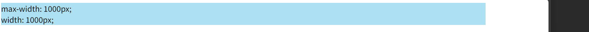
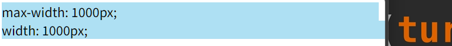
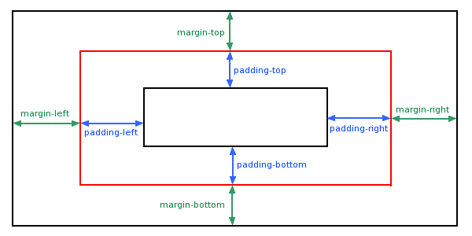
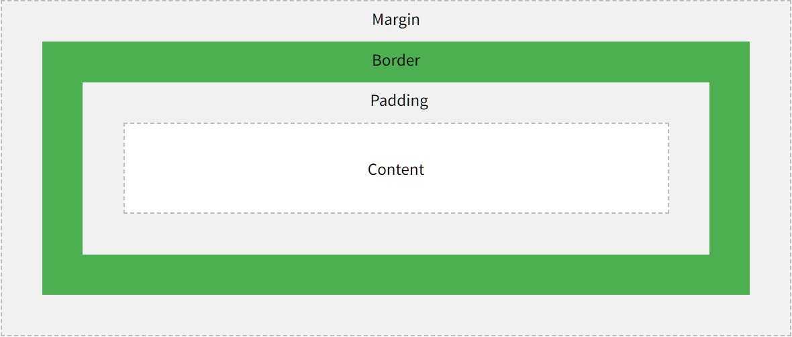

# 盒子模型

## 高度和宽度

### 值

>    `height` 和 `width` 属性

-   auto - 默认。浏览器计算高度和宽度
-   *length* - 以 px、cm 等定义高度/宽度
-   % - 以包含块的百分比定义高度/宽度
-   initial - 将高度/宽度设置为默认值

height 和 width 属性**不包括内边距、边框或外边距**

### 最大最小宽度(高度)

在浏览器宽度改变时发生作用

**max-width属性的值会覆盖 width**

浏览器宽度足够: 



浏览器宽度不足:



最大最小宽度效果的演示:

```html
<div style="max-width: 1000px;min-width: 600px;background-color: #aee0f3;">
    这是一些文字。 这是一些文字。 这是一些文字。
    这是一些文字。 这是一些文字。 这是一些文字。
    这是一些文字。 这是一些文字。 这是一些文字。
    这是一些文字。 这是一些文字。 这是一些文字。
    这是一些文字。 这是一些文字。 这是一些文字。
    这是一些文字。 这是一些文字。 这是一些文字。
    这是一些文字。 这是一些文字。 这是一些文字。
    这是一些文字。 这是一些文字。 这是一些文字。
    这是一些文字。 这是一些文字。 这是一些文字。
    这是一些文字。 这是一些文字。 这是一些文字。
    这是一些文字。 这是一些文字。 这是一些文字。
    这是一些文字。 这是一些文字。 这是一些文字。
    这是一些文字。 这是一些文字。 这是一些文字。
    这是一些文字。 这是一些文字。 这是一些文字。
    这是一些文字。 这是一些文字。 这是一些文字。
</div>
```

<video style="border-style:solid;" src="../assets/Day01-属性/最大最小宽度效果演示.mp4"></video>

## 边框

```css
<p style="width:200px;border-style: dotted;">虚点边框</p>
<p style="width:200px;border-style: dashed;">虚线边框</p>
<p style="width:200px;border-style: solid;">实心边框</p>
<p style="width:200px;border-style: double;">双边框</p>
<p style="width:200px;border-style: groove;">凹槽边框</p>
<p style="width:200px;border-style: ridge;">山脊边界</p>
<p style="width:200px;border-style: inset;">内嵌边框</p>
<p style="width:200px;border-style: outset;">外框</p>
<p style="width:200px;border-style: none;">无边框</p>
<p style="width:200px;border-style: hidden;">隐藏边框</p>
<p style="width:200px;border-style: solid double;">混合边框, 上下 左右</p>
<p style="width:200px;border-style: solid dotted double;">混合边框, 上 左右 下</p>
<p style="width:200px;border-style: dotted dashed solid double;">混合边框, 从上开始顺时针</p>
```

<p style="width:200px;border-style: dotted;">虚点边框</p>
<p style="width:200px;border-style: dashed;">虚线边框</p>
<p style="width:200px;border-style: solid;">实心边框</p>
<p style="width:200px;border-style: double;">双边框</p>
<p style="width:200px;border-style: groove;">凹槽边框</p>
<p style="width:200px;border-style: ridge;">山脊边界</p>
<p style="width:200px;border-style: inset;">内嵌边框</p>
<p style="width:200px;border-style: outset;">外框</p>
<p style="width:200px;border-style: none;">无边框</p>
<p style="width:200px;border-style: hidden;">隐藏边框</p>
<p style="width:200px;border-style: solid double;">混合边框, 上下 左右</p>
<p style="width:200px;border-style: solid dotted double;">混合边框, 上 左右 下</p>
<p style="width:200px;border-style: dotted dashed solid double;">混合边框, 从上开始顺时针</p>

### 边框宽度

>   border-width

-   *number* px
-   *number* pt
-   *number* cm
-   *number* em
-   thin
-   medium
-   thick

可以分别自定四个的宽度

```html
<p style="width:200px;border-style: solid;border-width: 2px">四周</p>
<p style="width:200px;border-style: solid;border-width: 2px 4px">上下 左右</p>
<p style="width:200px;border-style: solid;border-width: 2px 4px 8px 16px">上 右 下 左</p>
```

<p style="width:200px;border-style: solid;border-width: 2px">四周</p>
<p style="width:200px;border-style: solid;border-width: 2px 4px">上下 左右</p>
<p style="width:200px;border-style: solid;border-width: 2px 4px 8px 16px">上 右 下 左</p>

### 边框颜色

>   border-color

能分别自定义(略)

```html
<p style="width:200px;border-style: solid;border-color: red;">上下 左右</p>
```

<p style="width:200px;border-style: solid;border-color: red;">上下 左右</p>

### 各边

能分别定义各边, 例如

```css
p {
  border-top-style: dotted;
  border-right-style: solid;
  border-bottom-style: dotted;
  border-left-style: solid;
}
```

各边能分别**合写**

```css
p {
  border-style: solid;
  border-top: thick double #ff0000; /*top的部分合写*/
}
```

### 圆角

>   border-radius 圆角半径

```html
<p style="width:200px;text-align:center;border-style: solid;border-radius: 3px;">3px圆角</p>
<p style="width:200px;text-align:center;border-style: solid;border-radius: 6px;">6px圆角</p>
<p style="width:200px;text-align:center;border-style: solid;border-radius: 12px;">12px圆角</p>

```

<p style="width:200px;text-align:center;border-style: solid;border-radius: 3px;">3px圆角</p>
<p style="width:200px;text-align:center;border-style: solid;border-radius: 6px;">6px圆角</p>
<p style="width:200px;text-align:center;border-style: solid;border-radius: 12px;">12px圆角</p>

## 边距



-   auto - 浏览器来计算外边距
-   *length* - px、pt、cm
-   % - 以包含元素宽度的百分比计

### 外边距

>   margin 

-   `margin: 25px 50px 75px 100px;`
    -   上外 右外 下外 左外
-   两个(上下 左右)
-   三个(上 左右 下)

margin 的值**允许负值**

### 内边距

>   padding

padding 的值**不允许负值**

### 内边距和元素宽度

>   padding 和 width

```css
div {
  width: 300px;
  padding: 25px;
}
```

`<div>` 元素的实际宽度将是 300px + 左内边距 25px + 右内边距 25px

## 盒子模型


$$
元素总宽度 = margin_{left}+border_{left}+padding_{left}+width+padding_{right}+border_{right}+margin_{right}
\\
元素总高度 = margin_{top}+border_{top}+padding_{top}+height+padding_{bottom}+border_{bottom}+margin_{bottom}
$$

### 保持元素宽度

由于默认下, 元素的实际宽度是padding-left+content+padding-right, 为了保证所有的宽度不变, 使用`box-sizeing`属性

```css
div {
  width: 300px;
  padding: 25px;
  box-sizing: border-box;
}
```

此时content为 300px - 25px - 25px = 250px

## 轮廓

>   Outline

轮廓是在元素周围绘制的一条线，在边框之外，以凸显元素

-   轮廓在边框之外
-   可能与其他内容重叠
-   轮廓也不是元素尺寸的一部分
-   元素的总宽度和高度不受轮廓线宽度的影响
-   边框没有 上下左右分开的写法

### 属性

-   `outline-style`
-   `outline-color`
-   `outline-width`
-   `outline-offset` 向外偏移, 编译部分(*元素及其轮廓之间的空间*)是透明的
-   `outline` 值以此为`width style(必须) color`

### 轮廓样式

-   dotted - 点状虚线
-   dashed - 线状虚线
-   solid - 实线
-   double - 双实线
-   groove - 3D 凹槽
-   ridge - 3D 凸槽
-   inset - 3D 凹边
-   outset -3D 凸边
-   none
-   hidden

```html
<p style="width:200px;outline: 4px dotted;"> 点状虚线 </p>
<p style="width:200px;outline: 4px dashed;"> 线状虚线 </p>
<p style="width:200px;outline: 4px solid;"> 实线 </p>
<p style="width:200px;outline: 4px double;"> 双实线 </p>
<p style="width:200px;outline: 4px groove;"> 3D 凹槽 </p>
<p style="width:200px;outline: 4px ridge;"> 3D 凸槽 </p>
<p style="width:200px;outline: 4px inset;"> 3D 凹边 </p>
<p style="width:200px;outline: 4px outset;"> 3D 凸边 </p>
<p style="width:200px;outline: 4px none;">无边框</p>
<p style="width:200px;outline: 4px hidden;">隐藏边框</p>
```

<p style="width:200px;outline: 4px dotted;"> 点状虚线 </p>
<p style="width:200px;outline: 4px dashed;"> 线状虚线 </p>
<p style="width:200px;outline: 4px solid;"> 实线 </p>
<p style="width:200px;outline: 4px double;"> 双实线 </p>
<p style="width:200px;outline: 4px groove;"> 3D 凹槽 </p>
<p style="width:200px;outline: 4px ridge;"> 3D 凸槽 </p>
<p style="width:200px;outline: 4px inset;"> 3D 凹边 </p>
<p style="width:200px;outline: 4px outset;"> 3D 凸边 </p>
<p style="width:200px;outline: 4px none;">无边框</p>
<p style="width:200px;outline: 4px hidden;">隐藏边框</p>

##

