# 布局

## display属性

-   block 块级元素的display属性默认值
-   inline 行级元素的display属性默认值
-   none 与 JavaScript 一起使用，以隐藏和显示元素
-   inline-block 允许在元素上设置宽度和高度
-   `visibility`属性的`hidden` 与 none 的区别在于 hidden 依旧占用元素原本的空间

### inline-block

设置了 display: inline-block，将保留上下外边距/内边距，而 display: inline 则不会

元素之后不添加换行符，因此该元素可以位于其他元素旁边

### 水平目录

```css
.nav {
  background-color: yellow; 
  list-style-type: none;
  text-align: center;
  margin: 0;
  padding: 0;
}

.nav li {
  display: inline-block;
  font-size: 20px;
  padding: 20px;
  border: 2px solid;
}
```

```html
<ul class="nav">
  <li><a href="#home">home</a></li>
  <li><a href="#about">about</a></li>
  <li><a href="#clients">clients</a></li>  
  <li><a href="#contact">contact</a></li>
</ul>
```

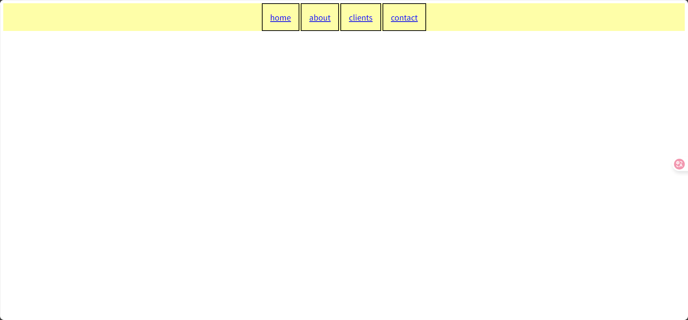


## 定位

>   position

有五个不同的位置值:

-   `static`  默认
-   `relative`
-   `fixed` 即使滚动页面，也始终位于同一位置
-   `absolute`
-   `sticky`

### static

始终根据页面的正常流进行定位

**不受 top、bottom、left 和 right 属性的影响**

### relative

相对于其正常的位置

相对定位的元素的 top、right、bottom 和 left 属性将导致其偏离其正常位置进行调整

不会对其余内容进行调整来适应元素留下的任何空间


```html
<div class="static">static</div>
<div class="static">static</div>

<div class="relative" style="top: 50px;left: 30px;">relative</div>

<div class="static">static</div>
```

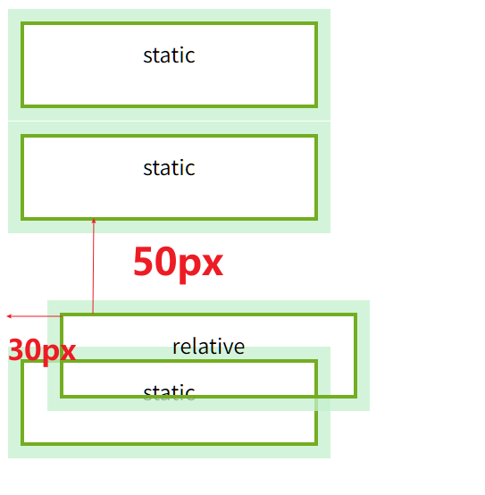

### fixed

即使滚动页面，也始终位于同一位置

```html
<div class="static">
    static
</div>
<div class="fixed">
    fixed
</div>
<div class="static">
    static
</div>
<div class="static">
    static
</div>
<!--........大量static-->
```

<video src="../assets/Day02-布局/演示position-fix.mp4" style="border: 2px solid">演示</video>


### absolute

对于外层的**祖先元素**为基准进行定位

absolute要求其父元素不应该是static, 比较好的是relative

如果绝对定位的元素没有祖先不是static，将使用文档主体`body`为基准

和 relative 的区别在于 relative 是以自己的**前一级兄弟元素**进行定位

```css
div {
    border: 3px solid #73AD21;
}
div.relative {
    position: relative;
    width: 400px;
    height: 200px;
    left: 50px;
    top: 50px;
}
div.in{
    top: 100px;
    right: 50px;
    width: 200px;
    height: 100px;
}
```


```html
<div class="relative">这是一个div的内部content文本
    <div class="in" style="position:absolute;">absolute</div><!--基准是前一段文本-->
    <div class="in" style="position:relative;">relative</div><!--基准是外边的div-->
</div>
```

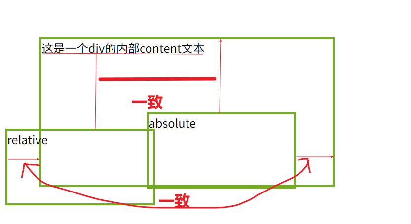

-   `absolute` 元素**会脱离文档流**，**不再占用空间**，因此会直接改变兄弟元素的布局位置。
-   `relative` 在文档流中原本占据的空间仍会保留，兄弟元素会在其后一样排列

### sticky

搭配一个方向(`top`, `bottom`, `right`, `left`)的属性, 用于配置之后留在哪

根据滚动位置在相对（relative）和固定（fixed）之间切换

```css
div.sticky {
    position: sticky;
    bottom: 20px;
    outline-color: rgba(60, 16, 206, 0.75);
}
```

-   以上诉样式为例
-   如果这个元素当前不在页面上, 那么就会`fixed`在`bottom: 20px;`的位置
-   如果这个元素在页面上, 那么就会 `relative` 在其页面上

```css
div.sticky {
    position: sticky;
    bottom: 20px;
    top: 50px;
    outline-color: rgba(60, 16, 206, 0.75);
}
```

-   以上诉样式为例
-   如果这个元素在页面上, 那么就会 `relative` 在其页面上
-   如果这个元素当前不在页面上
    -   如果这个元素, 在当前界面的下面, 那么就会`fixed`在`bottom: 20px;`的位置
    -   如果这个元素, 在当前界面的上面, 那么就会`fixed`在`top: 50px;`的位置


### 重叠元素

>   z-index


`z-index`属性指定元素的堆栈顺序, 越大越靠前

```html
<div><!--用于重叠的空间-->
    <div style="position: absolute;z-index: 2">元素一</div>
    <div style="position: absolute;z-index: 1"></div>
</div>
```


<div style="height: 500px;"><!--用于重叠的空间-->
    <div style="position: absolute;z-index: 2;font-size: 80px">元素一</div>
    <div style="border: solid 3px; width: 800px;height: 500px;position: absolute;z-index: 1"></div>
</div>


## overflow属性

>   属性仅适用于具有指定高度的块元素

元素太大, 一部分元素无法容纳内容的情况

### 值

| value   | description                                                  |
| ------- | ------------------------------------------------------------ |
| visible | 默认。溢出没有被剪裁。内容在元素框外渲染                     |
| hidden  | 溢出被剪裁，其余内容将不可见                                 |
| scroll  | 溢出被剪裁，同时添加水平＋竖直滚动条(总是添加)以查看其余内容 |
| auto    | 仅在必要时添加滚动条, 有时候也会不加滚动条而增加高度或宽度, 奇妙 |


### overflow-x 和 overflow-y

可以分别设置横向和纵向元素溢出后的样式


## 浮动

-   float 属性规定元素如何浮动
-   clear 属性规定哪些元素可以在清除的元素旁边以及在哪一侧浮动


### float 属性

-   left - 浮动到其容器的左侧
-   right - 元素浮动在其容器的右侧
-   none - 默认, 不会浮动（将显示在文本中刚出现的位置）


无浮动:

```html
<div style="width: 600px;height: 300px;text-align: justify;">
    <div style="width: 100px;text-align: center; padding: 40px; margin: 5px;">元素</div>
    The Supreme Court decided not to uphold an earlier ruling which found that
    hidden commission payments to car dealers were unlawful.However, the ruling left open the possibility of claims for
    compensation for large commissions that were unfair.The Financial Conduct Authority (FCA) says it will study the
    court's judgement and decide whether a compensation scheme is needed before 08:00 BST on Monday.The regulator's
    chief executive Nikhil Rathi told the BBC any compensation scheme would be up and running by next year if it went
</div>
```

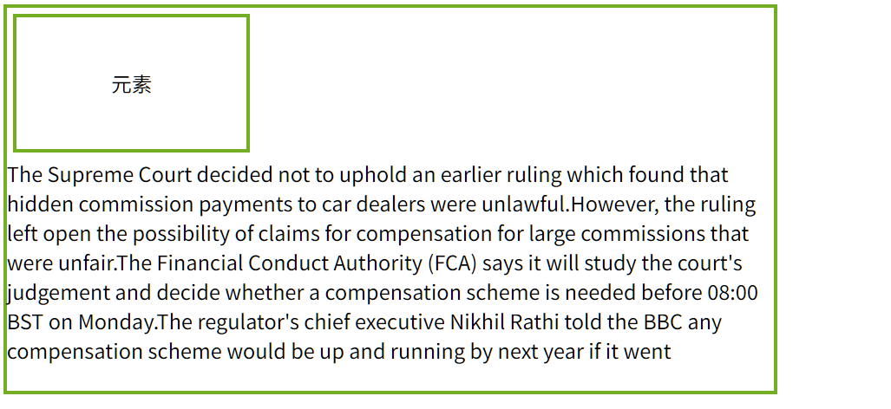将元素浮动(left)

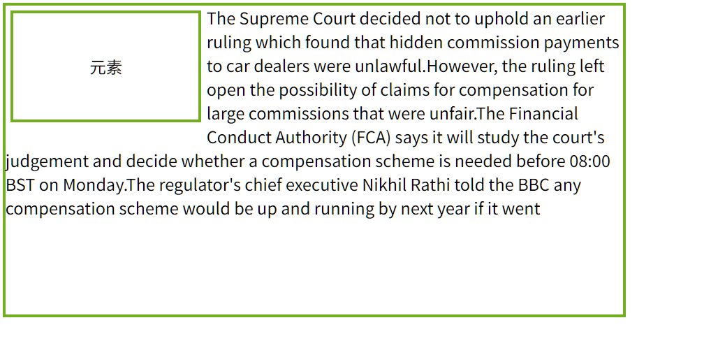

将元素浮动(right)


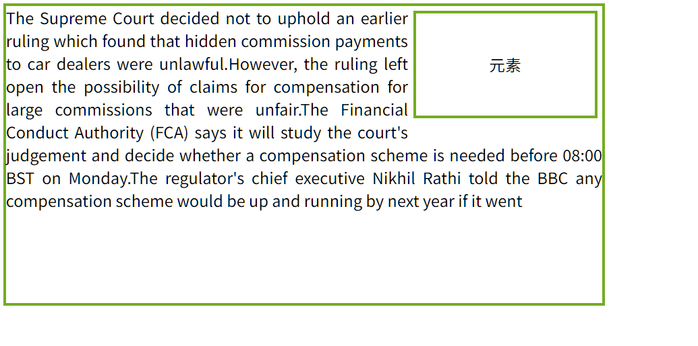


### clear 属性

指定哪些元素可以浮动于被清除元素的旁边以及哪一侧。

-   none - 允许两侧都有浮动元素。默认值
-   left - 左侧不允许浮动元素
-   right- 右侧不允许浮动元素
-   both - 左侧或右侧均不允许浮动元素

下例将清除向左的浮动。表示在（div 的）左侧不允许出现浮动元素:

一般元素进行了浮动, 其文字就该变排版

```html
<div style="width: 600px;height: 300px;">
    <div style="width: 100px;text-align: center; padding: 40px; margin: 10px;float: left;clear: right;">元素</div>
    <div style="margin: 15px;padding: 6px;text-align: justify;">
        The Supreme Court decided not to uphold an earlier ruling which found that hidden commission payments to car
        dealers were unlawful.However, the ruling left open the possibility of claims for compensation for large
        commissions that were unfair.The Financial Conduct Authority (FCA) says it will study the court's judgement and
        decide whether a compensation scheme is needed before 08:00 BST on Monday.The regulator's chief executive Nikhil
        Rather told the BBC any compensation scheme would be up and running by next year if it went
    </div>
</div>
```

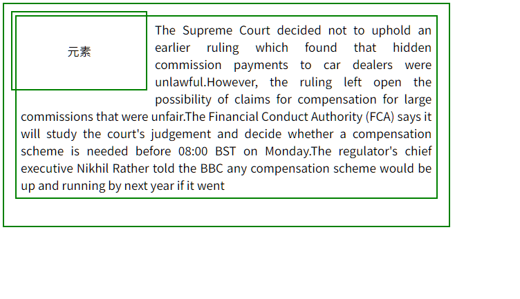

但是, 这个文字所在的`<div>`块, 其边框显示, 这个`div`有一部分会穿过元素, 不希望这样

于是对文本增加`clear:left`

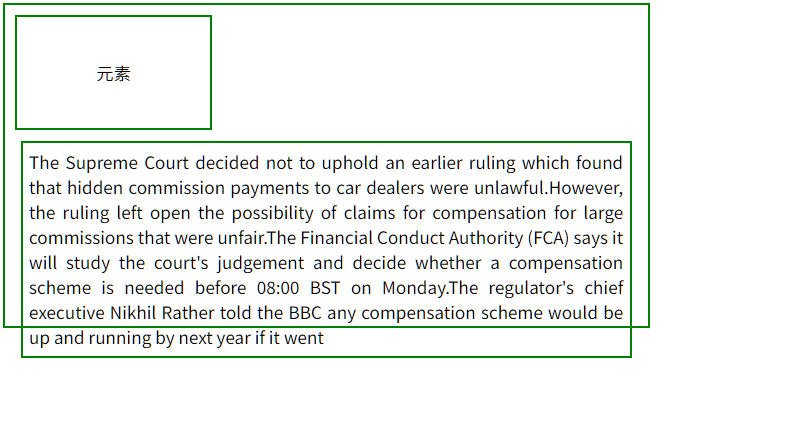


## 对齐

-   `margin: auto;width: 50%;` 块状元素**水平居中**, width要小于百分百
-   ` margin-left: auto; margin-right: auto;` 图像水平居中

## 示例

```html
<!DOCTYPE html>
<html lang="cn">
<head>      <!--meta-->
    <meta charset="UTF-8">
    <meta name="description" content="这是一个描述">
    <!--为搜索引擎的关键词-->
    <meta name="keywords" content="HTML, CSS, XML, XHTML, JavaScript">
    <link rel="author" href="mailto:harvey.blocks@outlook.com">
    <link rel="stylesheet" href="public/style.css">
    <link rel="icon" href="public/javascript.svg">
    <title>head的title是在这里</title>
    <base href="http://localhost:63342/untitled" target="_blank">
    <style>
        * {
            box-sizing: border-box;
        }

        body {
            font-family: Arial,sans-serif;
            padding: 10px;
            background: #f1f1f1;
        }

        /* 标题/博客标题 */
        .header {
            padding: 30px;
            text-align: center;
            background: white;
        }

        .header h1 {
            font-size: 50px;
        }

        /* 样式化顶部导航栏 */
        .topnav {
            overflow: hidden;
            background-color: #333;
        }

        /* 设置顶部导航链接的样式 */
        .topnav a {
            float: left;
            display: block;
            color: #f2f2f2;
            text-align: center;
            padding: 14px 16px;
            text-decoration: none;
        }

        /* 悬停时改变颜色 */
        .topnav a:hover {
            background-color: #ddd;
            color: black;
        }

        /* 创建两个不等的并排浮动的列 */
        /* 左边栏 */
        .leftcolumn {
            float: left;
            width: 75%;
        }

        /* 右边栏 */
        .rightcolumn {
            float: left;
            width: 25%;
            background-color: #f1f1f1;
            padding-left: 20px;
        }

        /* 假图像 */
        .fakeimg {
            background-color: #aaa;
            width: 100%;
            padding: 20px;
        }

        /* 为文章添加卡片效果 */
        .card {
            background-color: white;
            padding: 20px;
            margin-top: 20px;
        }

        /* 清除列后的浮点数 */
        .row:after {
            content: "";
            display: table;
            clear: both;
        }

        /* 页脚 */
        .footer {
            padding: 20px;
            text-align: center;
            background: #ddd;
            margin-top: 20px;
        }

        /* 响应式布局 - 当屏幕宽度小于 800px 时，使两列堆叠在彼此之上而不是彼此相邻 */
        @media screen and (max-width: 800px) {
            .leftcolumn, .rightcolumn {
                width: 100%;
                padding: 0;
            }
        }

        /* 响应式布局 - 当屏幕宽度小于 400px 时，使导航链接堆叠在彼此之上而不是彼此相邻 */
        @media screen and (max-width: 400px) {
            .topnav a {
                float: none;
                width: 100%;
            }
        }
    </style>
</head>
<body>

<div class="header">
    <h1>我的网站</h1>
    <p>调整浏览器窗口大小以查看效果。</p>
</div>

<div class="topnav">
    <a href="#">链接</a>
    <a href="#">链接</a>
    <a href="#">链接</a>
    <a href="#" style="float:right">链接</a>
</div>

<div class="row">
    <div class="leftcolumn">
        <div class="card">
            <h2>标题标题</h2>
            <h5>标题描述，2017 年 12 月 7 日</h5>
            <div class="fakeimg" style="height:200px;">图像</div>
            <p>一些文字..</p>
            <p>Sunt in culpa qui officia deserunt mollit anim id est laborum consectetur adipiscing elit, sed do eiusmod tempor incididunt ut labore et dolore magna aliqua. Ut enim ad minim veniam, quis nostrud exercitation ullamco.</p>
        </div>
        <div class="card">
            <h2>标题标题</h2>
            <h5>标题描述，2017 年 9 月 2 日</h5>
            <div class="fakeimg" style="height:200px;">图像</div>
            <p>一些文字..</p>
            <p>Sunt in culpa qui officia deserunt mollit anim id est laborum consectetur adipiscing elit, sed do eiusmod tempor incididunt ut labore et dolore magna aliqua. Ut enim ad minim veniam, quis nostrud exercitation ullamco.</p>
        </div>
    </div>
    <div class="rightcolumn">
        <div class="card">
            <h2>关于我</h2>
            <div class="fakeimg" style="height:100px;">图像</div>
            <p>一些关于我的文字在 balabalabalabala..</p>
        </div>
        <div class="card">
            <h3>Popular Post</h3>
            <div class="fakeimg"><p>图像</p></div>
            <div class="fakeimg"><p>图像</p></div>
            <div class="fakeimg"><p>图像</p></div>
        </div>
        <div class="card">
            <h3>Follow Me</h3>
            <p>一些文字..</p>
        </div>
    </div>
</div>

<div class="footer">
    <h2>页脚</h2>
</div>

</body>
</html>
```

## Box Sizing

在元素的总宽度和高度中包括内边距和边框

设置` box-sizing: border-box;`则宽度和高度会包括内边距和边框

```css
* {
  box-sizing: border-box;
}
```

设置所有的框都采用这台规则


## Flexbox

> display: flex;


```html
<!DOCTYPE html>
<html>
<head>
<style>
.flex-container {
  display: flex;
  background-color: DodgerBlue;
}

.flex-container > div {
  background-color: #f1f1f1;
  margin: 10px;
  padding: 20px;
  font-size: 30px;
}
</style>
</head>
<body>

<div class="flex-container">
  <div>1</div>
  <div>2</div>
  <div>3</div>  
</div>
</body>
</html>

```

弹性布局中必须有一个 **display** 属性设置为 **flex** 的**父元素**。

弹性容器的直接子元素会自动成为弹性项目。

### 属性

- `flex-direction`
- `flex-wrap`
- `flex-flow`
- `justify-content`
- `align-items`
- `align-content`

### flex-direction

定义容器要在哪个方向上堆叠 flex 项目

- `column` 设置垂直堆叠 flex 项目（从上到下）
- `column-reverse` 值垂直堆叠 flex 项目（但从下到上）
- `row` 值水平堆叠 flex 项目（从左到右）
- `row-reverse` 值水平堆叠 flex 项目（但从右到左）

```css
.flex-container {
  display: flex;
  flex-direction: row-reverse;
}
```


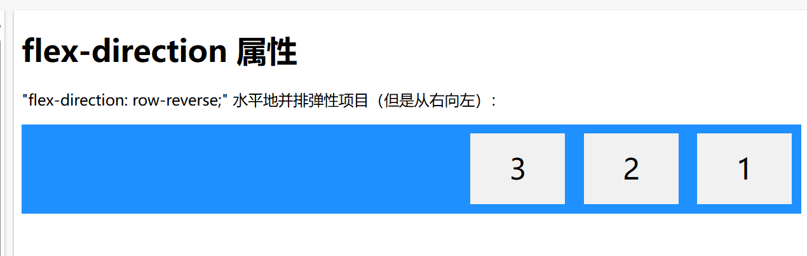

### flex-wrap

规定是否应该对 flex 项目换行。

```css
.flex-container {
  display: flex;
  flex-wrap: wrap;
}
```

- wrap 值规定 flex 项目将在必要时进行换行
- nowrap 值规定将不对 flex 项目换行（默认）
- wrap-reverse 值规定如有必要，弹性项目将以相反的顺序换行

默认情况(nowarp), 自动调整flex宽度

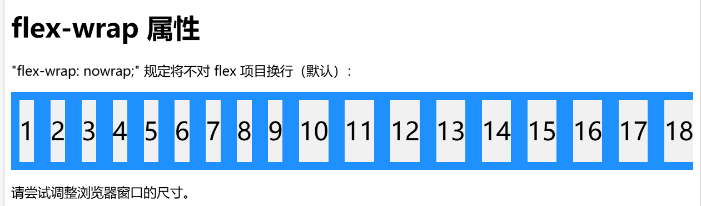

使用wrap-reverse

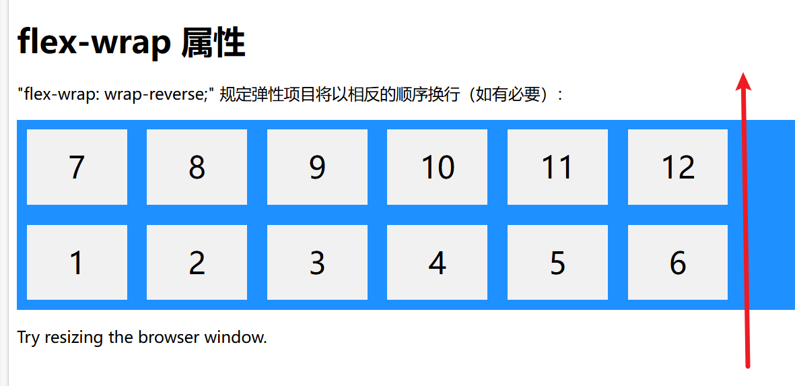

### flex-flow

**同时设置** `flex-direction` 和 `flex-wrap` 属性的简写属性。

````
.flex-container {
  display: flex;
  flex-flow: row wrap;
}
```


