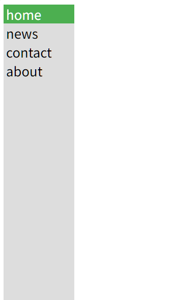
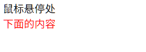
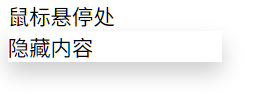

# Demo

## 导航栏

>   使用链接(`<a>`)列表(`<ul>`)制作导航栏

### 垂直导航栏

```css
ul {
    list-style-type: none;
    margin: 0;
    padding: 0;
    height: 100%; /* 全高 */
    position: fixed; /* 使它产生粘性，在滚动时不变 */
    overflow: auto; /* 如果侧栏的内容太多，则启用滚动条 */
    background-color: #dddddd;
}

li a {
    padding-left: 4px;
    display: block;
    width: 100px;
    font-size: 1.2em;
    color: #000;
    text-decoration: none;
}
/* 当前所在的页面 */
.now-active {
    background-color: #4CAF50;
    color: white;
}
/* 更改悬停时的链接颜色 */
li a:hover:not(.now-active) /*当前的页面不受悬停影响*/{
    background-color: #696969;
    color: white;
}
```


```html
<ul>
    <li><a target="_self" href="#home" class="now-active">home</a></li>
    <li><a target="_self" href="#news">news</a></li>
    <li><a target="_self" href="#contact">contact</a></li>
    <li><a target="_self" href="#about">about</a></li>
</ul>
```





### 横向导航栏

-   `float: left;`  使用 float 使块元素滑动为彼此相邻
-   `overflow: hidden;` ==不理解, 有什么BFC==
-   `position: sticky; top: 0;` 粘性导航栏

```css
ul {
    background-color: #565656;
    list-style-type: none;
    margin: 0;
    padding: 0;
    width: 100%;
    position: sticky; /*粘性导航栏*/
    top: 0;
    overflow: hidden;
}

li {
    float: left;
}

li a {
    color: #ffffff;
    padding: 5px 10px;
    text-decoration: none;
    text-align: center;
    font-size: 2em;
}

a.now-active {
    background-color: #4db051;
}

li a:hover:not(a.now-active) {
    background-color: #020202;
}
```

## 下拉菜单

### 鼠标显示下拉框

创建当用户将鼠标移到元素上时出现的下拉框

```css
.drop-down {
}

.drop-down-content {
    display: none;/*visible: hidden 占用空间, non 不占用*/
    position: absolute; /* 重新显示之后不会影响其他元素的位置 */
    background-color: rgb(0, 0, 0);
    color: white;
    min-width: 160px;
    z-index: 1; /*等于-1时会被其他为0的元素覆盖, 保险起见所以选择1*/
}
.drop-down:hover .drop-down-content {
    /*
    当drop-down处于hover悬停状态下
    drop-down-content会显示其内容
    */
    display: block;
}
```

```html
<div class="drop-down">
    <span>鼠标悬停处</span>
    <div class="drop-down-content">
        隐藏内容
    </div>
</div>
<span style="z-index: 100;color:red;">下面的内容</span>
```

默认:



悬停后:


在`drop-down-content`添加迫真阴影` box-shadow: 0 8px 16px 0 rgba(0,0,0,0.2);`

改动`drop-down-content`背景为白, color为黑




## 表单

### 带图标搜素框

```css
input[type=text] {
  width: 100%;
  border: 2px solid #ccc;
  /* 搜索提示 */
  font-size: 16px;
  padding: 12px 20px 12px 40px;
  /* 搜索图标 */
  background-image: url('searchicon.png');
  background-position: 10px 10px;
  background-repeat: no-repeat;
}
```

