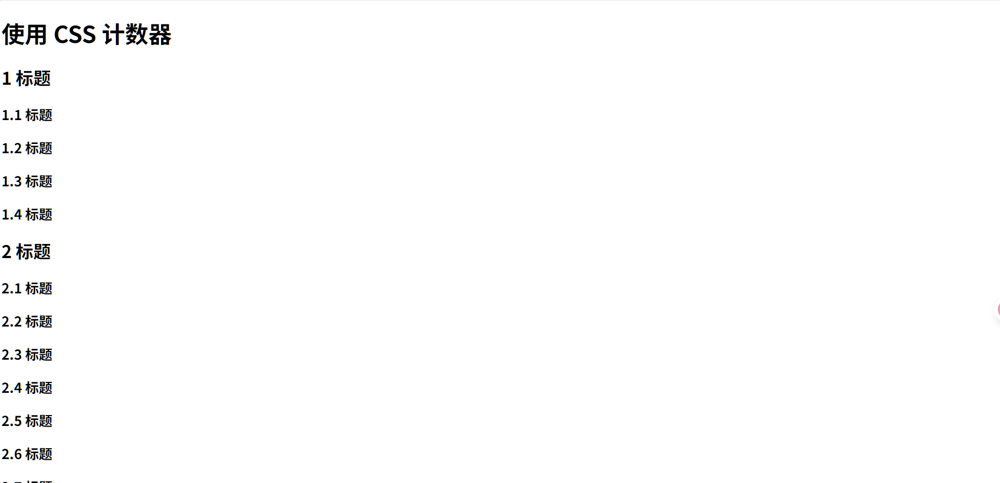
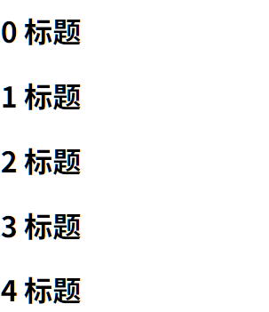

# 计数器

## 属性

-   counter-reset - 创建或重置计数器
-   counter-increment - 递增计数器值
-   content - 插入生成的内容
-   counter() 或 counters() 函数 - 将计数器的值添加到元素


## 示例

```css
h1 {
    /*创建一个计数器*/
    counter-reset: 二级标题计数器;
}


h2::before {
    counter-increment: 二级标题计数器; /*在每个h2标签前递增*/
    content: counter(二级标题计数器) " ";
}

h2 {
    counter-reset: 三级标题计数器;
}

h3::before {
    counter-increment: 三级标题计数器; /*在每个h3标签前递增*/
    content: counter(二级标题计数器) "." counter(三级标题计数器) " " ;
}
```

效果



如果要一个0开始的计数器咋办?

```css
h1 {
    /*创建一个计数器*/
    counter-reset: 二级标题计数器;
}

h2::before {
    content: counter(二级标题计数器) " ";
}

h2::after {
    content: ""; /*必须*/
    counter-increment: 二级标题计数器; /*z*/
}
```



