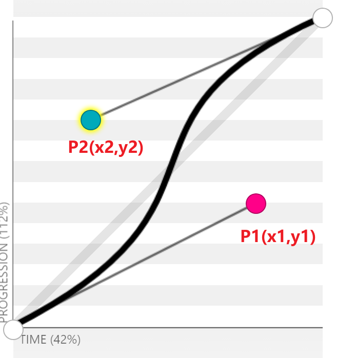
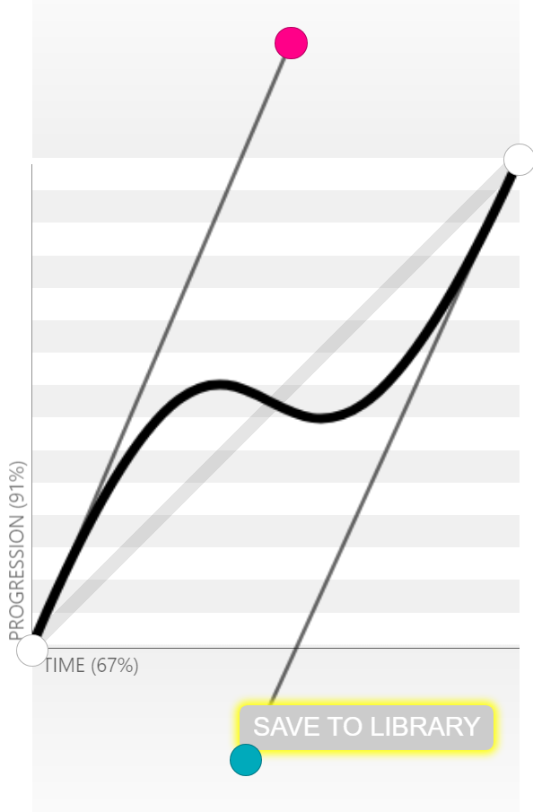

# 动画

>   animation

## 简介

### 动画的两个部分

1.   描述动画的样式规则
2.   用于指定动画开始、结束以及中间点样式的关键帧

### 优点

相较于传统的脚本实现动画的优点

1.  创建简单动画容易

2.  动画运行效果良好

    在低性能的系统上, 渲染引擎会使用跳帧或者其他技术以保证动画表现尽可能的流畅

    JavaScript 如果不特别设计就不会在低性能设备上有太好的表现

3.  让浏览器控制动画序列，允许浏览器优化性能和效果，如降低位于隐藏选项卡中的动画更新频率

## 动画性

-   所有 CSS 属性除非另有规定否则均有动画性
-   每个属性的*动画类型*决定了此属性的值如何**结合**
    -   插值
    -   相加
    -   累积
-   过渡仅涉及插值，而动画可能使用所有三种**结合**方法

### 动画类型

-   无动画性

    -   在列于动画关键帧中时不被处理
    -   不受过渡影响
    -   仅针对无动画性属性的动画效果仍将表现出动画效果的通常行为（如触发 animationstart 事件）

-   离散

    -   值不可加

    -   插值在 50% 处从开始值换为结束值
        $$
        记 p 为进度值\\

        若 p < 0.5，则 V_{结果} = V_{开始};\\
        若 p \ge 0.5，则 V_{结果} = V_{结束}.\\
        $$

-   按计算值

    -   计算值对应的各个分量使用其值类型所标示的流程相结合
    -   若分量数量或对应分量的类型不符，或有任意分量值使用离散动画且两个对应值不符，则属性值按离散相结合

-   可重复列表

    -   与按计算值相同，但若两个列表有不同数量的元素，则先将两个列表重复至元素数量的最小公倍数，再将每个元素按计算值相结合。
    -   若某对值无法结合或有任意分量值使用离散动画，则属性值按离散相结合。

## 配置

使用animation属性配置动画基本信息

| sub-attribute             | description                                                  | value                                                        |
| ------------------------- | ------------------------------------------------------------ | ------------------------------------------------------------ |
| animation-delay           | 设置延时，从元素加载完成之后到动画序列开始执行的这段时间     |                                                              |
| animation-direction       | 设置动画在每次运行完后是反向运行还是重新回到开始位置重复运行 | normal正向+重置<br/>reverse反向+重置<br/>alternate正向+往复<br/>alternate-reverse<br/> |
| animation-duration        | 设置动画一个周期的时长                                       |                                                              |
| animation-iteration-count | 动画重复次数， infinite 表示无限次重复动画                   |                                                              |
| animation-name            | 由@keyframes描述的关键帧名称                                 |                                                              |
| animation-play-state      | 允许暂停和恢复动画                                           | paused<br>running<br>                                        |
| animation-timing-function | 设置动画速度，即通过建立加速度曲线，设置动画在关键帧之间是如何变化 | linear<br>ease-in-out平滑进出<br>steps(n, \<jumpterm\>)<br>cubic-bezier(0.1, -0.6, 0.2, 0)<br>等timing-function |
| animation-fill-mode       | 指定动画执行前后如何为目标元素应用样式                       | none<br/>forwards保留由执行期间遇到的最后一个关键帧计算值<br/>back保留由执行期间遇到的第一个关键帧计算值<br/>both<br/> |

简写

```css
*{
	animation: 
        (duration)?(timing-function)?(delay)?(count)?(direction)?(fillmode)?(play-state)?[none|keyframes-name]?
        (, other-animation)*
}
```

## timing-function

### cubic-bezier

cubic-bezier(x1,y1,x2,y2)

[参数决定](https://cubic-bezier.com)

-   x表示时间(duration)
-   y表示动画进度
-   参数由P1,P2点的位置调整决定
-   x1, x2的值在区间[0,1]之间
    -   不能在规定开始时间之前开始(必须大于0)
    -   不能在规定结束时间之后结束(必须小于1)



-   y1和y2可以取任意值, 但可能取一些值导致动画往复(一个进度对应多个时间点, 也就是一个y对应多个x的情况)

    

### 可选值

-   ease
    -   cubic-bezier(0.25, 0.1, 0.25, 1.0)
    -   默认值
    -   动画在中间加速，在结束时减速
-   linear
    -   cubic-bezier(0.0, 0.0, 1.0, 1.0)
    -   动画以匀速运动
-   ease-in
    -   cubic-bezier(0.42, 0, 1.0, 1.0)
    -   动画一开始较慢，随着动画属性的变化逐渐加速，直至完成
-   ease-out
    -    cubic-bezier(0, 0, 0.58, 1.0)
    -   动画一开始较快，随着动画的进行逐渐减速
-   ease-in-out
    -   cubic-bezier(0.42, 0, 0.58, 1.0)
    -   一开始缓慢变化，随后加速变化，最后再次减速变化

### steps(n, \<jumpterm\>)

按照 n 个定格在过渡中显示动画迭代，每个定格等长时间($time = \frac{duration}{n}$)显示

jumpterm

-   `jump-start`/`start`

    表示一个左连续函数，因此第一个跳跃发生在动画开始时

-   `jump-end`/`end`

    表示一个右连续函数，因此最后一个跳跃发生在动画结束时

-   `jump-none`

    两端都没有跳跃。相反，在 0% 和 100% 标记处分别停留，每个停留点的持续时间为总动画时间的 1/n

-   `jump-both`

    在 0% 和 100% 标记处停留，有效地在动画迭代过程中添加一个步骤

-   `step-start`

    等同于 `steps(1, jump-start)`

-   `step-end`

    等同于 `steps(1, jump-end)`

## 关键帧

关键帧描述了动画元素在给定的时间点上应该如何渲染

使用@keyframes建立多个关键帧

### @keyframes语法

```css
@keyframes <keyframes-name> {
    20% {
        /*CSS...*/
    }
    40%,60 {
        /*CSS...*/
    }
    100% {
        /*CSS...*/
    }
}
```

-   keyframes-name> 自定义
-   使用百分比来指定动画发生的时间点。
    -   `0%` , 别名`to` 表示动画的第一时刻
    -   `100%` , 别名`from` 表示动画的最终时刻
    -   可选. 若 `from`/`0%` 或 `to`/`100%` 未指定，则浏览器使用计算值开始或结束动画。

## 动画事件

探测动画何时开始结束和开始新的循环。

每个事件包括动画发生的时间和触发事件的动画名称

-   animationstart
-   animationend
-   animationiteration

```js
var e = document.getElementById("watchme");
e.addEventListener("animationstart", listener, false);
e.addEventListener("animationend", listener, false);
e.addEventListener("animationiteration", listener, false);

function listener(e) {
  var l = document.createElement("li");
  switch (e.type) {
    case "animationstart":
      l.innerHTML = "Started: elapsed time is " + e.elapsedTime;
      break;
    case "animationend":
      l.innerHTML = "Ended: elapsed time is " + e.elapsedTime;
      break;
    case "animationiteration":
      l.innerHTML = "New loop started at time " + e.elapsedTime;
      break;
  }
  document.getElementById("output").appendChild(l);
}
```

