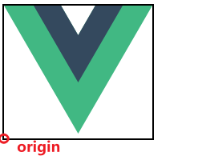
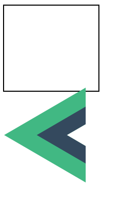
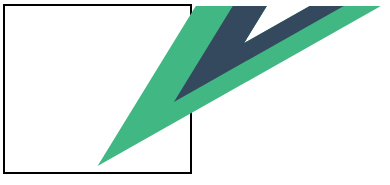
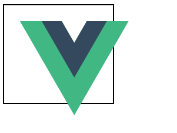
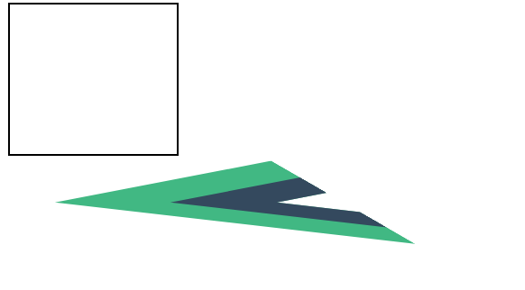

# 变换

>   transform

1.   变换

     制造效果

2.   过渡

     让变化平滑

3.   动画
     用时间轴精确控制多个**变换**和**过渡**


括旋转、倾斜、缩放以及位移

变换同时适用于平面与三维空间

## 属性

-   `transform-origin`
    -   指定原点的位置
    -   默认值为元素的中心，可以被移动
    -   旋转、缩放和倾斜等变换都需要一个指定的点作为参数
-   `transform`
    -   指定作用在元素上的变换
    -   值为**空格分隔**的一系列**变换的列表**，这些值会像被组合操作请求一样被分别执行
    -   复合变换按从右到左的顺序高效地应用

## 基础变换

原型


```vue
<template>
  <div style="width: 10%;border: 2px solid black">
    
  </div>
</template>
<style scoped>
#logo {
  transform-origin: bottom left;
}
</style>
```





### 旋转

>   rotate

可选值

-   number deg 角度
-   number rad 弧度
-   ...


```vue
<template>
  <div style="width: 10%;border: 2px solid black">
    
  </div>
</template>
<style scoped>
#logo {
  rotate: 90deg;
  transform-origin: bottom left;
}
</style>
```



### 倾斜

>   skewx(value)

-   number deg 角度
-   number rand 弧度


```vue
<template>
  <div style="width: 10%;border: 2px solid black">
    
  </div>
</template>
<style scoped>
#logo {
  transform: skewx(-50deg);
  transform-origin: bottom left;
}
</style>
```



### 位移

>   translatex translatey

```vue
<template>
  <div style="width: 10%;border: 2px solid black">
    
  </div>
</template>
<style scoped>
#logo {
  transform: translatex(20px) translatey(20px);
  transform-origin: bottom left;
}
</style>
```



### 缩放

>   scaleX scaleY

```vue
<template>
  <div style="width: 10%;border: 2px solid black">
    
  </div>
</template>
<style scoped>
#logo {
  transform: scaleX(120%) scaleY(80%);
  transform-origin: bottom left;
}
</style>
```


### 联合使用

```vue
<template>
  <div style="width: 10%;border: 2px solid black">
    
  </div>
</template>
<style scoped>
#logo {
  transform: rotate(30deg) skewx(-60deg) translatex(20px) translatey(20px);
  transform-origin: bottom left;
}
</style>
```



## 三维属性

打开三维属性

```css
* {
    transform-style: preserve-3d;
}
```


### 透视深度

>   perspective

三维属性

必须先设置一个透视点以便配置 3D 空间，再去定义 2D 元素在空间中的行为

元素与观察者之间的距离越远，透视值就越小

立方体收缩的速度由 `perspective` 属性定义。其值越小，视角越深

### 透视原点

>   perspective-origin

焦点所在的位置


### 示例容器

```vue
<template>
  <div class="container">
    <div class="cube perspective-setting">
    </div>
  </div>
</template>
<style scoped>

/* 定义容器 div、多维数据集 div 和通用面, 限制显示在固定大小 */
.container {
  position: absolute;
  top: 42%;
  left: 42%;
  width: 16%;
  aspect-ratio: 1;
}

    
.cube {
  width: 100%;
  height: 100%;
  /*...*/
}

</style>
```


### 定义每面样式

定义六个面的样式, 方便区分和演示

```vue
<template>
  <div class="container">
    <div class="cube">
      <div class="face front">1</div>
      <div class="face top">2</div>
      <div class="face left">3</div>
      <div class="face bottom">4</div>
      <div class="face right">5</div>
      <div class="face back">6</div>
    </div>
  </div>
</template>
<style scoped>

/* 定义容器 div、多维数据集 div 和通用面 */
.container {
  position: absolute;
  top: 42%;
  left: 42%;
  width: 16%;
  aspect-ratio: 1;
}

    
.cube {
  width: 100%;
  height: 100%;
  /*...*/
}

.face {
  display: block;
  position: absolute;
  width: 100px;
  height: 100px;
  border: none;
  line-height: 100px;
  font-family: sans-serif;
  font-size: 60px;
  color: white;
  text-align: center;
}

/* 定义每一面 */
.front {
  background: rgba(0, 0, 0, 0.3);
  transform: translateZ(50px);
}

.back {
  background: rgba(0, 255, 0, 1);
  transform: rotateY(180deg) translateZ(50px);
}

.right {
  background: rgba(196, 0, 0, 0.7);
  transform: rotateY(90deg) translateZ(50px);
}

.left {
  background: rgba(0, 0, 196, 0.7);
  transform: rotateY(-90deg) translateZ(50px);
}

.top {
  background: rgba(196, 196, 0, 0.7);
  transform: rotateX(90deg) translateZ(50px);
}

.bottom {
  background: rgba(196, 0, 196, 0.7);
  transform: rotateX(-90deg) translateZ(50px);
}


</style>

```

### 填写三维相关属性

```css
.cube {
  width: 100%;
  height: 100%;
  backface-visibility: visible;
  transform-style: preserve-3d;
}
```

-   backface-visibility 当前元素背面朝向观察者时是否可见
    -   visible
    -   hidden
-   transform-style 当前元素的子元素是位于 3D 空间中还是平面中
    -   flat
    -   preserve-3d

### 用拉条演示各参数

-   `perspective` 属性, 设置透视深度
-   `perspective-origin` 属性, 设置透视远点

```vue
<template>
  <div style="position: absolute;">
    <div>
      perspective:
      <input v-model="perspectiveInput" type="range" min="0" max="1000">
      {{ perspectiveInput }} px
    </div>
    <div>
      Perspective Origin Width:
      <input v-model="perspectiveOriginWidth" type="range" min="-500" max="500">
      {{ perspectiveOriginWidth }} %
    </div>
    <div>
      Perspective Origin Height:
      <input v-model="perspectiveOriginHeight" type="range" min="-500" max="500">
      {{ perspectiveOriginHeight }} %
    </div>
  </div>
  <div class="container">
    <div class="cube" :style="{
      perspective: perspectiveInput+'px', 
      perspectiveOrigin: `${perspectiveOriginWidth}% ${perspectiveOriginHeight}%`
    }">
      <!-- ... -->
    </div>
  </div>
</template>
<style scoped>

/* ... */

</style>
<script setup>
import {ref} from "vue";

const perspectiveInput = ref(200);
const perspectiveOriginHeight = ref(0);
const perspectiveOriginWidth = ref(0);
</script>
```

### 演示

<video src="../assets/Day05-变换/演示3D属性.mp4" style="border: 2px solid"></video>

