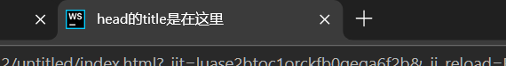
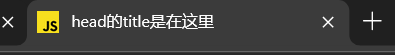

# `<head>`

## HTML head 元素

```html
<head>
    <meta charset="UTF-8">
    <title>head的title是在这里</title>
</head>
```

## 子标签

| 标签   | 描述                               |
| :----- | :--------------------------------- |
| title  | 定义了文档的标题                   |
| base   | 定义了页面链接标签的默认链接地址   |
| link   | 定义了一个文档和外部资源之间的关系 |
| meta   | 定义了HTML文档中的元数据           |
| script | 定义了客户端的脚本文件             |
| style  | 定义了HTML文档的样式文件           |

### `<title>`

```html
<title>head的title是在这里</title>
```



### `<base>`

>   添加后, 所有路径, 例如`"logo.txt"`(无前缀/)将直接加在base的路径之后

```html
<head>
	<base href="http://localhost:63342/untitled/" target="_blank">
    <!--注意base链接地址处的最后的`/`-->
    <!--target也会覆盖所有的链接处的缺省值-->
</head>
```

```html
<a href="label1" target="_self">top</a>
<!--此处没有前导`/`, base才会生效-->
```

拼接出地址`http://localhost:63342/untitled/label1`

### `<link>`

通常链接到样式表

```html
<link rel="stylesheet" type="text/css" href="mystyle.css">
```

-   [rel](https://www.runoob.com/tags/att-link-rel.html) 表示与资源的关系, `stylesheet` 样式表

```html
<head>
    <meta charset="UTF-8">
    <link rel="author" href="mailto:harvey.blocks@outlook.com">
    <link rel="stylesheet" href="public/style.css">
    <link rel="icon" href="public/javascript.svg"><!--指定了一幅图-->
    <title>head的title是在这里</title>
    <base href="http://localhost:63342/untitled" target="_blank">
</head>
```



### `<style>`

```html
<head>
    <style type="text/css">
        body {
            background-color:yellow;
        }
        p {
            color:blue
        }
    </style>
</head>
```

### `<meta>`

为搜索引擎定义关键词

```html
<meta name="keywords" content="HTML, CSS, XML, XHTML, JavaScript">
```

为网页定义描述内容

```html
<meta name="description" content="这是一个描述">
```

定义网页作者

```html
<meta name="author" content="HarveyBlocks">
```

每30秒钟刷新当前页面(非常适合用来调试😀)

```html
<meta http-equiv="refresh" content="30">
```