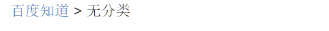

# 语义化标签

搜索引擎在爬取网页时，会优先通过**语义化标签**理解页面结构

## nav

用于存放网页导航



## footer

## dl-dd-dt

-   define list
-   define title
-   define data

默认情况下用缩进展示内容

```html
<dl>
  <dt>专有名词</dt>
  <dd>对名词的解释</dd>
  <dd>对名词的解释</dd>
</dl>
```
