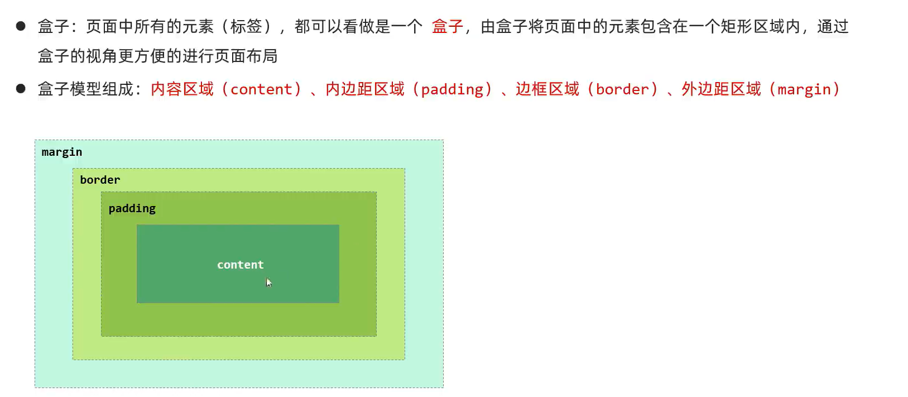
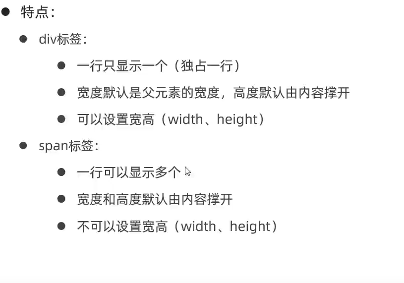
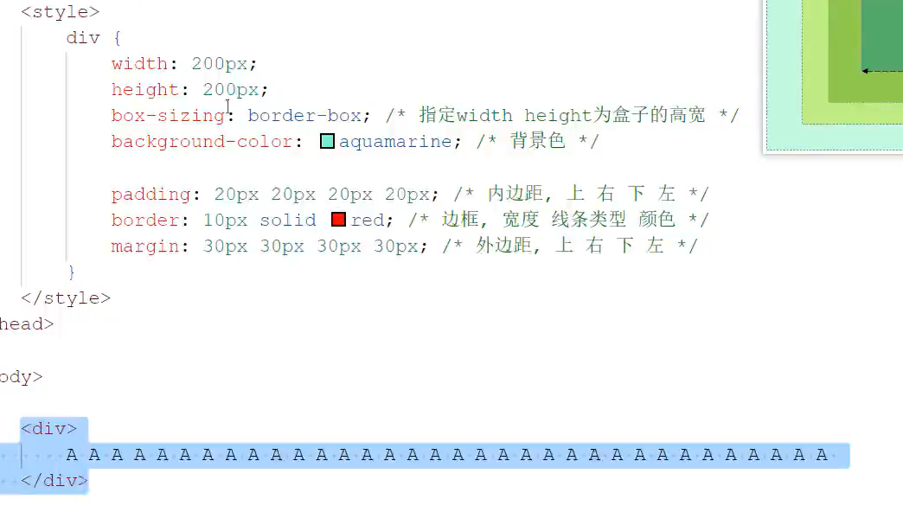
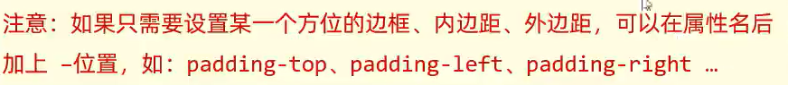
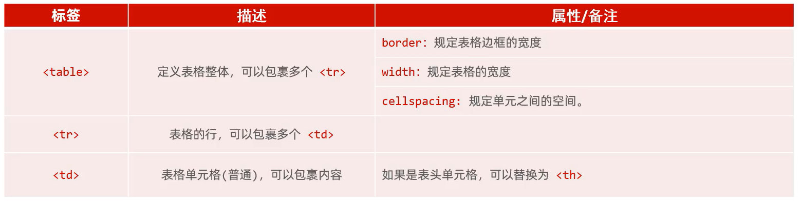
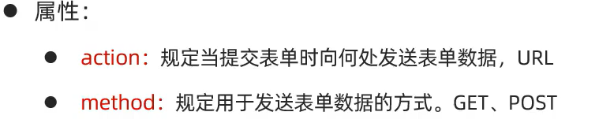
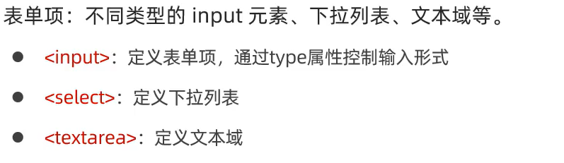
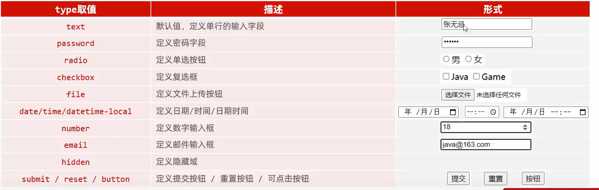
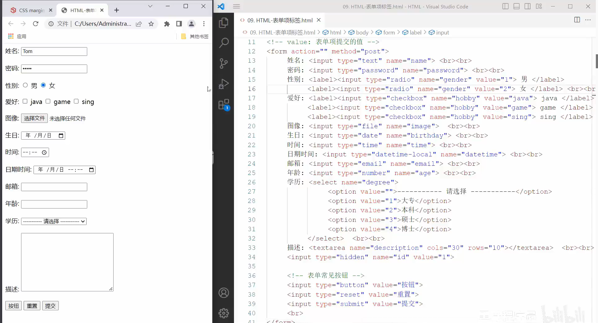

## Html

超文本标记语言

-   xml是可拓展的
-   html是预定义好的

###特点

结构松散(再怎么松散,也写写规范,这样反而更简单)

无关大小写(建议全小写)

###解决Html中文乱码

```html
<meta charset="UTF-8">
```


##CSS

层叠样式

-   用于控制页面样式(表现)

###三种引入方式

-   行内样式

    -   写在标签style属性中

        ```html
        <h1 style="xxx:xxx ;xxx:xxx;">
            你好
        </h1>
        ```

    -   不推荐(耦合)

-   内嵌样式

    -   写在\<style>标签中

        ```html
        <style>
            h1 {
                xxx:xxx;
                yyy:yyy;
            }
        </style>
        ```

        对所有h1标签有效

    -   可以写在页面任何位置

    -   通常写在head标签中

-   外联样式

    -   写在一个单独的.css文件中

        ```css
        h1 {
            xxx:xxx;
            yyy:yyy;
        }
        ```

    -   需要通过link标签在网页中引入

        ```html
        <link rel="styleheet" href="css/news.css">
        ```
    
    -    rel指定文本文件
    -   href指定文本地址
    -   前后可以互换

####搞颜色

拾色器(那个滴管)


三种搞颜色的法

```Css
/* color: red; */
color: rgb(26, 42, 103);
 /* color #eeeeeeem; */
```

####搞字体(font-)


```css
color: aquamarine;
font-size: 18px;/* 设置字体大小,也可以120%啥的 */
```

###CSS常见的选择器

####元素/标签选择器

-   元素=标签

####id选择器

-   给元素取ID

####类选择器

-   指定属性值

```html
<html>
    <head>
        <title>
            首页
        </title>
        <style>
            h1 {
                /* color: red; */
                color: rgb(26, 42, 103);
                /* color #eeeeeeem; */
            }
            /* 使用元素选择器  */
            /* span {
                color: rgba(128, 128, 128, 0.485);
            } */
            /* 使用类选择器 */
            .cls{
                color: rgba(128, 128, 128, 0.485);
            }
            /* ID选择器(唯一性) */
            #小标题{
                color: aquamarine;
            }
        </style>
    </head>
    
    
    <body">
        <h1>欢迎使用Html</h1>
        
        
        <p/>
        <hr>
            <!--span是没有语义的标签,仅仅把同一行的不同语义的元素分开,使其分开CSS -->
            <span class="cls">2023.10.12</span>
            <span id="小标题">Hello World</span>
        </hr>
        
    </body>

</html>
```

####三种选择器的优先级

ID>类>标签


##超链接

```html
<a href="指定资源访问的URL" target="在何处打开资源连接">问泵</a>
```

-   target
    -   _SELF 默认值:在当前页面打开
    -   _BLANK 在空白页面打开

```html
<a href="Text\114514.html" target="_blank" >前往114514</a>
```

### 更改超链接的文字样式

```css
a{
    color: #000;
    text-decoration-line: none;
}
```


## 视频和图片


### 播放控件

-   写个controls="controls"就使用浏览器默认播放器(?????????????????????????????????我无敌了?)


##文本

-   &nbsp空格


-   \<p\>,段落标签,换行+空行(视觉上的,如果尝试去选中,是选不了的)
-   \<br\>,换行标签,相当于\r\n

### CSS修饰

```CSS
p{
	test-indent:30px;
    /*多少像素*/
    line-hight:30px;
    /*行高*/
    test-align:center;
    /*
    对齐方式
    center
    left
    right
    */
}
```

##页面布局

###盒子模型


-   键入F12



###布局标签





-   ```CSS
    width:70%;
    margin:0 auto;自动居中
    ```



## 表格




-   cellspace="0"表格单元之间变成实心

## 表单

```html
        <form  action="服务端的URL" method="post">
            用户名:<input type="text" name = "username">
            年龄:<input type="number" name = "age">
            <input type="submit" value ="提交">
            <!-- 提交到何方?不指定,默认提交到当前页面,服务端的URL地址指定,就提交到服务端 -->
            <!-- 指定action=服务端的URL,且GET,URL=域名/index.html/服务端的URL?username=二货age=19 -->
            <!-- 不指定action且用GET,URL是这样的:域名/index.html?username=二货age=19 -->
        </form>
```

-   Get有长度限制
-   Post没有


###属性

-   一定要有Name属性,否则这个表单是无法提交给服务端的




###表单项标签



-   \<input>



-   隐藏域看不见,但是会提交(大概就是贤良说的管理员快捷登录罢)



-   radio:name一样,才能实现多选一
-   label一包裹,不需要点男女前面的圆圈,label里面的元素都可以被点击,即点击文字亦可以

