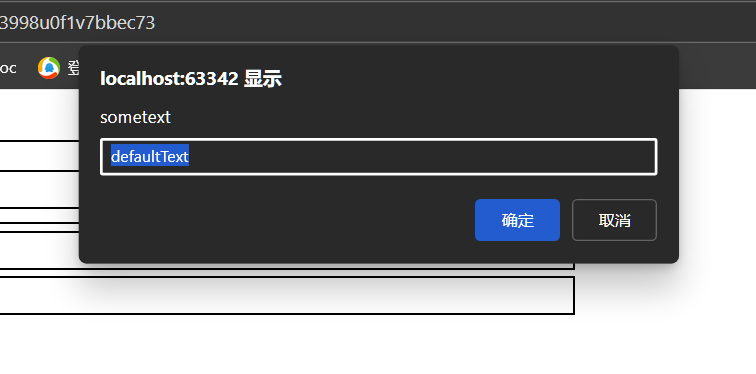
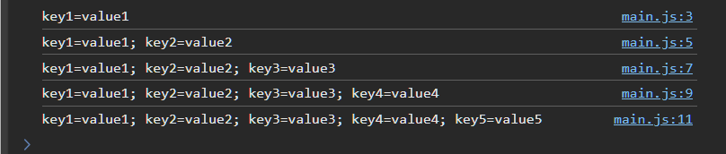
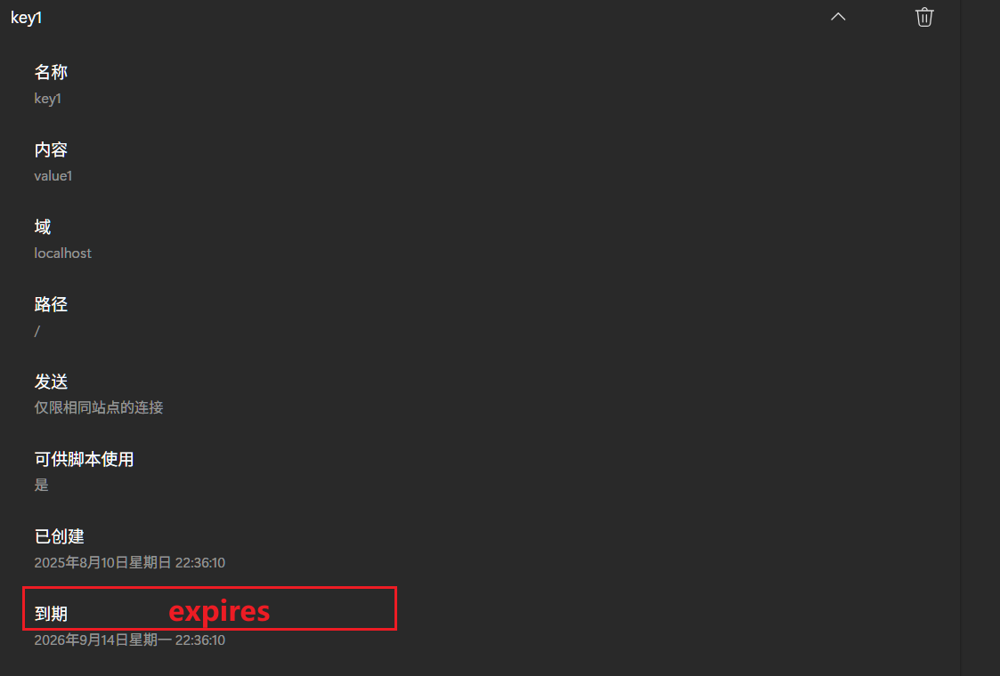

# BOM

>   **B**rowser **O**bject **M**odel 浏览器对象模型

## Window 对象

-   所有浏览器都支持 **window** 对象
-   所有全局 JavaScript 对象，函数和变量自动成为 window 对象的成员
    -   全局变量是 window 对象的属性
    -   全局函数是 window 对象的方法
    -   document 对象也是 window 对象属性


## 浏览器窗口尺寸

不包括工具栏和滚动条


-   `window.innerHeight` - 浏览器窗口的内高度（以像素计）
-   `window.innerWidth` - 浏览器窗口的内宽度（以像素计）
-   只读, 可以写, 不出异常, 但没用, 不会真的改变窗口内宽度
-   对于 Internet Explorer 8, 7, 6, 5
    -   `document.documentElement.clientHeight`
    -   `document.documentElement.clientWidth`
    -   或
    -   `document.body.clientHeight`
    -   `document.body.clientWidth`


```js
var w = window.innerWidth
|| document.documentElement.clientWidth
|| document.body.clientWidth;

var h = window.innerHeight
|| document.documentElement.clientHeight
|| document.body.clientHeight;
```

可以适用于所有的宽度和长度

## 窗口方法

-   `window.open()` - 打开新窗口

    ```js
    window.open('https://www.baidu.com','_self');
    ```

-   `window.close()` - 关闭当前窗口

-   `window.moveTo()` - 移动当前窗口

    -   不好使

-   `window.resizeTo()` - 重新调整当前窗口

    -   不好使

## Screen

>   window.screen

可以不带window前缀

-   `screen.width`

    -   `number`
    -   像素
    -   访问者屏幕宽度

-   `screen.height`

    -   `number`
    -   像素
    -   访问者屏幕高度

-   `screen.availWidth`

    -   减去诸如窗口工具条之类的界面特征

-   `screen.availHeight`

    -   减去诸如窗口工具条之类的界面特征

-   `screen.colorDepth`

    所有现代计算机都使用 24 位或 32 位硬件的色彩分辨率

    -   24 bits =16,777,216 种不同的 "True Colors"
    -   32 bits = 4,294,967,296 中不同的 "Deep Colors"

-   `screen.pixelDepth`

    -   像素深度


## location

可不带 window 前缀书写

获取当前页面地址（URL）并把浏览器重定向到新页面

-   `location.href` 返回当前页面的 href (URL)

-   `location.hostname` 返回 web 主机的域名(无端口)

-   `location.port` 端口

-   `location.pathname` 返回当前页面的路径或文件名, 不包含域名, 端口, 协议, 从端口后面的内容开始

-   `location.protocol` 返回使用的 web 协议（http: 或 https:）会有冒号

-   `location.assign("URL")` 加载新文档, 跳转到目标URL

    ```js
    window.location.assign("https://www.baidu.com")
    ```


## History

可不带 window 前缀书写

包含浏览器历史

-   `history.back()` - 等同于在浏览器点击后退按钮
-   `history.forward()` - 等同于在浏览器中点击前进按钮


## Navigator

可不带 window 前缀

有关访问者的信息

大部分属性都被弃用了,来自 navigator 对象的信息通常是误导性的，不应该用于检测浏览器版本

-   不同浏览器能够使用相同名称
-   导航数据可被浏览器拥有者更改
-   某些浏览器会错误标识自身以绕过站点测试
-   浏览器无法报告发布晚于浏览器的新操作系统

### 属性

-   `navigator.appName`
    -   "Netscape" 是 IE11、Chrome、Firefox 以及 Safari 的应用程序名称的统称
-   `navigator.appCodeName`
    -   "Mozilla" 是 Chrome、Firefox、IE、Safari 以及 Opera 的应用程序代码名称
-   `navigator.product`
    -   大多数浏览器返回 "Gecko" 作为产品名称
-   `navigator.appVersion`
-   `navigator.platform`
    -   操作系统
-   `navigator.language`
-   `navigator.onLine `
    -   bool
    -   是否在线
-   `navigator.cookieEnabled`
    -   bool
    -   未弃用


### Java 是否启用

`navigator.javaEnabled()`

## 弹出窗

警告窗

```js
alert("I am an alert box!");
```


确认窗

```js
if (confirm("Press a button!")) {
  txt = "You pressed OK!";
} else {
  txt = "You pressed Cancel!";
}
```


提示窗

```js
let s = window.prompt('some text', 'defaultText');
console.log(s);
```



按下取消后, 返回`null`

## Timing事件

定时事件

-   `setTimeout(*function, milliseconds*`)
-   `setInterval(*function, milliseconds*`)

见[异步](../高级/Day03-异步.md)


## Cookies

```js
document.cookie = 'key1=value1; expires=Thu, 18 Dec 2033 12:00:00 UTC; path=/';
console.log(document.cookie);
document.cookie = 'key2=value2; expires=Thu, 18 Dec 2033 12:00:00 UTC; path=/';
console.log(document.cookie);
document.cookie = 'key3=value3; expires=Thu, 18 Dec 2033 12:00:00 UTC; path=/';
console.log(document.cookie);
document.cookie = 'key4=value4; expires=Thu, 18 Dec 2033 12:00:00 UTC; path=/';
console.log(document.cookie);
document.cookie = 'key5=value5; expires=Thu, 18 Dec 2033 12:00:00 UTC; path=/';
console.log(document.cookie);
```



-   set 的 逻辑比较特殊
-   一次写入, 其实写入一条cookie, 而不会覆盖之前的cookie



-   通过`;`分割同一个cookie的不同属性

```js
document.cookie = 'key1=value-1; expires=Thu, 18 Dec 2033 12:00:00 UTC; path=/';
```

key1被覆盖

删除 cookie 时省略 cookie 值, 直接把 expires 参数设置为过去的日期

```js
document.cookie = "username=; expires=Thu, 01 Jan 1970 00:00:00 UTC; path=/;";
```

**应该定义 cookie 路径以确保删除正确的 cookie**

如果你不指定路径，一些浏览器不会让你删除 cookie
