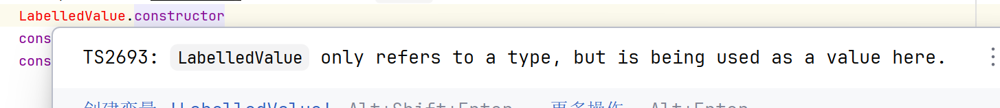
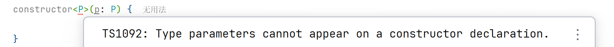

# OOP

## constructor

原生的constructor不被Typescript认定为类型

```ts
function P() {
    this.x = 2;
}

let p:P = new P();// ERROR, 没有P
console.log(p.x);// O
```

## interface

为这些类型命名

为代码定义契约

### 语法

```typescript
function printLabel(labelledObj: { label: string }) {
  console.log(labelledObj.label);
}

let myObj = { size: 10, label: "Size 10 Object" };
printLabel(myObj);
```

对象参数可能会包含很多属性，但是编译器只会检查那些必需的属性是否存在，并且其类型是否匹配。

使用Interface重写

```js
interface LabelledValue {
    label: string;
}

function printLabel(labelledObj: LabelledValue) {
    console.log(labelledObj.label);
}
```

接口的定义不会被编译为Javascript, 因此其能且仅能作为类型指示, 而不能出现在在实质性的代码中




```typescript
let myObj = { size: 10, label: "Size 10 Object" };
printLabel(myObj);
```

其中size属性依然能通过类型检查. 类型检查只会去关注值的外形

只要传入的对象满足接口的必要条件，它就被允许

不允许的情形, 详情见后文

### 额外的属性

如果,直接将对象作为实参填入函数参数, 那么就不允许出现多余的属性

```typescript
interface LabelledValue {
    label: string;
}

function printLabel(labelledObj: LabelledValue) {
    console.log(labelledObj.label);
}

printLabel({
    size: 10, // 不被允许
    label: "Size 10 Object"
});
```

此时认为, 填入的对象仅仅用作实参, 而不会用在其他地方, 即使存在多余的属性, 也不会被使用, 因此编译会报错

此时往参数列表里填实参, 被编译器认为是在直接构造一个目标对象, 这个目标对象仅用作函数的实参, 而不是构造一个可能会产生各种其他作用的对象集合

要绕开检查, 可以使用**断言**, 但是不建议, 这样可能产生Bug而不被检查

```typescript
printLabel({    
	size: 10,
    label: "Size 10 Object"
} as LabelledValue);
```

或者加入字符串[索引签名](#索引签名), 让这个对象作为一个数据集合, 允许容纳任意多的成员

```typescript
interface LabelledValue {
    label: string;
    [index: string]: any;
}

function printLabel(labelledObj: LabelledValue) {
    console.log(labelledObj.label);
}

printLabel({
    size: 10, // 被允许了
    label: "Size 10 Object"
});
```

### 可选属性

```typescript
interface LabelledValue {
    label: string;
    count?: number; // 定义可选属性
}
```

```typescript
function printLabel(labelledObj: LabelledValue) {
    console.log(labelledObj.label);
    console.log(labelledObj.count); // undefined
}

printLabel({
    label: "Size 10 Object"
});
```

### readonly

属性只能在对象刚刚创建的时候修改其值

```typescript
interface Point {
    readonly x: number;
    readonly y: number;
}
```


```typescript
let p1: Point = {x: 10, y: 20};
p1.x = 5; // error!
```

接口和类都可以在属性上使用


### 函数式接口

给接口定义一个调用签名, 参数列表里的每个参数都需要名字和类型。

函数的参数名不需要与接口里定义的名字相匹配

```typescript
interface CalculateFunc {
    (a: string, b: number): number
}

let calculate: CalculateFunc = (x: string) => {
    // 参数名可以不同
    // 返回值类型必须要符合
    // 参数不一定给全, 但一定要能匹配接口的规范
    // 参数可以不标注类型(of course), 但如果标注了就应该符合接口标准正确
    return x.length;
}
```

### 构造签名

用于规范一个构造器

声明语法

```typescript
interface StudentConstructor {
    // 用new关键字开头, 表示这是一个构造签名
    new(name: string): Student;// 指定构造的目标对象
}
```

使用构造签名构造一个对象

1.   将构造签名作为一个参数使用, 等待一个构造器(函数)的实参

     ```typescript
     function askStudy(studentConstructor: StudentConstructor): void {
         let student: Student = new studentConstructor("A");
         console.log(student);
     }
     ```

2.   创建一个类, 有构造器符合StudentConstructor

     ```typescript
     class Student {
         name: string;
     
         constructor(name: string) {
             this.name = name;
         }
     
         toString() {
             return this.name;
         }
     }
     ```

3.   将Student的构造器作为实参传入

     ```typescript
     askStudy(Student); // Javascript语法糖, 类名就是这个类的构造器
     ```

4.   在使用构造签名的时候, 往往不知道具体, 因此建议类似于工厂模式, 一个工厂接口对应一个产品接口([接口实现](#接口实现))

     ```typescript
     interface StudentConstructor {
         new(name: string): StudentInterface;
     }
     
     interface StudentInterface {
         name: string;
     
         study(): void;
     }
     
     class Student implements StudentInterface {
         name: string;
     
         constructor(name: string) {
             this.name = name;
         }
     
         study(): void {
             console.log(this.name + " is studying");
         }
     
     }
     
     function askStudy(studentConstructor: StudentConstructor): void {
         let student: StudentInterface = new studentConstructor("A");
         student.study();
     }
     
     askStudy(Student);
     ```


## 索引签名

可以用在interface和class上

### 索引签名

用于描述那些能够“通过索引得到”的类型，比如*数组*或*映射*


$$
[identifier:number|string|symbol]: type;
$$

-   identifier 不能被使用. 它的作用就好像函数式接口中的参数名一样, 可以不使用, 但不可以没有
-   TypeScript支持作为索引的类型有number和string
-   这种使用`[]`括起来的格式, 就好像函数签名一样. `[]`内部是参数,每个参数是`参数名:参数类型`,  `[]`后边是返回值类型

```typescript
interface StringArray {
    // 从number 映射到string
    [index: number]: string;
}

// 用对数组的形式表示
let myArray: StringArray = ["Bob", "Fred"];
let element: string = myArray[0];
// 用对象的形式表示
let myMap: StringArray = {1: "Bob", 0: "Fred"};
let value: string = myMap[0];
```

```typescript
interface StringMap {
    // 从string 映射到string
    [key: string]: string;
}

let map: StringMap = {"a": "21"};
```

### 加上特定字段

依旧可以加上特定字段

当索引签名是**string**的时候特定字段的类型有限制(是number的时候无限制)

```typescript
interface NumberDictionary {
  [index: string]: number;
  length: number;    // 可以，number assignable to number
  name: string       // 错误，string can not assignable to number
}
```

```typescript
interface NumberDictionary {
    [index: string]: object;
	message: string; // 可以, string assignable to object
}
```

### 多个索引类型

允许同时使用多个索引类型

```typescript
interface DataMap {
    [key: number]: Data;

    [key: string]: Data;
}

let map: DataMap = {"a": "21", 1: "12"};
let array: DataMap = ["a", "v"]; // 很遗憾, 不能转换
```

但是值的类型必须一致, 这是由于string索引签名的返回类型限制

```typescript
interface NotOkay {
    [x: number]: string; // 不允许
    [x: string]: number;
}
```

### readonly

给索引签名加readonly, 就是给一系列的成员(元素)都加上只读标签, 也就是让所有能被索引元素都只读

```typescript
interface ReadonlyStringArray {
    readonly [index: number]: string;

    length: string;
}

let myArray: ReadonlyStringArray = ["Alice", "Bob"];
myArray[2] = "Mallory"; // error!
myArray.length = "2"; // OK!
```

### symbol作为索引类型

```ts
const fieldSymbol = Symbol();
const methodSymbol = Symbol();

class A {
    [index: symbol]: any;

    [methodSymbol]() {
        return "method";
    }

    [fieldSymbol]: "filed";
}

let a = new A();
console.log(a[fieldSymbol])
console.log(a[methodSymbol]())
```

可以搞一些单例, 例如KlassPointer

## 接口与类

### 接口实现

接口描述了类的公共部分, 它不会检查类是否具有某些私有成员

```typescript
interface ClockInterface {
    currentTime: Date; // 字段的规范
}

class Clock implements ClockInterface {
    currentTime: Date = new Date();

    constructor(h: number, m: number) {
        let now = new Date();
        now.setHours(h, m, 0, 0);
        this.currentTime = now;
    }
}
```

不能使用`implements`显式地实现函数式接口和构造签名, 但是一个函数或构造器和接口有相同的签名, 则是在事实上实现了接口

也有一种说法认为, 函数式接口和构造签名描述的对象是静态的, 因此无法用`implements`实现

Typescript支持对接口的多继承(实现)

```typescript
interface A {
    func(a: number): string;
}

interface B {
    func(a: string): number;
}

class C implements A, B { // C 将永远无法实现

}
```

接口有索引签名的, 也要实现索引签名

```ts
interface A {
    [index: number]: string;
}

class X implements A {
    [index: number]: string;
}
```

### 接口继承

支持接口之间的多继承

```ts
interface Shape {
    color: string;
}

interface PenStroke {
    penWidth: number;
}

interface Square extends Shape, PenStroke {
    sideLength: number;
}

let square = <Square>{}; // 这种操作还是太有实力了
square.color = "blue";
square.sideLength = 10;
square.penWidth = 5.0;
```

### 接口继承类

继承类的成员但不包括其实现

**同样会继承到类的private和protected成员**

```ts
class Control {
    private state: any;
}

interface SelectableControl extends Control {
    select(): void;
}

// 错误, 缺少私有成员
class Button implements SelectableControl {
    select() { }
}

```

Button要正确实现Selectable接口(一个继承了含有`private` or `protected`成员的类型的接口), 必须继承这个含有`private` or `protected`成员的类才行

```ts
class Button extends Control implements SelectableControl {
    select() { }
}
```


## class

JavaScript程序使用函数和基于原型的继承

typescript支持单继承

### 访问控制

-   public 缺省
-   protected 子类中可访问
-   private 类外无法访问
-   没有文件和包位置的概念, protect和private一样, 在类外无法访问


### readonly

同接口

只读属性必须在声明时或构造函数里被**初始化**(其他函数, 如果不是undefined, 也要先初始化才是)

### 构造器参数成员

如果在构造器参数里传入一个readonly的参数, 就会自动构造此只读成员了

```ts
class Octopus {
    constructor(readonly name: string) {
    }
}
```

编译成JS的时候会加上

```js
class Octopus {
    constructor(name) {
        this.name = name;
    }
}
```

在参数之前加上访问控制符也可以构造成员, `public`, `private`, `protected`

```ts
class Octopus {
    constructor(public name: string) {
    }
}
```

访问控制符和只读可以一起用

## generic

### 泛型函数

```ts
function identity<T>(arg: T): T {
    return arg;
}

console.log(identity<string>("myString"));
console.log(identity<number>("myString")); // error
console.log(identity("myString")); // 使用了类型推论
```

带泛型的函数的函数类型签名

```ts
let identityVar:<U>(argument:U)=>U = identity;
```

### 泛型类

在类型上加泛型, 动态成员都能使用

```ts
class GenericNumber<T> {
    zeroValue: T;
    add: (x: T, y: T) => T;
}
let myGenericNumber = new GenericNumber<number>();
```


### 泛型函数式接口/构造签名

可以在定义的函数签名上加泛型

```ts
interface Consumer {
    <P>(param: P): void;
}
let consumer: Consumer = <P>(a: P): void => {
    console.log(a);
}
```

也可以在接口上定义泛型

```ts
interface Consumer<P> {
    (param: P): void;
}
let numberConsumer: Consumer<number> = (a: number): void => {
    console.log(a);
}
```

构造签名能使用泛型, 但是由于类的构造器上不允许使用泛型, 所以在构造签名的构造器签名上定义泛型其实没有意义

```ts
interface Constructor {
    new<P, R>(param: P): R;
}
```




但是在接口上定义泛型就有意义了

```ts
interface Constructor<P, R> {
    new(param: P): R;
}

class A {
    constructor(public msg: string) {
    }

    read(this: A): string {
        return this.msg;
    }
}

let aCons: Constructor<string,A> = A;
```

### 泛型约束

TypeScript 没有原生下界语法, 也没有直接的通配符

不过通配符的效果, 可以用`unknown` 类似实现, `any`不太行, 因为unknown保留类型推断, any不会

不过, 由于Typescirpt的对[实质性的类型判断](Day01-简介#实质性的类型检查)的效果, 下界和通配符, 都没啥必要了

```ts
interface Lengthwise {
    length: number;
}

function loggingIdentity<T extends Lengthwise>(arg: T): void {
    console.log(arg.length);
}

loggingIdentity([1, 2, 3]);
```

对于上界, 也可以用泛型

```ts
function getProperty<T, K extends keyof T>(obj: T, key: K) {
    return obj[key];
}
```

keyof见[索引类型](Day02-索引类型)

### 在类型定义中使用泛型

非常好的骚操作

```ts
function create<T>(c: {new(): T; }): T {
    return new c();
}
```

### 所有构造器的构造签名

```ts
interface AnyConstructor<T> {
    new(...args: any[]): T;
}
```


## enum


### 语法

声明

```typescript
enum Color {Red, Green, Blue}

let c: Color = Color.Green;
```


```typescript
let c0:Color = Color.Red; // 0
let c0n:number = Color.Red;// 0
let c1:Color = Color["Red"]; // 0
let c1n:number = Color["Red"]; // 0
let c2:string = Color[0]; // Red, 不建议, 因为数字索引可以被需改
```

遍历

```ts
for (let colorKey in Color) {
    console.log(colorKey+"->"+Color[colorKey]);
}
/*
0->Red
1->Green
2->Blue
Red->0
Green->1
Blue->2
*/
```

### 修改数字索引

可以以数字为索引访问, 一般从0开始, 除非

```typescript
enum Color {Red = 1, Green, Blue}
```

一般是自动递增的, 除非全部自定义

```typescript
enum Color {Red = 1, Green = 2, Blue = 4}
```

调用示例

```typescript
enum Color {Red = 1, Green = 3, Blue = 2}

let colorName: string = Color[1];

console.log(colorName);  // Red
```

### 原理

```typescript
enum Color {Red , Green, Blue }
```

编译后:

```javascript
"use strict";
var Color;
(function (Color) {
    Color[Color["Red"] = 0] = "Red"; // 则 Color["Red"]==0;Color[0]=="Red"
    Color[Color["Green"] = 1] = "Green";
    Color[Color["Blue"] = 2] = "Blue";
})(Color || (Color = {})); // 很奇妙的短路技巧 if (!Color) Color = {};
let c = Color.Green;
```

### 字符串枚举

和数字枚举类似

```ts
enum Color {
    Red = "R",
    Green = "G",
    Blue = "B"
}
```

编译成js后

```js
var Color;
(function (Color) {
    Color["Red"] = "R";
    Color["Green"] = "G";
    Color["Blue"] = "B";
})(Color || (Color = {}));
```

使用字符串枚举后, 只要给其中一个字符命名, 则必须全部赋值

```ts
enum Color {
    Red= "R" ,
    Green , // ERROR
    Blue// ERROR
}
```


### 异构枚举

不建议使用

```ts
let c = 12 * Math.random();

enum Character {
    A = 0,
    B = "B",
    C = c,
    D  = A | C,
}
```

编译成Js: 

```ts
let c = 12 * Math.random();
var Character;
(function (Character) {
    Character[Character["A"] = 0] = "A";
    Character["B"] = "B";
    Character[Character["C"] = c] = "C";
    Character[Character["ReadWrite"] = Character.A | Character.C] = "ReadWrite";
})(Character || (Character = {}));

```

不允许字符串和数字外的类型作为值

### 枚举值

看编译, 字符串的值, 被编译引用了两次, 而数字是被引用一次

因此数字是可以比较复杂的运算, 字符串必须是常量

```ts
enum Character {
    A = "",
    B = 1 + "", // 常量表达式OK
    C = "".length + "", // ERROR
}
```

### 枚举常量作为类型

```ts
enum ShapeKind {
    Circle,
    Square,
}

interface Circle {
    kind: ShapeKind.Circle; // 枚举常量作为类型
}

let c: Circle = {
    kind: ShapeKind.Square,
    // Error! 应当是ShapeKind.Circle
}
```

### 将枚举看作对象

```ts
enum E {
    X, Y, Z
}
function f(obj: { X: number }) {
    return obj.X;
}

// 能够运行, E中确实含有X
f(E);
let nameOfX = E[E.X]; // "X"
```

### const 枚举

直接将枚举编译为常数

```ts
const enum E {
    X, Y, Z
}

console.log(E.X);
```

编译的JS结果

```js
console.log(0 /* E.X */);
```


同时也不允许number进行运算了

```ts
const enum E {
    X = "", Y = Math.random()/*ERROR*/, Z = ""
}
```

### 外部枚举

有时候, 以对象的形式定义了枚举, 而不是以enum的形式

```ts
// 形式上的Enum, 不会再编译时检查
export const Character = {
  A: 1,
  B: 0,
  C: 2,
  D: 12
};
```

这时候, 希望覆盖这个枚举,使其具有TS的类型检查, 但是不希望产生一个新的对象(一般enum编译后会产生对象)

仅仅是在编译阶段对这个类增加一个检查的功能

```ts
import {Character} from "./Character.js";

declare enum Character {
    A = 1,
    B = 3, // 这里不定义和原来不同, 用于说明Character没有被编译
    C = 2
}
// let y: Character = 12; // 编译时报错, 6不在Character里, 这里检查的依据是本文件的Character
let x: Character = Character.B; // 不报错
console.log(x); // 0, 采用的是js的值, 说明这个enum没有被编译
```

仅声明类型, 不作为值, 不被编译

详见[declare](./Day03-declare)

