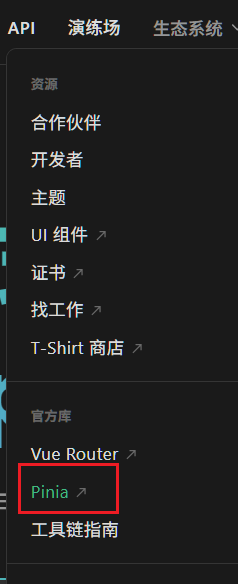
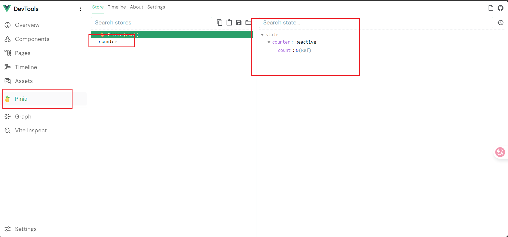

# 简介

[Pinia](https://pinia.vuejs.org/zh/)

Vue3 的 官方库

Vue.js 的状态管理库

使用组合式API



```shell
npm install pinia
```

## Store

一个保存状态和业务逻辑的实体

Pinia是一种store

不与组件树绑定, 每个组件都可以对其读取和写入

-   state
-   getter
-   action

### 用处

用于存储整个应用中访问的数据, 例如用户信息

同时应该避免在store中保存本地数据

## 开始

### pinia实例

创建一个pinia实例 `main.js`

```js
import {createApp} from 'vue'
import App from './App.vue'
import {createPinia} from 'pinia'

const pinia = createPinia();
createApp(App).use(pinia).mount('#app')
```

-   `App#use`用于安装插件
-   第一个参数是插件本身, 第二个参数是是插件选项(可选)
-   插件是带有`install()`方法的对象, 或者是一个被用作`install()`方法的函数
-   弱`App#use`多次对同一个插件反复调用, 则只会安装一次

### defineStore

在`/store/counter.js`定义

使用

```js
import {defineStore} from 'pinia'
```

导入定义的函数

-   第一个参数是唯一标识(*id*), 用于连接store和devtools
-   第二个参数是对store的详细定义, 分别定义
    -   state
    -   getter
    -   action
-   返回值是一个函数和
    -   建议以`use`开头, `Store`结尾, 中间是唯一标识, 也就是第一个参数

#### 对象定义

```js
import {defineStore} from 'pinia'

export const useCounterStore = defineStore('counter', {
  state() {
    return {count: 0}
  },
  getters: {
    double: (state) => state.count * 2,
  },
  actions: {
    increment() {
      this.count++
    },
  },
});
```

#### 函数定义

```js
import { ref } from 'vue'
import { defineStore } from 'pinia'

export const useCounterStore = defineStore('counter', () => {
  // state
  const count = ref(0);
  // getter(用 computed);
  const double = computed(() => count.value * 2);
  // actions
  function increment() {
    count.value++
  }

  return { count,double, increment }
});
```

要让 pinia 正确识别 `state`，**必须**在 setup store 中返回 **`state` 的所有属性**

不能在 store 中使用**私有**属性

不完整返回会影响 **SSR**，开发工具和其他插件的正常运行

==使用组合式函数定义Store会让 SSR 变得更加复杂==

在setup定义中允许使用任何*组合式函数*, 例如Router的`useRoute()`

### 自定义选项

在OptionalApi中, 自定义选项作为除了Getter, State, Action之外的字段

```js
import {defineStore} from 'pinia'

export const useCounterStore = defineStore('counter', {
  state() {
    return {count: 0}
  },action(){
      increment: ()=>count++
  }{
    myOptionOnType: {
      increment: 'unsigned int'
    },
  }
});
```

在setup api中, 自定义选项作为第三个参数

```js
import {defineStore} from 'pinia'

export const useCounterStore = defineStore('counter', () => {
  const count = ref(0);
  function increment = ()=>count.value++;
  return {count,increment};
}, {
  myOptionOnType: {
    increment: 'unsigned int'
  },
});
```

自定义选项用于被**插件**读取, 一般用于增强

### 使用Store

在`App.vue`使用

#### setup api

```vue
<script setup>
import { useCounterStore } from '@/store/counter'

const counter = useCounterStore()

// 直接对数据进行操作
counter.count++
// 使用 $patch(意为'补全') 处理数据
counter.$patch({ count: counter.count + 1 })
// 使用 action 处理数据
counter.increment()
</script>

<template>
  <!-- 直接从 store 中访问 state -->
  <div>Current Count: {{ counter.count }}</div>
</template>
```

`store` 是一个用 `reactive` 包装的对象，因此==不需要在 getters 后面写 `.value`==。就像 `setup` 中的 `props` 一样

```js
let count = counter.count; // count 的值永远不会改变, 因为响应式被破坏
```

使用storeToRefs保留state和getter的响应式, action一般不需要保留响应

```js
const count = storeToRefs(counter).count; // 保留响应式 
```

#### optional api

如果在optional api中使用useCounterStore()会产生错误

```js
import {useCounterStore} from '@/stores/counter'

const counterStore = useCounterStore(); // 有错
export default {
  computed: {
    count() {
      return counterStore.count;
    }
  }
}
```

因此使用`mapState`将store的所有属性作为**只读属性**转到computed上

```js
import {mapState} from "pinia";
import {useCounterStore} from "@/stores/counter.js";

export default {
  computed: {
    // 可以访问组件中的 this.count
    // 与从 stores.count 中读取的数据相同
    ...mapState(useCounterStore, ['count']), // mapState返回对象, 使用...运算符展开
    // 与上述相同，但将其注册为 this.myOwnName
    ...mapState(useCounterStore, {
      countAlias: 'count',
      // 也可以写一个函数来获得对 stores 的访问权
      double(store){
          return store.count * 2
      },
      // 它可以访问 `this`
      magicValue(store) {
        return store.count + this.double;
      }
    })
  },
}
```

```vue
<template>
  <div>
    countAlias: {{ countAlias }}
    magicValue: {{ magicValue }}
  </div>
</template>
```

使用 `mapWritableState()` 获取可写的映射

```vue
<script>
import {mapWritableState} from "pinia";
import {useCounterStore} from "@/stores/counter.js";

export default {
  computed: {
    // 可以访问组件中的 this.count
    ...mapWritableState(useCounterStore, ['count']),
    // 此处不允许使用函数了
    ...mapWritableState(useCounterStore, {
      countAlias: 'count',
    }),
  },
}
</script>
```

或者使用setup钩子

```vue
<script>
import {useCounterStore} from "@/stores/counter.js";
export default defineComponent({
  setup() {
    const counterStore = useCounterStore()
    return { counterStore }
  },
  methods: {
    printDouble() {
      console.log('New Count:', this.counterStore.double);
    },
  },
})
</script>
```

## DevTools



