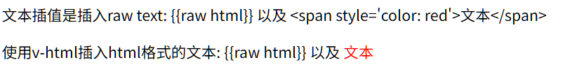

# 文本插值

### Mustache

使用*Mustache*语法(双大括号), 进行最基本的**数据绑定**

```html
<span>Message: {{ msg }}</span>
```

msg 会替换为响应组件中的属性值

msg 属性改变时会同步更新渲染

-   可以插值常数
-   可以调用一个只读方法, 此方法不会导致成员指的改变
-   可以读取一个字段
-   可以插值一个表达式, 表达式不会导致成员值发生改变, 例如`msg.toUpperCase()`
-   不允许控制流`if, else, for `, 也不允许声明语句
-   不允许多个语句(`;`分割的)

其实是可以发生对成员的写操作的, 但这样往往导致逻辑发生错误, 所以不建议

同理, 不建议插值过于复杂

### 插值HTML

```html
<script setup>
const text = ref("{{raw html}} 以及 <span style='color: red'>文本</span>");
</script>

<template>
  <p>文本插值是插入raw text:  {{ text }}</p>
  <p>使用v-html插入html格式的文本: <span v-html="text"/></p>
</template>

```



但是, 使用`v-html`属性, 其内部就不能再使用组合模板了

==不建议设用动态的HTML==

因为

