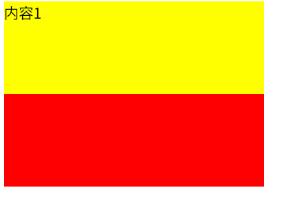
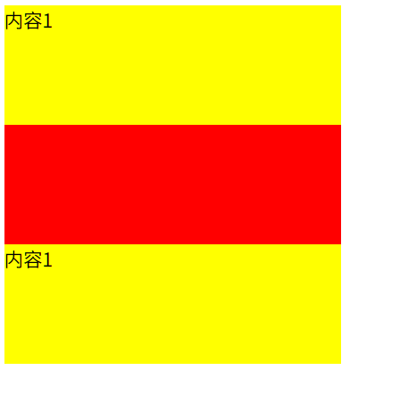
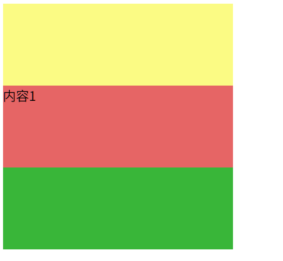
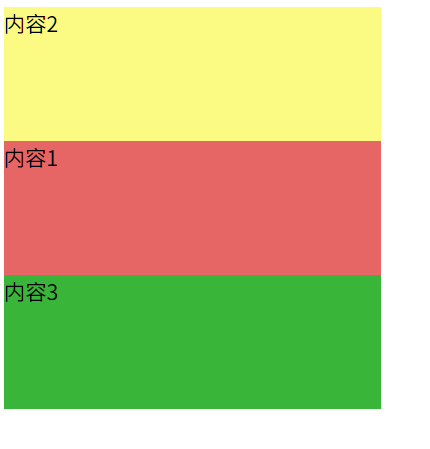
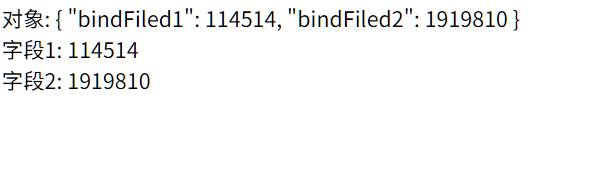
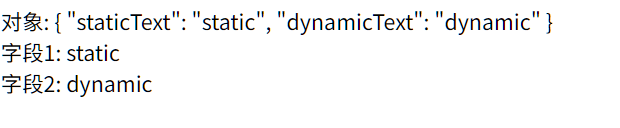
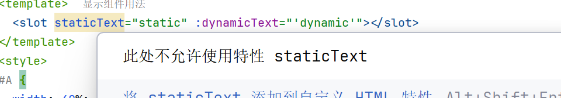
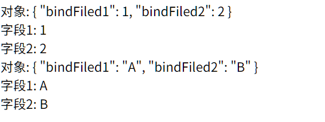

# Slot

>   插槽

## 语法

Root.vue

```vue
<template>
  <ChildComp>Message</ChildComp>
</template>
```


ChildNode.vue

```vue
<template>
  <slot>被覆盖</slot>
</template>
```


-   当Message部分不设置时, 就显示`被覆盖`
-   Message部分或slot内部可以是更复杂的html标签结构, 也可以有一些文本插值之类

## v-slot指令

在ChildNode中指定多个slot, 然后给slot各自命名, 然后在**父组件用v-slot**指令添加到slot上

Root.vue

```vue
<script setup>
import ChildNode from "@/components/ChildNode.vue";
</script>

<template>
  <ChildNode v-slot:up>
    内容1
  </ChildNode>

</template>
```

ChildNode.vue

```vue
<template>
  <div id="A">
    <slot name="up"></slot>
  </div>
  <div id="B">
    <slot name="down"></slot>
  </div>
</template>
<style>
#A {
  width: 20%;
  height: 100px;
  background: yellow;
}
#B {
  width: 20%;
  height: 100px;
  background: red;
}
</style>
```



slot 名字可以重复: ChildNode.vue

```vue
<template>
  <div id="A">
    <slot name="up"></slot>
  </div>
  <div id="B">
    <slot name="down"></slot>
  </div>
  <div id="A">
    <slot name="up"></slot>
  </div>
</template>
```



但是v-slot不能重复


## 默认插槽

如果ChildNode.vue 的  `<slot>` 没有名称

```vue
<template>
  <div id="A">
    <slot name="up"></slot>
  </div>
  <div id="B">
    <slot></slot>
  </div>
  <div id="C">
    <slot name="down"></slot>
  </div>
</template>
<style>
#A {
  width: 20%;
  height: 100px;
  background: #fbfb84;
}
#B {
  width: 20%;
  height: 100px;
  background: #e66565;
}
#C {
  width: 20%;
  height: 100px;
  background: #39b639;
}
</style>
```

则 `<slot>` 将是标有 `v-slot:default` 的组件

Root.vue

```vue
<script setup>
import ChildNode from "@/components/ChildNode.vue";
</script>

<template>
  <ChildNode v-slot:default>
    内容1
  </ChildNode>
</template>
```

或未标有 `v-slot` 的组件的默认值

Root.vue

```vue
<script setup>
import ChildNode from "@/components/ChildNode.vue";
</script>

<template>
  <ChildNode>
    内容1
  </ChildNode>
</template>
```




## v-slot in `<template>`

`<template>` 标签在原生HTML中, 不会被渲染, 用于联合Javascript来显示

在ChildNode标签中使用template标签, ==加之以`v-slot`==, template标签内的内容将显示在slot里

 

Root.vue

```vue
<script setup>
import ChildNode from "@/components/ChildNode.vue";
</script>

<template>
  <ChildNode >
    <template v-slot:default>内容1</template>
    <template v-slot:up>内容2</template>
    <template v-slot:down>内容3</template>
  </ChildNode>
</template>
```





## v-slot 的简写 #


```vue
<script setup>
import ChildNode from "@/components/ChildNode.vue";
</script>

<template>
  <ChildNode >
    <template #default>内容1</template>
    <template #up>内容2</template>
    <template #down>内容3</template>
  </ChildNode>
</template>
```

## 作用域插槽

### `v-bind`传输数据

[v-bind](Day02-指令#v-bind) 不仅能绑定传统的属性, 当其在slot标签中绑定自定义属性的时候, 会将这些属性包装成对象, 然后传递给组件的调用者使用

从ChildNode传输数据给外界使用

ChildNode.vue

```vue
<template>
  <slot v-bind:bindFiled1="114514" v-bind:bindFiled2="1919810"></slot>
</template>
```

父组件的插件拿到内部的数据, 并在标签内部使用

Root.vue

```vue
<script setup>
import ChildNode from "@/components/ChildNode.vue";
</script>

<template>
  <ChildNode v-slot="bindObj">
    对象: {{ bindObj }} <br>
    字段1: {{ bindObj.bindFiled1 }} <br>
    字段2: {{ bindObj.bindFiled2 }} <br>
  </ChildNode>
</template>
```



-   v-bind 冒号之后是字段名

-   v-bind 等号之后是字段值, 可以是JS表达式(字面量/表达式/变量/函数/函数表达式等)

-   v-slot 等号之后创建一个对象, 用于接收v-bind提供的数据

-   当然依旧能用`v-bind`的简写`:`

    ```vue
    <template>
      <slot :bindFiled1="114514" :bindFiled2="1919810"></slot>
    </template>
    ```

    

### 静态数据

自定义标签前不加`v-bind`, 就可以是静态数据

但这么做没什么意义, 也会被IDE警告

ChildNode.vue

```vue
<template>
  <slot staticText="static" :dynamicText="'dynamic'"></slot>
</template>
```

Root.vue

```vue
<script setup>
import ChildNode from "@/components/ChildNode.vue";
</script>

<template>
  <ChildNode v-slot:default="texts">
    对象: {{ texts }} <br>
    字段1: {{ texts.staticText }} <br>
    字段2: {{ texts.dynamicText }} <br>
  </ChildNode>
</template>
```




会产生警告(我更相信是WebStorm对Vue的支持不好)



### 带name的作用域slot

上面的例子中, slot没有定义name, v-slot也没有指定名字, 那是它们选择了default

如果命名, 那和原来的name用法是一样的, 也可以联合template使用, 只是额外增加了值

ChildNode.vue

```vue
<template>
  <slot name="numbers" :bindFiled1="1" :bindFiled2="2"></slot>
  <slot name="characters" :bindFiled1="'A'" :bindFiled2="'B'"></slot>
</template>
```


Root.vue

```vue
<script setup>
import ChildNode from "@/components/ChildNode.vue";
</script>

<template>
  <ChildNode>
    <template  #characters="bindObj">
      对象: {{ bindObj }} <br>
      字段1: {{ bindObj.bindFiled1 }} <br>
      字段2: {{ bindObj.bindFiled2 }} <br>
    </template>
    <template  #numbers="bindObj">
      对象: {{ bindObj }} <br>
      字段1: {{ bindObj.bindFiled1 }} <br>
      字段2: {{ bindObj.bindFiled2 }} <br>
    </template>
  </ChildNode>
</template>
```




## v-for和作用域插槽的联合使用

想不出什么有创造性的例子...

```vue
<template>
  <slot v-for="i in range(1,100,1)" name="numberList" :item="i"></slot>
</template>
```

```vue
<ChildNode>
  <template  #numberList="list">
    {{ list.item }} <br>
  </template>
</ChildNode>
```

