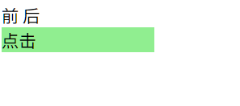

# teleport

>   传送

组件里定义的内容, 能迁移到其他标签下, 甚至迁移到组件外. 

但其内部的有关逻辑或样式由组件决定

## 使用

```vue
<script setup>
import {computed, ref} from "vue";

const choose = ref(false);
const backgroundColor = computed(() => {
  return choose.value ? 'lightgreen' : 'lightpink';
})
</script>

<template>
  前
  <teleport to="body">
    <div
        id="redDiv"
        @click="choose = !choose"
        :style="{ background: backgroundColor, width: '10%' }"
    >
      点击
    </div>
  </teleport>
  后
</template>
```



目标似乎有很多限制, 暂时未知

