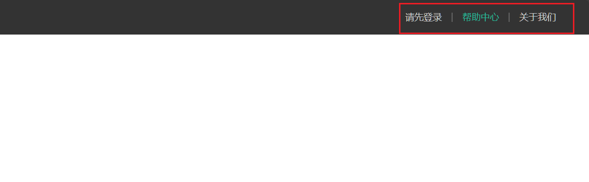

# Layout

设计稿

-   nav
-   header
-   二级路由
-   footer


## navigation





1.   nav内部使用`<div class="container">`, container样式在common.scss

     保证滚动时定位在最顶层

     ```html
     <nav class="app-top-nav">
       <div class="container"><!--container的样式见common.scss-->
         
       </div>
     </nav>
     ```

     ```scss
     .app-top-nav {
       position: sticky;
       top: 0;
       z-index: layer.$app-top-nav; // 以上三条保证滚动时定位在最顶层
         // 保存到一个文件, 方便管理
       background: #333333FF;
     }
     ```

2.   左侧的三个链接用`<ul>`和`<li>`排列

     考虑到**登录前后的三个链接不同**, 使用v-if, 

     链接地址不确定此处按下不表

     ```html
     <nav class="app-top-nav">
       <div class="container"><!--container的样式见common.scss-->
         <ul><!--ul的common, list-style: none-->
           <template v-if="login">
             <li><a href="javascript:;">用户信息</a></li>
             <li><a href="javascript:;">退出登录</a></li>
             <li><a href="javascript:;">我的订单</a></li>
             <li><a href="javascript:;">会员中心</a></li>
           </template>
           <template v-else>
             <li><a href="javascript:;">请先登录</a></li>
             <li><a href="javascript:;">帮助中心</a></li>
             <li><a href="javascript:;">关于我们</a></li>
           </template>
         </ul>
       </div>
     </nav>
     ```

     scss

     ```scss
     .app-top-nav {
       background: #333333FF;
     
       ul {
         display: flex; // 横着排
         height: 53px;
         justify-content: flex-end; // 排在后面
         align-items: center;
       }
     }
     ```

3.   修改链接a的样式

     ```scss
     .app-top-nav {
         /*...*/
     
       ul {
         /*...*/
     
         li {
           a {
             padding: 0 15px;
             color: #cdcdcd;
             line-height: 1;
             display: inline-block;
     
             i {
               font-size: 14px;
               margin-right: 2px;
             }
     
             &:hover { 
               color: var.$color-primary;
             }
           }
         }
       }
     }
     ```

4.   连接的中间有三个分割, 使用`left-border`

     ```scss
     .app-top-nav {
         /*...*/
       ul {
         /*...*/
         li {
           /*...*/
           ~ li a{ /*~ 普通兄弟选择器, li的兄弟的后代a都加上左边界*/
             /*这里不采用后代a, 而是直接采用li的话, 左边界就大一点*/
             border-left: 2px solid #666;
           }
         }
       }
     }
     ```

## header


1.   准备容器

     ```html
     <header class='app-header'>
       <div class="container">
         <!--logo-->
         <!--导航栏-->
         <!--搜索框-->
       </div>
     </header>
     ```

     ```scss
     .app-header{
       background: #fff;
     
       .container {
         display: flex;
         align-items: center;
       }
     }
     ```

2.   图标和标题, 能链接返回主页, 容器略

     ```html
     <h1 class="logo">
       <RouterLink to="/"></RouterLink>
     </h1>
     ```

     样式

     ```scss
     .app-header {
       // 容器
     
       .logo {
         width: 200px;
     
         .logo-link {
           display: block;
           height: 132px;
           width: 100%;
           // text-indent: 1px;
           background: url('@/assets/images/logo.png') no-repeat center 18px;
           background-size: contain;
         }
       }
     }
     ```

3.   左边是Header的导航栏(外侧容器略)

     ```html
     <ul class="app-header-nav">
       <li>
         <router-link to="/">首页</router-link>
       </li>
       <li>
         <router-link to="/">居家</router-link>
       </li>
       <li>
         <router-link to="/">美食</router-link>
       </li>
       <li>
         <router-link to="/">服饰</router-link>
       </li>
     </ul>
     ```

     ```scss
     
     .app-header {
       // 容器
     
       // logo
     
       .app-header-nav {
         width: 820px;
         display: flex;
         padding-left: 40px;
         position: relative;
         z-index: layer.$app-header-nav;
     
         li {
           margin-right: 40px;
           width: 38px;
           text-align: center;
     
           a {
             font-size: 16px;
             line-height: 32px;
             height: 32px;
             display: inline-block;
     
             &:hover {
               color: var.$color-primary;
               border-bottom: 1px solid var.$color-primary;
             }
           }
         }
       }
     }
     ```

4.   搜索框使用elementplus

     ```vue
     <el-input
         v-model="searchInput"
         style="width: 240px"
         size="large"
         placeholder="搜一搜"
         :prefix-icon="Search"
     />
     ```


## footer

容器

```html
<footer class="app_footer">
    <!--联系我们-->
    <!--其他内容-->
</footer>
```

```scss
.app_footer {
  margin-top: 20px; // 和正文隔开
}
```

### concat

"联系我们"的部分


1.   容器

     ```vue
     <div class="contact">
       <div class="container">
       </div>
     </div>
     ```

     ```scss
     .contact {
       background: #fff;
     
       .container {
         padding: 60px 0 40px 25px;
         display: flex;
       }
     }
     ```

2.   客户服务和关注我们

     以这两个页面为例, 每一个块,都有一个标题, 都以border为界限分割

     ```vue
     <div class="message-block">
       <div class="message-title">客户服务</div>
       <div class="message-description">在线客服</div>
       <div class="message-description">问题反馈</div>
     </div>
     <div class="message-block">
       <div class="message-title">关注我们</div>
       <div class="message-description">公众号</div>
       <div class="message-description">微博</div>
     </div>
     ```

     ```scss
     .message-block {
       height: 190px;
       text-align: center;
       padding: 0 72px;
       border-right: 1px solid #f2f2f2; // 制作分割线
       color: var.$color-info;
     
       &:first-child {
         padding-left: 0;
       }
     
       &:last-child {
         border-right: none;
         padding-right: 0;
       }
     }
     
     .message-title {
       line-height: 1; // 文本行间距, 单倍行距
       font-size: 18px;
     }
     
     .message-description {
       margin: 36px 12px 0 0;
       float: left;
       width: 92px;
       height: 92px;
       padding-top: 10px;
       border: 1px solid #ededed;
     
       &:last-child {
         margin-right: 0; // 如果是横着排列的话, 就不在右边留空间
       }
     }
     ```

     

3.   下载

     ```vue
     <div class="message-block">
       <div class="message-title">下载APP</div>
       <div class="message-description qrcode">
           
       </div>
       <div class="message-description download">
         <p>扫描二维码(Fake)</p>
         <p>下载APP</p>
         <a href="javascript:;">下载页面</a>
       </div>
     </div>
     ```

     ```scss
     .qrcode {
       padding: 2px;
       border: 1px solid #ededed;
     }
     
     .download {
       padding-top: 5px;
       font-size: 14px;
       width: auto;
       height: auto;
     
       a {
         display: block;
         line-height: 1;
         padding: 10px 25px;
         margin-top: 5px;
         color: #fff;
         border-radius: 2px;
         background-color: var.$color-primary;
       }
     }
     ```

     

4.   服务热线

     ```vue
     <div class="message-block">
       <div class="message-title">服务热线</div>
       <div class="message-description hotline">400-0000-000 <small>周一至周日 8:00-18:00</small></div>
     </div>
     ```

     ```scss
     
     .hotline {
       $font-size: 22px;
       padding-top: 20px;
       font-size: $font-size;
       color: var.$color-icon-font;
       width: auto;
       height: auto;
       border: none; // 覆盖父级边界样式
     
       small {
         display: block;
         font-size: $font-size*0.7;
         color: var.$color-info;
       }
     }
     ```

     


### 其他


上面是口号

下面是版权

1.   容器

     ```html
     <!-- 其它 -->
     <div class="extra">
       <div class="container">
         <!--口号-->
         <!-- 版权信息 -->
       </div>
     </div>
     ```

     ```scss
     .extra {
         background-color: #333;
     }
     ```

     

2.   口号

     ```html
     <!--口号-->
     <div class="slogan">
       <a href="javascript:;">
         <span>价格亲民</span>
       </a>
       <a href="javascript:;">
         <span>物流快捷</span>
       </a>
       <a href="javascript:;">
         <span>品质新鲜</span>
       </a>
     </div>
     ```

     ```scss
     .slogan {
       height: 178px;
       line-height: 58px;
       padding: 60px 100px;
       border-bottom: 1px solid #434343;
       display: flex; // 平铺, 均匀三个分
       justify-content: space-between;
     
       a {
         height: 58px;
         line-height: 58px;
         color: #fff;
         font-size: 28px;
     
         span {
           vertical-align: middle;
         }
       }
     }
     ```

3.   版权

     ```html
     <div class="copyright">
       <p>
         <a href="javascript:;">关于我们</a>
         <a href="javascript:;">帮助中心</a>
         <a href="javascript:;">售后服务</a>
         <a href="javascript:;">配送与验收</a>
         <a href="javascript:;">商务合作</a>
         <a href="javascript:;">搜索推荐</a>
         <a href="javascript:;">友情链接</a>
       </p>
       <p>CopyRight © 小兔鲜儿</p>
     </div>
     ```

     ```scss
     .copyright {
       height: 170px;
       padding-top: 40px;
       text-align: center;
       color: #999;
       font-size: 15px;
     
       p {
         line-height: 1;
         margin-bottom: 20px;
       }
     
       a {
         color: #999;
         line-height: 1;
         padding: 0 10px;
         border-right: 1px solid #999;
     
         &:last-child {
           border-right: none;
         }
       }
     }
     ```


## index

```vue
<script setup lang="ts">

import LayoutNavigation from "@/views/layout/LayoutNavigation.vue";
import LayoutHeader from "@/views/layout/LayoutHeader.vue";
import LayoutFooter from "@/views/layout/LayoutFooter.vue";
</script>

<template>
  <layout-navigation></layout-navigation>
  <layout-header></layout-header>
  <router-view></router-view>
  <layout-footer/>
</template>

```

