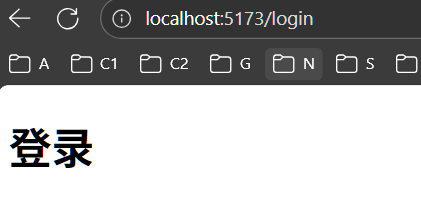
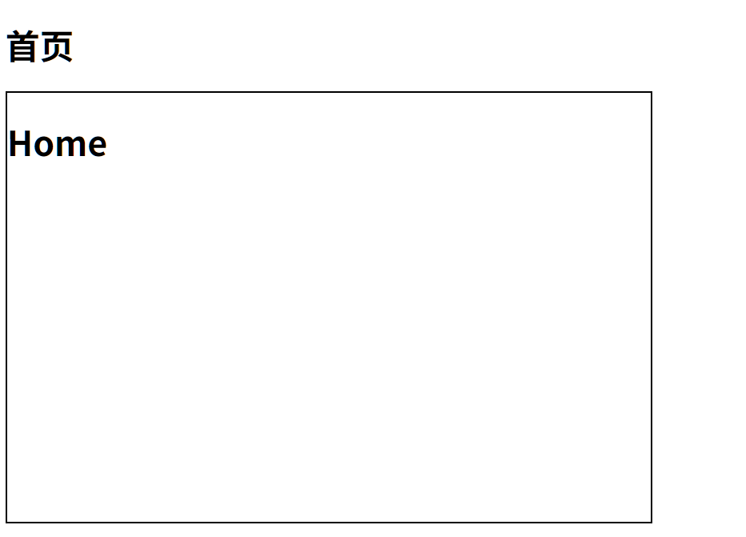

# 路由设计

## 设计思路

以首页-登录页为例

创建文件`/view/layout/index.vue`表示首页

创建文件`/view/login/index.vue`表示登录页面

-   如果页面整体切换, 则为一级路由

    -   例如页面到登录页

        `#/`=>`#/login`

-   如果在一级路由内部切换, 则为二级路由

    -   例如home页和category页

        `#/`=>`#category`

## 创建路由

创建`/router/index.js`创建路由器

```js
import {createRouter, createWebHistory} from "vue-router";
const router = createRouter({
  history: createWebHistory(import.meta.env.BASE_URL),
  routes: [
    /*待填写路由*/
  ]
});
export default router;
```

在main.js上注册router

```js
import {createApp} from 'vue'
import App from '@/App.vue'
import router from "@/router/index.js";

let app = createApp(App);
app.use(router);
app.mount('#app');
```

### 注册一级路由

创建`/views/layout/Index.vue`和`/view/login/Index.vue` 表示页面, 而后加上一些提示

创建`/router/index.js`注册一级路由

```js
import {createRouter, createWebHistory} from "vue-router";
import LayoutIndex from "@/views/layout/Index.vue"
import LoginIndex from "@/views/login/Index.vue"

const router = createRouter({
  history: createWebHistory(import.meta.env.BASE_URL),
  routes: [
    {
      path: "/",
      component: LayoutIndex
    }, {
      path: "/login",
      component: LoginIndex
    }
  ]
});
export default router;
```

在App.vue创建一级路由出口

```vue
<template>
  <!--一级路由出口-->
  <router-view></router-view>
</template>
```


更换成`/login`



## 创建二级路由

创建`/views/home/Index.vue`和`/view/category/Index.vue` 表示页面, 而后加上一些提示

然后在router里配置children

```js
import {createRouter, createWebHistory} from "vue-router";
import LayoutIndex from "@/views/layout/Index.vue"
import HomeIndex from "@/views/home/Index.vue"
import CategoryIndex from "@/views/category/Index.vue"

const router = createRouter({
  history: createWebHistory(import.meta.env.BASE_URL),
  routes: [
    {
      path: "/",
      component: LayoutIndex,
      children: [
        {
          path: "",/*置空, home和layout都渲染*/
          component: HomeIndex
        }, {
          path: "category",/*无前导`/`*/
          component: CategoryIndex
        }
      ]
    }, /*...其他一级路由*/
  ]
});
export default router;
```

在一级路由的组件`@/views/layout/Index.vue`中配置二级路由出口

```vue
<template>
<h1>首页</h1>
  <div style="border: 2px black solid; width: 600px;height: 400px">
    <router-view></router-view>
  </div>
</template>
```



制作二级路由目录

```vue
<template>
<h1>首页</h1>
  <ul>
    <li><router-link to="/">主页</router-link></li>
    <li><router-link to="category">分类</router-link></li>
  </ul>
  <div style="border: 2px black solid; width: 600px;height: 400px">
    <router-view></router-view>
  </div>
</template>
```

